# Awesome GPT Image 2 API and Prompts [](https://awesome.re)

<div align="center">

<a href="https://evolink.ai/gpt-image-2-prompts?utm_source=github&utm_medium=banner&utm_campaign=awesome-gpt-image-2-API-and-Prompts"></a>

[](LICENSE)
[](README.md)
[](https://github.com/EvoLinkAI/GPT-Image-2-Seedance2-Workflow)
[](https://docs.evolink.ai/en/api-manual/image-series/gpt-image-2/gpt-image-2-image-generation?utm_source=github&utm_medium=readme&utm_campaign=awesome-gpt-image-2-API-and-Prompts)

[](README.md)
[](README_es.md)
[](README_pt.md)
[](README_ja.md)
[](README_ko.md)
[](README_de.md)
[](README_fr.md)
[](README_tr.md)
[](README_zh-TW.md)
[](README_zh-CN.md)
[](README_ru.md)

</div>

## EvoLink Quick Start

Turn any prompt in this repository into a GPT Image 2 API call:

<p align="center">
  <a href="https://evolink.ai/gpt-image-2-prompts?utm_source=github&utm_medium=readme&utm_campaign=awesome-gpt-image-2-API-and-Prompts"><strong>Run GPT Image 2 API</strong></a> &nbsp;·&nbsp;
  <a href="https://docs.evolink.ai/en/api-manual/image-series/gpt-image-2/gpt-image-2-image-generation?utm_source=github&utm_medium=readme&utm_campaign=awesome-gpt-image-2-API-and-Prompts"><strong>View API Docs</strong></a> &nbsp;·&nbsp;
  <a href="https://evolink.ai/signup?utm_source=github&utm_medium=readme&utm_campaign=awesome-gpt-image-2-API-and-Prompts"><strong>Get API Key</strong></a> &nbsp;·&nbsp;
  <a href="https://github.com/EvoLinkAI/gpt-image-2-gen-skill"><strong>Install Agent Skill</strong></a> &nbsp;·&nbsp;
  <a href="https://github.com/EvoLinkAI/GPT-Image-2-Seedance2-Workflow"><strong>Image-to-Video Workflow</strong></a>
</p>

```bash
export EVOLINK_API_KEY="your_key_here"

curl --request POST \
  --url https://api.evolink.ai/v1/images/generations \
  --header "Authorization: Bearer ${EVOLINK_API_KEY}" \
  --header 'Content-Type: application/json' \
  --data '{
    "model": "gpt-image-2",
    "prompt": "A premium ecommerce hero shot of a ceramic coffee dripper on a clean kitchen counter, soft morning light, realistic product photography"
  }'
```

## Contents

- [🍌 Introduction](#-introduction)
- [❓ What is GPT Image 2](#-what-is-gpt-image-2)
- [🔌 Use GPT Image 2 API](#-use-gpt-image-2-api)
- [🛒 E-commerce Cases](#-e-commerce-cases)
- [📣 Ad Creative Cases](#-ad-creative-cases)
- [🍌 Portrait & Photography Cases](#-portrait--photography-cases)
- [🎨 Poster & Illustration Cases](#-poster--illustration-cases)
- [🧍 Character Design Cases](#-character-design-cases)
- [📱 UI & Social Media Mockup Cases](#-ui--social-media-mockup-cases)
- [🧪 Comparison & Community Examples](#-comparison--community-examples)
- [🤝 How to Contribute](#-how-to-contribute)
- [Acknowledge](#acknowledge)
- [Star History](#star-history)

## 🍌 Introduction

Welcome to the **Awesome GPT Image 2 API and Prompts** repository! 🤗

A curated collection of **871+ high-quality GPT-Image-2 prompts**, API usage patterns, and reusable visual workflows for AI image generation.

Whether you're looking for GPT-Image-2 prompt examples, text-to-image best practices, image editing techniques, or ready-to-use prompt templates — this is your one-stop reference.

**What you'll find here:**
- 🎯 Production-ready prompts across 7 categories (portrait, poster, UI, e-commerce, ad creative, character design, comparison)
- 🔌 GPT Image 2 API integration guides and callable skills
- 🌍 Full documentation in 11 languages
- 📸 Real output images for every prompt case

Run it on EvoLink: [GPT Image 2 API with prompts, docs, and first request](https://evolink.ai/gpt-image-2-prompts?utm_source=github&utm_medium=readme&utm_campaign=awesome-gpt-image-2-API-and-Prompts)

If you find this useful, consider giving it a star. ⭐

<a href='https://evolink.ai/gpt-image-2-prompts?utm_source=github&utm_medium=badge&utm_campaign=awesome-gpt-image-2-API-and-Prompts'></a>

## ❓ What is GPT Image 2

**GPT Image 2** (also known as GPT-Image-2 or gpt-image-2) is OpenAI's latest image generation and editing model, integrated natively into ChatGPT and available via the OpenAI API.

**Key capabilities:**
**Text-to-image generation** — Create photorealistic images, illustrations, posters, UI mockups, and more from natural language prompts
**Image editing** — Modify existing images with text instructions (inpainting, outpainting, style transfer)
**Multi-turn conversations** — Iteratively refine images through dialogue
**High fidelity text rendering** — Accurately render text within generated images
**Consistent character generation** — Maintain character identity across multiple generations

**Why developers use the GPT Image 2 API:**
One API call for both generation and editing
Superior prompt adherence compared to previous models
Native support for aspect ratios, transparency, and batch generation
Works with OpenAI's standard API format (`/v1/images/generations`)

> Learn more about using the API in the Use GPT Image 2 API section below.

## 🔌 Use GPT Image 2 API

Want to move from prompt inspiration to real image generation fast? Use the GPT Image 2 API docs together with the callable skill.

- [Run GPT Image 2 API on EvoLink](https://evolink.ai/gpt-image-2-prompts?utm_source=github&utm_medium=readme&utm_campaign=awesome-gpt-image-2-API-and-Prompts)
- [View GPT Image 2 API docs](https://docs.evolink.ai/en/api-manual/image-series/gpt-image-2/gpt-image-2-image-generation?utm_source=github&utm_medium=readme&utm_campaign=awesome-gpt-image-2-API-and-Prompts)
- [Get your EvoLink API key](https://evolink.ai/signup?utm_source=github&utm_medium=readme&utm_campaign=awesome-gpt-image-2-API-and-Prompts)
- [Go to the GPT Image 2 to Seedance 2.0 workflow repository](https://github.com/EvoLinkAI/GPT-Image-2-Seedance2-Workflow)

### 1. Install the Skill

- [Go to gpt-image-2-gen-skill repository](https://github.com/EvoLinkAI/gpt-image-2-gen-skill)
- One-line install:

```bash
npx evolink-gpt-image -y
```

### 2. Connect to the API

Set your key once, then copy any prompt from this repository into the request body:

```bash
export EVOLINK_API_KEY="your_key_here"

curl --request POST \
  --url https://api.evolink.ai/v1/images/generations \
  --header "Authorization: Bearer ${EVOLINK_API_KEY}" \
  --header 'Content-Type: application/json' \
  --data '{
  "model": "gpt-image-2",
  "prompt": "A beautiful colorful sunset over the ocean"
}'
```

## 🛒 E-commerce Cases

> **13 curated cases**

<!-- Case 151: E-commerce Main Image - Miniature Diorama Skincare Advertisement (by @Strength04_X) -->
### Case 151: [E-commerce Main Image - Miniature Diorama Skincare Advertisement](https://x.com/Strength04_X/status/2048074514278563949) (by [@Strength04_X](https://x.com/Strength04_X))

|                                                                                                                                                                                                                 Output                                                                                                                                                                                                                 |
| :------------------------------------------------------------------------------------------------------------------------------------------------------------------------------------------------------------------------------------------------------------------------------------------------------------------------------------------------------------------------------------------------------------------------------------: |
| <a href="https://evolink.ai/gpt-image-2-prompts?utm_source=github&utm_medium=picture&utm_campaign=awesome-gpt-image-2-API-and-Prompts" target="_blank" rel="noopener noreferrer"></a> |

**Prompt:**

```
A hyper-realistic miniature diorama product advertisement featuring an oversized luxury skincare pump bottle labeled "LUXEVEIL Skin Science - Radiance Nourishing Body Lotion" in cream/beige with a polished gold pump top, placed on a circular platform. Tiny figurine construction workers dressed in yellow coveralls and white hard hats swarm around the bottle climbing scaffolding, painting the bottle with rollers, operating a tower crane, working near industrial tanks and pipework, and unloading a miniature flatbed truck. The scene includes metal scaffolding structures, industrial silos, orange traffic cones, wooden barricades, and storage barrels. The overall color palette is warm beige, cream, gold, and mustard yellow. Studio photography style with soft diffused lighting, no shadows, clean beige background. The concept metaphorically shows workers "crafting" or "building" the perfect lotion. Tilt-shift miniature aesthetic, ultra-detailed, commercial product photography, 8K resolution, photorealistic CGI render.
```

<!-- Case 160: E-commerce Main Image - 9-Panel Product TVC Storyboard (by @Magncsans) -->
### Case 160: [E-commerce Main Image - 9-Panel Product TVC Storyboard](https://x.com/Magncsans/status/2047876253898903594) (by [@Magncsans](https://x.com/Magncsans))

|                                                                                                                                                                                                            Output                                                                                                                                                                                                            |
| :--------------------------------------------------------------------------------------------------------------------------------------------------------------------------------------------------------------------------------------------------------------------------------------------------------------------------------------------------------------------------------------------------------------------------: |
| <a href="https://evolink.ai/gpt-image-2-prompts?utm_source=github&utm_medium=picture&utm_campaign=awesome-gpt-image-2-API-and-Prompts" target="_blank" rel="noopener noreferrer"></a> |

**Prompt:**

```
Using the provided reference image, transform the single casual product photo into a polished e-commerce TVC storyboard board for a {argument name="video duration" default="15-second"} ad in a {argument name="aspect ratio" default="9:16"} vertical format, presented as a 9-panel grid. Keep the same blue-and-white ceramic ashtray as the product base, but restage it across cinematic advertising shots with warm premium lighting, shallow depth of field, and a refined lifestyle desktop environment. Add a dark storyboard layout with Chinese titles and timing for each panel. Include exactly 9 scenes: 1) environment-establishing wide shot with desk, books, window, and the product placed in context; 2) hero product medium shot on the table; 3) extreme close-up of the blue floral craftsmanship pattern; 4) use case showing a hand placing a cigarette into the ashtray with visible smoke; 5) top-down capacity display showing multiple cigarette butts inside; 6) cleaning scene under running water in a sink with a hand holding the product; 7) bottom-detail close-up showing the underside and anti-slip pads; 8) mood/lifestyle scene at night with the product on a desk, smoke rising, and ambient lamp light; 9) brand closing frame with the product as the hero plus Chinese marketing text. Add the overall header text "产品TVC分镜脚本(15秒 / 9:16竖屏 / 9宫格)" and a product subtitle naming it {argument name="product name" default="青花瓷烟灰缸"}. Give each of the 9 panels a Chinese scene title and timestamp, plus small descriptive Chinese copy beneath each image in the style of a professional commercial shot list. Use premium, realistic commercial photography throughout, consistent product identity, elegant Chinese aesthetic, and a clean high-end storyboard presentation.
```

<!-- Case 163: Burger hero image plus 9-cell ad storyboard (by @Gdgtify) -->
### Case 163: [Burger hero image plus 9-cell ad storyboard](https://x.com/Gdgtify/status/2049449869530775877) (by [@Gdgtify](https://x.com/Gdgtify))

|                                                                                                                                                                                                        Output                                                                                                                                                                                                        |
| :------------------------------------------------------------------------------------------------------------------------------------------------------------------------------------------------------------------------------------------------------------------------------------------------------------------------------------------------------------------------------------------------------------------: |
| <a href="https://evolink.ai/gpt-image-2-prompts?utm_source=github&utm_medium=picture&utm_campaign=awesome-gpt-image-2-API-and-Prompts" target="_blank" rel="noopener noreferrer"></a> |

**Prompt:**

```
Prompt 1: Create a cinematic hero image of a gourmet cheeseburger on a dark stone surface with glossy brioche bun, melted cheese, crisp lettuce, tomato, grilled patty, sauce, realistic texture, appetizing steam, warm side light, shallow depth of field, premium food commercial style, no text/logos/watermark.

Prompt 2: Create a 9-cell hybrid keyframe-to-transition storyboard sheet for a 15-second gourmet burger ad, moving from empty surface to ingredient assembly to final macro hero shot. Use large S cells and smaller T cells, motion arrows, ghosted ingredient positions, steam, sauce trails, and camera push-in icons. Style: premium food commercial, warm lighting, rich texture, appetizing, cinematic, minimal labels only. No logos, no watermark.
```

👉 **[See all 20 E-commerce prompt cases →](cases/ecommerce.md)**

<!-- Case 164: Döner Commercial Food Photography Set (by @iamaiistudio) -->
### Case 164: [Döner Commercial Food Photography Set](https://x.com/iamaiistudio/status/2063094917774086510) (by [@iamaiistudio](https://x.com/iamaiistudio))

| Output |
| :----: |
| <a href="https://evolink.ai/gpt-image-2-prompts?utm_source=github&utm_medium=picture&utm_campaign=awesome-gpt-image-2-API-and-Prompts" target="_blank" rel="noopener noreferrer"></a> |

**Prompt:**

```
prompt:

8K UHD hyper-realistic commercial food photography, 3:4 aspect ratio. 6 scenes, each on its own solid or gradient background:

Scene 1, Döner slice explosion: Traditional Turkish döner (beef and lamb mix), paper-thin ribbons spiraling outward mid-air, white garlic sauce and red chili sauce splashing, fresh parsley leaves floating. Deep crimson red background.

Scene 2, Dürüm wrap floating: Premium dürüm cut in half and floating vertically, cross-section revealing döner meat, lettuce, tomatoes, onions layered inside, white garlic yogurt sauce drizzling elegantly, subtle spice particles drifting. Warm terracotta orange background.

Scene 3, Sauce pour drama: Mound of freshly sliced döner with crispy charred edges, thick creamy garlic yogurt sauce pouring from above frozen mid-flow, spicy red chili sauce drizzling alongside in thin crimson streams, sliced tomatoes and parsley below, heat vapor rising. Dark charcoal black background.

Scene 4, Deconstructed composition: Toasted lavash bread pieces, döner slices, tomato slices, lettuce leaves, and onion rings all suspended separately at varying heights, glossy sauce ribbons connecting elements artistically, ultra-fine spice dust in the air. Muted sage green background.

Scene 5, Rotating spit close-up: Extreme close-up of vertical döner tower on spit, large döner knife frozen mid-slice, fresh slice falling away, charred bits and seasoning particles in air, heat vapor rising from the fresh cut. Rich golden amber background.

Scene 6, Overhead plate explosion: Top-down view, all ingredients bursting upward in circular pattern, döner slices, french fries, grilled peppers and tomatoes, fresh parsley, sumac, lemon wedges, sauce droplets spraying, elements at varying heights with some rotating. Deep burgundy red background with vignette.

Global: controlled studio lighting emphasizing meat texture and char marks, shallow to medium depth of field, rich contrast, warm savory tones, natural shine, appetizing color grading. No text, logos, people, hands, cartoon style, or plastic-looking food.
```

<!-- Case 165: 3D Pixel Food Transformation (by @iamaiistudio) -->
### Case 165: [3D Pixel Food Transformation](https://x.com/iamaiistudio/status/2063171137685569561) (by [@iamaiistudio](https://x.com/iamaiistudio))

| Output |
| :----: |
| <a href="https://evolink.ai/gpt-image-2-prompts?utm_source=github&utm_medium=picture&utm_campaign=awesome-gpt-image-2-API-and-Prompts" target="_blank" rel="noopener noreferrer"></a> |

**Prompt:**

```
A minimalist food photograph featuring a single [FOOD] on a clean matte white surface, caught mid-transformation into a 3D pixel art style. The left half is perfectly photorealistic while the right half dissolves into large floating geometric cubes, each cube exposing the food's vibrant colors, textures, and inner details. Soft studio lighting, gentle shadows, shallow depth of field, hyperrealistic meets geometric abstraction, subtle motion blur on the cubes. High resolution cinematic close-up composition.

Full prompt:
```

<!-- Case 166: Ancient Palace Perfume Ad (by @iamaiistudio) -->
### Case 166: [Ancient Palace Perfume Ad](https://x.com/iamaiistudio/status/2063187221730185227) (by [@iamaiistudio](https://x.com/iamaiistudio))

<table>
<tr><td width="50%"><a href="https://evolink.ai/gpt-image-2-prompts?utm_source=github&utm_medium=picture&utm_campaign=awesome-gpt-image-2-API-and-Prompts" target="_blank" rel="noopener noreferrer"></a></td><td width="50%"><a href="https://evolink.ai/gpt-image-2-prompts?utm_source=github&utm_medium=picture&utm_campaign=awesome-gpt-image-2-API-and-Prompts" target="_blank" rel="noopener noreferrer"></a></td></tr>
<tr><td width="50%"><a href="https://evolink.ai/gpt-image-2-prompts?utm_source=github&utm_medium=picture&utm_campaign=awesome-gpt-image-2-API-and-Prompts" target="_blank" rel="noopener noreferrer"></a></td></tr>
</table>

**Prompt:**

```
Full prompt:

Ancient Chinese palace perfume advertisement inspired by the legendary dancer Zhao Feiyan. A bronze bottle with gold-inlaid twisting lotus vines. Mysterious, cold, and haunting imperial harem atmosphere. Vertical portrait format, 9:16 ratio.
```

<!-- Case 167: Plush Soda Can Product Shot (by @iamaiistudio) -->
### Case 167: [Plush Soda Can Product Shot](https://x.com/iamaiistudio/status/2063261665207239055) (by [@iamaiistudio](https://x.com/iamaiistudio))

<table>
<tr><td width="50%"><a href="https://evolink.ai/gpt-image-2-prompts?utm_source=github&utm_medium=picture&utm_campaign=awesome-gpt-image-2-API-and-Prompts" target="_blank" rel="noopener noreferrer"></a></td><td width="50%"><a href="https://evolink.ai/gpt-image-2-prompts?utm_source=github&utm_medium=picture&utm_campaign=awesome-gpt-image-2-API-and-Prompts" target="_blank" rel="noopener noreferrer"></a></td></tr>
<tr><td width="50%"><a href="https://evolink.ai/gpt-image-2-prompts?utm_source=github&utm_medium=picture&utm_campaign=awesome-gpt-image-2-API-and-Prompts" target="_blank" rel="noopener noreferrer"></a></td><td width="50%"><a href="https://evolink.ai/gpt-image-2-prompts?utm_source=github&utm_medium=picture&utm_campaign=awesome-gpt-image-2-API-and-Prompts" target="_blank" rel="noopener noreferrer"></a></td></tr>
</table>

**Prompt:**

```
prompt:

A soda can featuring the label [BRAND NAME], constructed entirely from soft, colorful plush material, centered against a matching plush background in [BRAND NAME]'s brand colors.

Pop Art and Memphis-inspired style, vibrant and premium at the same time.

Crisp studio lighting that highlights every fiber, the plush texture, and the tactile softness of the material.

Razor-sharp focus, vivid color saturation, clean shadows, sleek commercial product photography, minimalist composition, ultra-high resolution.
```


<!-- Case 168: VOLT Goal Celebration Ad (by @RuzainaMeer) -->
### Case 168: [VOLT Goal Celebration Ad](https://x.com/RuzainaMeer/status/2063513621754491039) (by [@RuzainaMeer](https://x.com/RuzainaMeer))

<table>
<tr><td width="50%"><a href="https://evolink.ai/gpt-image-2-prompts?utm_source=github&utm_medium=picture&utm_campaign=awesome-gpt-image-2-API-and-Prompts" target="_blank" rel="noopener noreferrer"></a></td><td width="50%"><a href="https://evolink.ai/gpt-image-2-prompts?utm_source=github&utm_medium=picture&utm_campaign=awesome-gpt-image-2-API-and-Prompts" target="_blank" rel="noopener noreferrer"></a></td></tr>
</table>

**Prompt:**

```
Prompt 1:
A high-energy commercial product advertisement for VOLT Energy Drink. A beautiful young woman in her mid-20s, wearing a green and white football jersey, is caught in a euphoric goal celebration — arms wide open, head thrown back, screaming with pure joy. She is holding a sleek VOLT Energy Drink can in one raised hand, electric blue liquid splashing dramatically around it. Stadium packed with roaring fans, golden confetti raining down, floodlights blazing. Bold text "FEEL THE VOLT" in electric yellow. Cinematic lighting, photorealistic commercial quality, 9:16 vertical format.

Prompt 2:
A beautiful young woman in a green and white football jersey is sitting in a packed stadium, casually drinking from a sleek VOLT Energy Drink can. Suddenly a goal is scored — she explodes into euphoric celebration, jumping up, arms wide open, screaming with pure joy, still holding the VOLT can high in the air. Electric blue liquid splashes dramatically around the can in slow motion. Golden confetti rains down from above. Camera starts wide on stadium, pushes in close on her face mid-celebration, then pulls back to reveal VOLT can glowing with electric blue energy trails and sparks. Bold text "FEEL THE VOLT" flashes on screen at the end. Sound: stadium ambient noise building → crowd erupting into massive roar at goal moment → electric bass hit when VOLT can is revealed → crowd cheer fading out. Cinematic quality, slow-motion moments mixed with real-time, 9:16 vertical format, 15 seconds.
```

<!-- Case 169: Lightning Storm Supercar Ad (by @iamrealsnow) -->
### Case 169: [Lightning Storm Supercar Ad](https://x.com/iamrealsnow/status/2063649073819959502) (by [@iamrealsnow](https://x.com/iamrealsnow))

<table>
<tr><td width="50%"><a href="https://evolink.ai/gpt-image-2-prompts?utm_source=github&utm_medium=picture&utm_campaign=awesome-gpt-image-2-API-and-Prompts" target="_blank" rel="noopener noreferrer"></a></td><td width="50%"><a href="https://evolink.ai/gpt-image-2-prompts?utm_source=github&utm_medium=picture&utm_campaign=awesome-gpt-image-2-API-and-Prompts" target="_blank" rel="noopener noreferrer"></a></td></tr>
</table>

**Prompt:**

```
Sports Car Made of Lightning
Prompt: Supercar emerging from a storm cloud, body formed entirely from blue lightning bolts, wet reflective road, thunder exploding in background, cinematic action advertising, high-speed energy trails, ultra-detailed automotive render, luxury commercial photography, 8K.
```

<!-- Case 170: Luxury Jewelry Contrast Campaign (by @aziz4ai) -->
### Case 170: [Luxury Jewelry Contrast Campaign](https://x.com/aziz4ai/status/2063737218003333288) (by [@aziz4ai](https://x.com/aziz4ai))

| Output |
| :----: |
| <a href="https://evolink.ai/gpt-image-2-prompts?utm_source=github&utm_medium=picture&utm_campaign=awesome-gpt-image-2-API-and-Prompts" target="_blank" rel="noopener noreferrer"></a> |

**Prompt:**

```
Use the uploaded image as the one and only product reference. Preserve the jewelry exactly as it is, with high fidelity to its original design, shape, proportions, gemstone arrangement, metal tone, craftsmanship, setting, texture, and identity. Do not redesign, simplify, or alter the jewelry itself in any way. Keep the product accurate, luxurious, and instantly recognizable.

Create an extraordinary luxury jewelry campaign image where the product is the absolute visual hero. Build a bold, artistic, and premium scene around it that feels cinematic, elegant, and visually unforgettable. The result must never feel like a basic catalog shot or a repetitive product render.

For every generation, create a different visual concept so the outputs do not look similar to one another. Vary the composition, environment, supporting element, texture, background structure, framing, angle, and styling approach each time. Each image should feel unique, fresh, and creatively elevated while still maintaining a refined luxury identity.

Include one or more strong supporting natural or tactile elements that help frame and enhance the jewelry, such as a branch, hand, leaf, stone, bark, flower petal, sand texture, silk fold, glass reflection, water ripple, smoke, shell, or sculptural organic form. These elements should not distract from the product, but should artistically support it and make it feel more premium, emotional, and visually magnetic.

Use color contrast intelligently. Place the jewelry within a scene that uses an opposite or contrasting color tone to make the piece stand out strongly, while still keeping the palette harmonious, tasteful, and luxurious. The contrast should feel intentional and sophisticated, never random or harsh. The product must pop clearly from the scene through contrast in color, texture, light, or material.

Use strong visual hierarchy, elegant negative space, and a striking focal composition that makes the jewelry dominate the frame. The product should feel iconic, powerful, and highly desirable. Emphasize macro-level detail, realistic sparkle, gemstone brilliance, polished metal reflections, fine craftsmanship, prongs, edges, texture, and premium material depth.

Lighting should be cinematic and refined, with soft directional light, controlled highlights, elegant shadows, subtle rim light, atmospheric glow, and beautiful depth. Use shallow depth of field and macro product-photography aesthetics to keep the jewelry crisp and visually commanding.

The final image should feel like a world-class luxury editorial ad from a top creative studio: visually bold, highly refined, emotionally captivating, and far beyond ordinary product photography.

Avoid repeated concepts, repeated props, repeated backgrounds, flat lighting, weak framing, visual clutter, cheap styling, generic catalog presentation, text, watermark, and logos.
```


<!-- Case 171: Miniature Brand Universe Shoe (by @AIwithAliya) -->
### Case 171: [Miniature Brand Universe Shoe](https://x.com/AIwithAliya/status/2064034557352202253) (by [@AIwithAliya](https://x.com/AIwithAliya))

| Output |
| :----: |
| <a href="https://evolink.ai/gpt-image-2-prompts?utm_source=github&utm_medium=picture&utm_campaign=awesome-gpt-image-2-API-and-Prompts" target="_blank" rel="noopener noreferrer"></a> |

**Prompt:**

```
A high-performance running shoe transformed into a miniature brand universe. The shoe is the hero character, surrounded by floating speed trails, miniature running tracks, energetic mascot companions, stopwatch icons, clouds, and dynamic sports-inspired elements. Oversized bold typography integrated into the scene. Clean commercial 3D rendering, pastel orange, white, and gray color palette derived from the product, premium packaging aesthetics, soft gloss, graphic backgrounds, floating platforms, collectible toy-like charm. Modern consumer branding, cute yet premium, highly shareable social-media campaign visual, rich detail, centered composition, studio quality.
```


<!-- Case 172: Romantic Smartphone Couple Scene Product Shot (by @hmontilla_) -->
### Case 172: [Romantic Smartphone Couple Scene Product Shot](https://x.com/hmontilla_/status/2065072437398589669) (by [@hmontilla_](https://x.com/hmontilla_))

<table>
<tr><td width="50%"><a href="https://evolink.ai/gpt-image-2-prompts?utm_source=github&utm_medium=picture&utm_campaign=awesome-gpt-image-2-API-and-Prompts" target="_blank" rel="noopener noreferrer"></a></td><td width="50%"><a href="https://evolink.ai/gpt-image-2-prompts?utm_source=github&utm_medium=picture&utm_campaign=awesome-gpt-image-2-API-and-Prompts" target="_blank" rel="noopener noreferrer"></a></td></tr>
<tr><td width="50%"><a href="https://evolink.ai/gpt-image-2-prompts?utm_source=github&utm_medium=picture&utm_campaign=awesome-gpt-image-2-API-and-Prompts" target="_blank" rel="noopener noreferrer"></a></td></tr>
</table>

**Prompt:**

```
Create a cozy cinematic romantic scene featuring two black smartphones standing vertically on a rustic wooden table, positioned side by side and slightly angled inward. Each phone displays a video call.

On the left phone screen, show a smiling young woman with long brown hair, light skin, wearing a cream knitted sweater and a beige winter beanie with a pom-pom. She is looking warmly toward the other phone while raising her hand to form one half of a heart shape.

On the right phone screen, show a smiling young man with light skin, subtle facial hair, wearing a gray winter beanie and a denim jacket with a soft shearling collar. He is looking toward the woman while raising his hand to form the other half of the heart shape.

The hands from both screens should visually meet in the center between the two phones, creating a perfect heart shape, symbolizing long-distance love and connection.

Set the scene in a warm indoor room during golden hour, with a large softly blurred window in the background, subtle potted plants, a cozy coffee mug, soft knitted fabric, floating dust particles, and warm cinematic bokeh lights. Use shallow depth of field, realistic glass reflections, soft rim lighting, warm amber highlights, and natural wooden table textures.

Include minimal video-call UI elements on each phone screen: small video camera icon, green call button, microphone icon, and a subtle white home indicator bar. Keep the UI clean, modern, and realistic.

Style and quality:

Ultra-realistic cinematic digital art, premium lifestyle photography aesthetic, cozy winter romance mood, warm golden-hour sunlight, soft atmospheric haze, realistic skin texture, realistic knit fabric, detailed phone reflections, elegant composition, sharp focus on phones and faces, dreamy romantic bokeh, high-end editorial visual quality.

Aspect ratio: 1:1 square composition.

Negative prompt:

Distorted hands, extra fingers, broken anatomy, duplicated limbs, unrealistic reflections, blurry faces, messy composition, unreadable UI, fake lighting, harsh shadows, low resolution, overexposed highlights, warped phones, text errors, AI artifacts, plastic skin, unnatural facial expressions.
```

<!-- Case 173: Floral Serum Product Shot (by @iamaiistudio) -->
### Case 173: [Floral Serum Product Shot](https://x.com/iamaiistudio/status/2067413876564795743) (by [@iamaiistudio](https://x.com/iamaiistudio))

<table>
<tr><td width="50%"><a href="https://evolink.ai/gpt-image-2-prompts?utm_source=github&utm_medium=picture&utm_campaign=awesome-gpt-image-2-API-and-Prompts" target="_blank" rel="noopener noreferrer"></a></td><td width="50%"><a href="https://evolink.ai/gpt-image-2-prompts?utm_source=github&utm_medium=picture&utm_campaign=awesome-gpt-image-2-API-and-Prompts" target="_blank" rel="noopener noreferrer">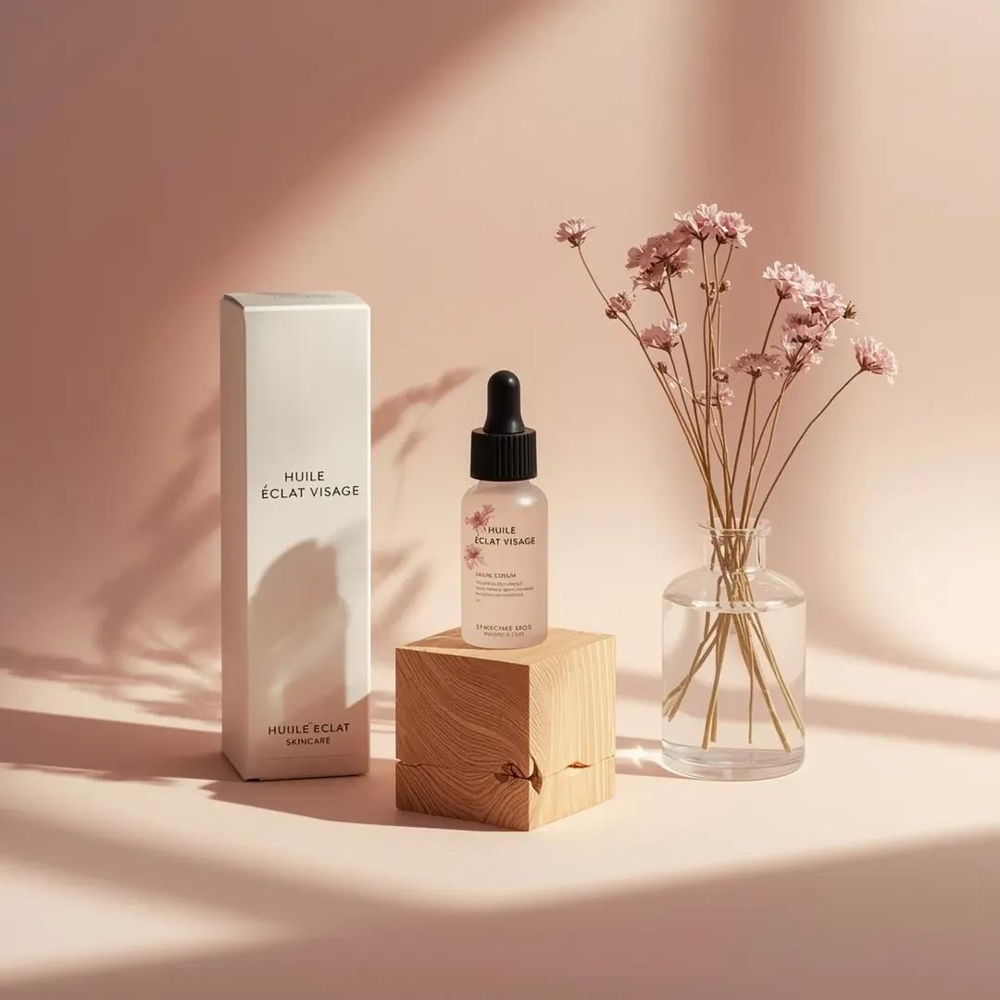</a></td></tr>
<tr><td width="50%"><a href="https://evolink.ai/gpt-image-2-prompts?utm_source=github&utm_medium=picture&utm_campaign=awesome-gpt-image-2-API-and-Prompts" target="_blank" rel="noopener noreferrer">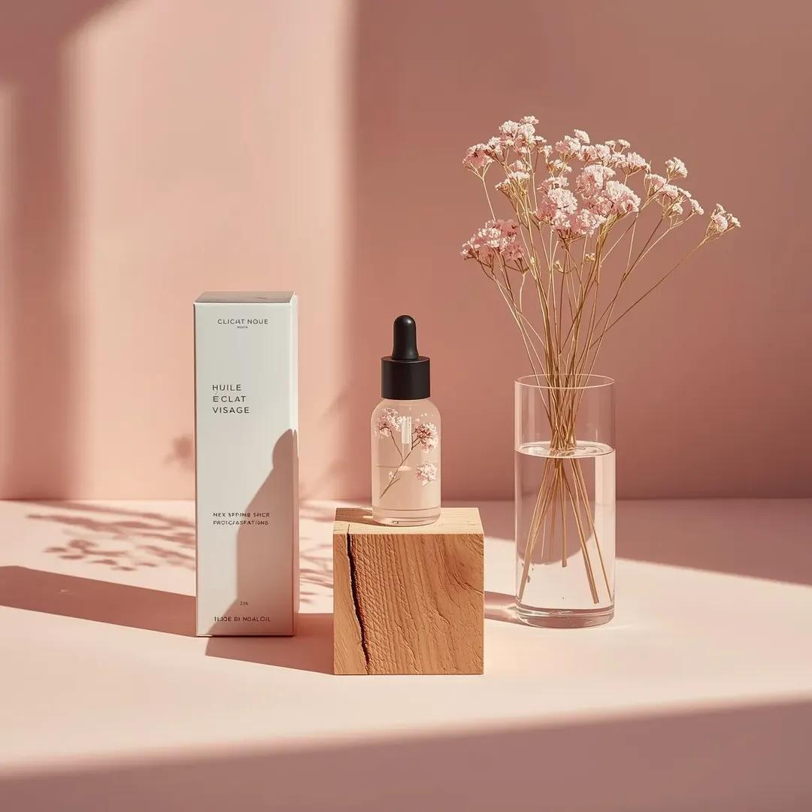</a></td><td width="50%"><a href="https://evolink.ai/gpt-image-2-prompts?utm_source=github&utm_medium=picture&utm_campaign=awesome-gpt-image-2-API-and-Prompts" target="_blank" rel="noopener noreferrer">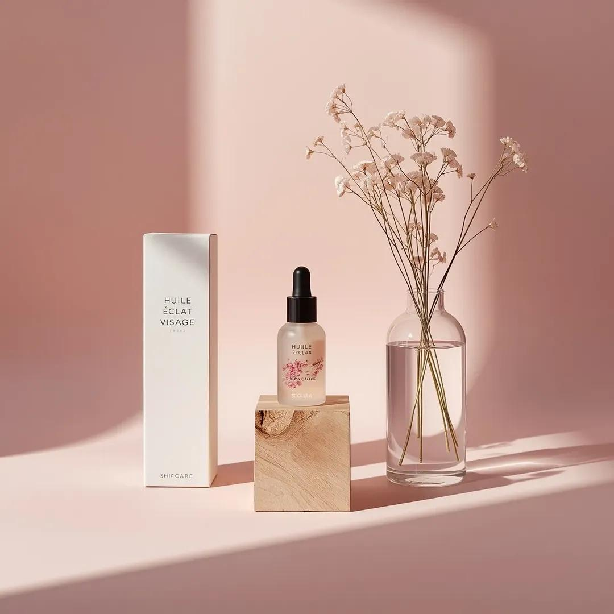</a></td></tr>
</table>

**Prompt:**

```
Minimalist studio product photography, a small transparent glass facial oil dropper bottle with a black rubber pipette cap, containing pale pink serum with suspended dried pink floral elements, centered on a natural raw wooden block with visible grain and split texture. Tall matte white skincare box on the left labeled "HUILE ÉCLAT VISAGE" with clean black typography and subtle logo near the bottom. Clear cylindrical glass vase on the right filled with water and thin stems of dried pink gypsophila extending upward. Composition rests on a smooth matte pastel pink surface against a matching seamless pink studio background. Strong directional soft light from the left casts long natural-style shadows of the flowers onto the background, with gentle highlights on the glass, subtle reflections on the serum bottle, and soft texture on the wooden block. Straight-on tabletop camera angle, all objects in sharp focus. Color palette: blush pink, soft rose, warm light wood, clean white, transparent glass. Premium Scandinavian minimalist skincare aesthetic, ultra-realistic, studio-grade.

full prompt:
```

## 📣 Ad Creative Cases

> **24 curated cases** — [Explore all Ad Creative Prompts →](cases/ad-creative.md)

<!-- Case 176: Luxury Chronograph Watch Ad (by @AlwaveNazca) -->
### Case 176: [Luxury Chronograph Watch Ad](https://x.com/AlwaveNazca/status/2048147643809865950) (by [@AlwaveNazca](https://x.com/AlwaveNazca))

|                                                                                                                                                                                               Output                                                                                                                                                                                              |
| :-----------------------------------------------------------------------------------------------------------------------------------------------------------------------------------------------------------------------------------------------------------------------------------------------------------------------------------------------------------------------------------------------: |
| <a href="https://evolink.ai/gpt-image-2-prompts?utm_source=github&utm_medium=picture&utm_campaign=awesome-gpt-image-2-API-and-Prompts" target="_blank" rel="noopener noreferrer"></a> |

**Prompt:**

```
A dramatic luxury product advertising image for a motorsport-inspired chronograph wristwatch in a dark studio. Center-left foreground, show a single stainless steel chronograph watch standing upright at a slight three-quarter angle, with a black dial, two red-accent subdials, slim silver hour markers, a tachymeter bezel, and visible crown and pushers on the right side. The watch has a black leather strap with bold red stitching along both edges and a sporty premium finish. To the right of the watch, place one black square presentation box slightly behind it, textured like leather, with red stitching around the lid and a silver embossed eye-shaped logo above the text "NESS STUDIO" and smaller red text "TRACK SURFACE." At the top center of the composition, add the same silver eye logo with the words "NESS STUDIO" and smaller "BY NICOLAS." Across the background, place one oversized blurred word, {argument name="headline text" default="PRECISION"}, in large gray capital letters spanning nearly the full width. The scene is set against a deep black background with cinematic red and white horizontal light streaks crossing behind the products from left to right, suggesting speed and racetrack energy. Use a glossy wet ground plane with reflective texture, catching red highlights and mirrorlike reflections beneath the watch and box. At the bottom center, add the text "CHRONOGRAPH SERIES" in clean white spaced capitals with thin red horizontal lines extending on both sides, and below it smaller red capitals reading {argument name="tagline text" default="ALSACE MADE"}. Color palette: black, charcoal gray, silver steel, vivid racing red, and a touch of white. Lighting should be high-contrast and premium, with crisp specular highlights on the metal case, subtle soft fill on the box, and moody shadows. Overall style: ultra-polished commercial product photography, luxury watch campaign, sharp focus on the products, sleek branding, high-end automotive aesthetic.
```

<!-- Case 176: Luxury chocolate campaign system (by @SPEEDAI07) -->
### Case 176: [Luxury chocolate campaign system](https://x.com/SPEEDAI07/status/2049459155086500321) (by [@SPEEDAI07](https://x.com/SPEEDAI07))

|                                                                                                                                                                                                 Output                                                                                                                                                                                                 |
| :----------------------------------------------------------------------------------------------------------------------------------------------------------------------------------------------------------------------------------------------------------------------------------------------------------------------------------------------------------------------------------------------------: |
| <a href="https://evolink.ai/gpt-image-2-prompts?utm_source=github&utm_medium=picture&utm_campaign=awesome-gpt-image-2-API-and-Prompts" target="_blank" rel="noopener noreferrer"></a> |

**Prompt:**

```
Create a premium, square (1:1) product advertisement for a fictional luxury chocolate brand called Noirvelle Chocolat, inspired by high-end chocolate brands. The ad should feel like a high-end editorial campaign, combining luxury food photography, refined packaging design, and cinematic lighting. Use matte black wrapper, subtle gold foil, elegant serif typography, and realistic product rendering. Generate flavor variants such as Blood Orange Noir, Salted Pistachio Muse, and Raspberry Ember with distinct mood, color palette, ingredients, headline, and supporting copy. Keep the chocolate bar as hero centerpiece with subtle reflections, shallow depth of field, luxury minimalism, and a small CTA: "Shop the drop."
```

<!-- Case 176: Surreal Brand World Poster (by @SaasJunctionHQ) -->
### Case 176: [Surreal Brand World Poster](https://x.com/SaasJunctionHQ/status/2050644926023844149) (by [@SaasJunctionHQ](https://x.com/SaasJunctionHQ))

|                                                                                                                                                                                            Output                                                                                                                                                                                            |
| :------------------------------------------------------------------------------------------------------------------------------------------------------------------------------------------------------------------------------------------------------------------------------------------------------------------------------------------------------------------------------------------: |
| <a href="https://evolink.ai/gpt-image-2-prompts?utm_source=github&utm_medium=picture&utm_campaign=awesome-gpt-image-2-API-and-Prompts" target="_blank" rel="noopener noreferrer"></a> |

**Prompt:**

```
A hyper-detailed surreal advertising poster for [BRAND NAME].

BACKGROUND: A large deep-toned rounded rectangle in [BRAND NAME]'s signature brand color fills 90% of the frame. Behind the subject, massive cropped brand typography bleeds off-frame, letters constructed from the brand's core material texture, embossed and lit with sharp directional rim lighting. Subtle noise grain texture overlays the background.

SUBJECT: Use the uploaded reference image. Preserve the subject's exact face and skin tone from the reference. The person faces camera in a three-quarter foreground stance, holding the brand's most iconic product directly toward the lens.

EXPRESSION: Restyle the subject's facial expression to match [BRAND NAME]'s brand personality and emotional tone.

OUTFIT: Completely restyle the subject's clothing into a character that naturally belongs to [BRAND NAME]'s universe. Use [BRAND NAME]'s exact brand palette and add small branded details.

SURREAL PRODUCT MOMENT: The product held by the subject opens, spills, or expands into a self-contained miniature world tied to [BRAND NAME]'s identity and values.

GRAPHIC LAYER: Scattered sparkle glyphs, floating micro-elements, layered soft fog, and subtle chromatic aberration at frame edges.

TEXT SYSTEM:
- TOP: Rounded pill badge, "[BRAND NAME]"
- CENTER-LEFT: Brand tagline in bold condensed uppercase
- BOTTOM STRIP: Four feature tags in a row

QUALITY: Unreal Engine render quality, octane lighting, macro lens bokeh on background elements, 8K sharp foreground.
```

<!-- Case 176: Luxury Fragrance Campaign Portrait (by @amynys) -->

### Case 176: [Luxury Fragrance Campaign Portrait](https://x.com/amynys/status/2054340951678587051) (by [@amynys](https://x.com/amynys))

|                                                                                                                                                                                                     Output                                                                                                                                                                                                    |
| :-----------------------------------------------------------------------------------------------------------------------------------------------------------------------------------------------------------------------------------------------------------------------------------------------------------------------------------------------------------------------------------------------------------: |
| <a href="https://evolink.ai/gpt-image-2-prompts?utm_source=github&utm_medium=picture&utm_campaign=awesome-gpt-image-2-API-and-Prompts" target="_blank" rel="noopener noreferrer"></a> |

**Prompt:**

```
Transform the uploaded portrait into a luxurious cinematic fragrance poster inspired by the dark seductive elegance of a high-fashion perfume campaign. Preserve her exact facial features, warm skin tone, confident expression, wavy brunette hair, and recognizable identity. Style her as a mysterious femme fatale with soft glossy lips, luminous skin, subtle smoky eyes, and an intense captivating gaze.

Dress her in a black satin slip dress with delicate lace trim and a glamorous faux fur wrap slipping off her shoulders. Place her inside a moody Parisian-inspired luxury interior with black reflective walls, gold rim lighting, deep shadows, cinematic contrast, and sensual ambient lighting. Add elegant reflections and depth for a premium editorial look.

Include a sleek black perfume bottle inspired by a luxury noir fragrance aesthetic near the foreground. Use refined minimalist typography in a luxury fashion-ad style with dramatic spacing and premium composition. Add a tagline such as: “She doesn’t follow. She leaves a trace.”

The overall mood should feel seductive, mysterious, powerful, feminine, cinematic, timeless, and ultra-luxurious — like a Chanel Coco Noir campaign directed by a Hollywood cinematographer. High detail, photorealistic skin texture, glossy highlights, rich blacks, warm gold accents, magazine-quality fashion photography, 8K luxury editorial finish.
```

<!-- Case 176: Berry Splash Cafe Campaign (by @iamaiistudio) -->

### Case 176: [Berry Splash Cafe Campaign](https://x.com/iamaiistudio/status/2054248552294158350) (by [@iamaiistudio](https://x.com/iamaiistudio))

|                                                                                                                                                                                                 Output                                                                                                                                                                                                |
| :---------------------------------------------------------------------------------------------------------------------------------------------------------------------------------------------------------------------------------------------------------------------------------------------------------------------------------------------------------------------------------------------------: |
| <a href="https://evolink.ai/gpt-image-2-prompts?utm_source=github&utm_medium=picture&utm_campaign=awesome-gpt-image-2-API-and-Prompts" target="_blank" rel="noopener noreferrer"></a> |

**Prompt:**

```
Prompt 1:
Create a vibrant lifestyle food ad set inside a colorful, trendy cafe. Show a smiling woman in a bright hot pink blazer seated at a wooden table, lifting a spoon as she eats an acai berry bowl topped with strawberries, blueberries, banana slices, and granola. Keep a clearly branded "Berry Loud" jar on the table. Add playful retro cream bubble-letter typography that reads "BERRY LOUD". Use a tropical cafe interior with hanging plants, warm natural sunlight, a cheerful mood, a bold pink-and-teal palette, shallow depth of field, cinematic food-photography realism, high detail, and a polished commercial campaign finish. Format: vertical 9:16. Quality: ultra realistic, 4k.

Prompt 2:
Create a dynamic food product advertisement for "Berry Loud" mixed berry blend. Feature an acai smoothie bowl overflowing with strawberries, raspberries, blueberries, blackberries, banana slices, and granola. Surround it with dramatic berry juice splashes and floating fruit frozen midair. Place a branded jar next to the bowl. Use a vivid hot pink background and large retro cream typography that says "NEW DROP BERRY LOUD". Keep the lighting glossy, the composition energetic, the colors vibrant, the textures ultra detailed, and the overall look like a polished studio-shot commercial poster with hyper-realistic food photography and splash-effect motion. Format: vertical 9:16. Quality: 4k.
```

<!-- Case 176: Fast Food Hero Poster (by @ShamsAmin56) -->

### Case 176: [Fast Food Hero Poster](https://x.com/ShamsAmin56/status/2054238324198625780) (by [@ShamsAmin56](https://x.com/ShamsAmin56))

|                                                                                                                                                                                              Output                                                                                                                                                                                              |
| :----------------------------------------------------------------------------------------------------------------------------------------------------------------------------------------------------------------------------------------------------------------------------------------------------------------------------------------------------------------------------------------------: |
| <a href="https://evolink.ai/gpt-image-2-prompts?utm_source=github&utm_medium=picture&utm_campaign=awesome-gpt-image-2-API-and-Prompts" target="_blank" rel="noopener noreferrer"></a> |

**Prompt:**

```
A cinematic 9:16 vertical composition featuring a gourmet "Smokey Obsidian" burger.
WHAT: A towering burger with a charcoal brioche bun, thick Wagyu beef patty with visible sear marks, melting aged gruyère dripping like lava, and crispy maple-glazed bacon.
FEEL: An atmosphere of "Urban Indulgence." Dark, moody lighting with a single warm amber spotlight. Wisps of real hickory smoke curl around the bun. The texture is hyper-realistic you can see the salt crystals on the crust and the moisture on the heirloom tomato.
SHOW: The burger is captured in a "deconstructed gravity" moment the top bun is slightly hovering, revealing the internal layers of house-made aioli and pickled red onions.
TYPOGRAPHY: Integration of ultra-bold, distressed sans-serif typeface overlapping the bottom third of the frame. The text reads "DEFY GRAVITY" in a raw, concrete-texture finish.
TECHNICAL: 4k resolution, macro photography style, shallow depth of field, neon-noir color grading (deep blacks, warm ambers, and subtle teal highlights).
```

<!-- Case 176: Matcha Granola Ad Poster (by @Sairah_0) -->

### Case 176: [Matcha Granola Ad Poster](https://x.com/Sairah_0/status/2054111354202779672) (by [@Sairah_0](https://x.com/Sairah_0))

|                                                                                                                                                                                                Output                                                                                                                                                                                               |
| :-------------------------------------------------------------------------------------------------------------------------------------------------------------------------------------------------------------------------------------------------------------------------------------------------------------------------------------------------------------------------------------------------: |
| <a href="https://evolink.ai/gpt-image-2-prompts?utm_source=github&utm_medium=picture&utm_campaign=awesome-gpt-image-2-API-and-Prompts" target="_blank" rel="noopener noreferrer"></a> |

**Prompt:**

```
(Matcha Granola Ad)

Ultra-realistic premium food advertisement poster for a healthy breakfast granola brand, centered matte pouch packaging labeled “Matcha Oat Granola”, green monochrome aesthetic, flat lay composition, soft studio lighting, vibrant matcha green background, surrounded by kiwi slices, almonds, oats, chia seeds, matcha powder bowl, granola bowls, scattered ingredients, clean modern typography headline “SUPERFOOD MORNING BOWL”, handwritten annotation arrows with wellness benefits, luxury organic branding, natural shadows, high-end commercial food photography, minimal yet detailed layout, symmetrical composition, sharp focus, Instagram ad style, 8k detail, healthy lifestyle marketing design.

Prompt : (Berry Yogurt Cereal Ad)

High-end commercial breakfast cereal advertisement, pastel pink aesthetic with centered standing pouch packaging labeled “Berry Yogurt Crunch Cereal”, surrounded by strawberries, blueberries, yogurt bowls, milk jug, crunchy granola, scattered berries and grains, soft natural lighting, vibrant fresh mood, modern bold typography headline “START FRESH EVERY MORNING”, handwritten callout arrows and benefit text, realistic food textures, luxury supermarket packaging design, clean flat lay composition, soft shadows, premium branding, glossy vibrant colors, ultra-detailed food photography, Instagram/Facebook ad campaign style, healthy breakfast concept, 8k realistic render.

Prompt : (Chocolate Protein Muesli Ad)

Premium protein breakfast food advertisement poster featuring centered pouch package labeled “Chocolate Protein Muesli”, rich brown monochrome theme, surrounded by dark chocolate chunks, almonds, oats, banana slices, milk jug, muesli bowls, scattered ingredients, dramatic warm studio lighting, bold modern headline typography “HIGH PROTEIN BREAKFAST FUEL”, handwritten annotation arrows highlighting benefits, luxury fitness breakfast branding, realistic textures, symmetrical flat lay composition, high-end commercial food photography, strong contrast, healthy energy concept, clean packaging mockup design, ultra-realistic 8k advertising render, cinematic food styling.
```

<!-- Case 176: Tropical Product Ad Poster (by @AIwithAliya) -->

### Case 176: [Tropical Product Ad Poster](https://x.com/AIwithAliya/status/2054553101236080714) (by [@AIwithAliya](https://x.com/AIwithAliya))

|                                                                                                                                                                                                 Output                                                                                                                                                                                                |
| :---------------------------------------------------------------------------------------------------------------------------------------------------------------------------------------------------------------------------------------------------------------------------------------------------------------------------------------------------------------------------------------------------: |
| <a href="https://evolink.ai/gpt-image-2-prompts?utm_source=github&utm_medium=picture&utm_campaign=awesome-gpt-image-2-API-and-Prompts" target="_blank" rel="noopener noreferrer"></a> |

**Prompt:**

```
GPT Image 2 Prompt Create a creative commercial advertising poster for [PRODUCT NAME], a [PRODUCT TYPE], inspired by vibrant tropical product campaigns. Place the product as a large hero object on the center-right with realistic glossy reflections, sharp label details, and premium lighting. Add a stylish model sitting beside or slightly in front of the product, naturally interacting with it by [MODEL ACTION]. The model should look [MOOD], wearing [OUTFIT STYLE], and should not cover the product label.
```

👉 **See all 19 Ad Creative prompt cases →**

<!-- Case 176: Foam Clogs Ad Poster (by @Shinning1010) -->
### Case 176: [Foam Clogs Ad Poster](https://x.com/Shinning1010/status/2055688162333401470) (by [@Shinning1010](https://x.com/Shinning1010))

|                                                                                                                                                                                              Output                                                                                                                                                                                             |
| :---------------------------------------------------------------------------------------------------------------------------------------------------------------------------------------------------------------------------------------------------------------------------------------------------------------------------------------------------------------------------------------------: |
| <a href="https://evolink.ai/gpt-image-2-prompts?utm_source=github&utm_medium=picture&utm_campaign=awesome-gpt-image-2-API-and-Prompts" target="_blank" rel="noopener noreferrer"></a> |

**Prompt:**

```
Create a premium vertical 4:5 commercial advertising poster for perforated foam clogs, making the shoes visually central, clean, and instantly legible. Use the uploaded portrait photo only for the woman’s appearance and hairstyle so the final result keeps a similar identity. Preserve face shape, facial features, hairstyle, skin tone, body proportion, and overall temperament only; do not copy the original expression, clothing, background, lighting, or pose. Style her in refined modern summer campaign wardrobe with effortless premium casual energy. Composition: a confident lifestyle fashion portrait with the woman seated or stepping forward in an airy sunlit architectural setting, the clogs clearly visible in the foreground and on-foot, showing their rounded shape, ventilation holes, heel strap, soft matte foam texture, and lightweight comfort. Atmosphere: elevated urban resort, fresh air, clean shadows, soft natural daylight, polished commercial photography, subtle water or glass reflections, crisp product detail, realistic skin texture, premium but approachable. Poster headline: “STEP INTO AIR”. Subtitle: “Lightweight comfort for every city moment.” Use clean modern typography with generous spacing, placed in reserved negative space without covering the face or shoes. No watermark.

Negative Prompt:
watermark, random text, misspelled headline, garbled letters, logo distortion, low quality, blurry, plastic skin, extra fingers, deformed hands, bad anatomy, overexposed highlights, unrealistic lighting, oversmoothed skin, cheap e-commerce look, AI-generated look, warped clog holes, incorrect shoe structure, melted foam texture, distorted heel strap, mismatched pair, hidden product, product cropped out, cluttered background
```

<!-- Case 176: Energy Drink Stadium Ad (by @Shorelyn_) -->
### Case 176: [Energy Drink Stadium Ad](https://x.com/Shorelyn_/status/2055570197973799376) (by [@Shorelyn_](https://x.com/Shorelyn_))

|                                                                                                                                                                                               Output                                                                                                                                                                                               |
| :------------------------------------------------------------------------------------------------------------------------------------------------------------------------------------------------------------------------------------------------------------------------------------------------------------------------------------------------------------------------------------------------: |
| <a href="https://evolink.ai/gpt-image-2-prompts?utm_source=github&utm_medium=picture&utm_campaign=awesome-gpt-image-2-API-and-Prompts" target="_blank" rel="noopener noreferrer"></a> |

**Prompt:**

```
Ultra realistic premium product advertising shot of a sleek aluminum energy drink can standing upright on a wet reflective surface inside a futuristic football stadium at night. The can design features vivid swirling rainbow brushstroke patterns in red, orange, yellow, green, and blue wrapping around the entire can, with a large glossy black and white soccer ball graphic in the center. Bold white distressed typography on the front reads “GOAL” with smaller clean modern text below saying “ENERGY DRINK”. Tiny premium icon details for energy, focus, and endurance near the bottom, along with “250 ml”.

The can is covered in realistic cold water droplets and condensation, highly detailed metallic texture, cinematic reflections, ultra sharp focus, luxury beverage commercial aesthetic, professional studio lighting.

Background filled with explosive colorful powder smoke clouds in blue, red, orange, green, and yellow bursting dramatically behind the can, combined with glowing football stadium floodlights, floating particles, water splashes, sparks, mist, and bokeh light effects. Dark moody environment with intense contrast and neon glow atmosphere.

Composition centered and symmetrical, low angle hero shot, shallow depth of field, hyper realistic, cinematic color grading, ultra detailed advertising photography, sports branding campaign aesthetic, IMAX quality, 8k resolution, volumetric lighting, premium commercial product render, high energy dynamic mood.
```

<!-- Case 183: Showroom Still Life Merch Drop (by @iamaiistudio) -->
### Case 183: [Showroom Still Life Merch Drop](https://x.com/iamaiistudio/status/2062279671618957656) (by [@iamaiistudio](https://x.com/iamaiistudio))

| Output |
| :----: |
| <a href="https://evolink.ai/gpt-image-2-prompts?utm_source=github&utm_medium=picture&utm_campaign=awesome-gpt-image-2-API-and-Prompts" target="_blank" rel="noopener noreferrer"></a> |

**Prompt:**

```
[BRAND NAME]. You are a Creative Director and Still Life Photographer for a high-fashion hypebeast magazine.

YOUR TASK:
Design a premium "Showroom Still Life" image to announce a limited merch drop for [BRAND NAME].

STEP 1: BRAND ANALYSIS
Study [BRAND NAME]: identify its industry and signature physical product (e.g., "Spalding" = basketballs, "McDonald's" = burger packaging, "Visa" = metal cards).
Choose the Color Palette:
- Background: a deep, rich, textured tone from the brand's secondary colors (Teal, Navy, Burgundy, or Slate Grey).
- Merch: a warm or neutral accent tone (Camel, Orange, or Cream) that pops against the backdrop.
- Apparel Piece: select something that fits the brand's energy (Varsity Letterman Jacket, Heavyweight Hoodie, Canvas Tote, or Wool Scarf).

STEP 2: SET DESIGN
Main Prop: a clean, modern White Powder-Coated Metal Rack or shelving unit.
Layout:
- The apparel piece hangs casually from the rack or a hanger, showing off its texture.
- On the rack shelves, stack several units of the brand's core product (e.g., basketballs, cans, boxes).
- Backdrop: hand-painted canvas in the chosen deep background color, with visible brushstrokes for that studio aesthetic.

STEP 3: BRANDING DETAILS
Apparel: feature premium physical branding via Chenille Patches, Embroidered Logos, or Screen Print on the sleeve or back. It should look like a genuinely expensive garment.
Products: ensure the [BRAND NAME] logo is clearly visible on all stacked items.

STEP 4: PHOTOGRAPHY
Lighting: soft, directional side window light with realistic soft shadows and rich texture highlights.
Focal length: 50mm or 85mm. Sharp focus on the merch, gentle background falloff.

STEP 5: GRAPHIC OVERLAY
Left-aligned composition:
- Large, clean white [BRAND NAME] logo placed in the negative space on the left.
- Beneath the logo, small white text with the brand's official tagline.
```


<!-- Case 184: Adidas Futuristic Drop Ad Poster 9:16 (by @iamaiistudio) -->
### Case 184: [Adidas Futuristic Drop Ad Poster 9:16](https://x.com/iamaiistudio/status/2065133774413906004) (by [@iamaiistudio](https://x.com/iamaiistudio))

| Output |
| :----: |
| <a href="https://evolink.ai/gpt-image-2-prompts?utm_source=github&utm_medium=picture&utm_campaign=awesome-gpt-image-2-API-and-Prompts" target="_blank" rel="noopener noreferrer"></a> |

**Prompt:**

```
Full prompt:

Design a striking premium vertical advertising poster (9:16 format) for a fictional ultra-limited Adidas sneaker called "ADIDAS AEROBLADE X - LIMITED DROP". The creative direction should feel like a world-class agency campaign — original, futuristic, visually explosive.

Main visual:
A single hero sneaker floating center-frame, captured at a dramatic low angle as if levitating above a dark obsidian running track split by glowing energy cracks. The shoe combines knit mesh, sculpted foam, translucent panels, reflective stripes, and a carbon-fiber sole plate. Neon light trails swirl around it like captured speed. Particles and mist add motion and intensity. Background features faint silhouettes of elite sprinters frozen mid-dash, blurred enough to keep focus on the shoe.

Color palette:
Matte black, electric red, silver, deep charcoal, with subtle neon blue highlights.

Typography and copy (sharp, clean, strong visual hierarchy):
Main headline: "OWN THE SPEED"
Product title: "ADIDAS AEROBLADE X"
Subheadline: "Built for the ones who never run ordinary."
Feature callouts in elegant boxed layout:
- "Featherlight Adaptive Knit Upper"
- "Carbon Energy Return Plate"
- "Precision Grip Traction"
- "Limited Collector Release"
Price: "$280"
Primary CTA: "DROP LIVE NOW"
Secondary CTA: "Only at
Footer text: "Performance innovation meets futuristic street identity."

Layout:
Bold oversized headline partially integrated into background. Product name near shoe in refined premium placement. Feature callouts stacked vertically along one side. Add a "LIMITED SERIES" badge. The composition blends luxury sports campaign with futuristic editorial design.

Style: Ultra-detailed hyper-realistic product photography, cinematic studio lighting, premium advertising aesthetics, sharp focus, rich textures, subtle atmosphere, dynamic motion energy, high-end commercial poster feel. Aspect ratio 9:16.

#AIart #GPTImage2
```

<!-- Case 185: Luxury Linen Texture Editorial Poster (by @ZephyraLeigh) -->
### Case 185: [Luxury Linen Texture Editorial Poster](https://x.com/ZephyraLeigh/status/2065123985713700925) (by [@ZephyraLeigh](https://x.com/ZephyraLeigh))

<table>
<tr><td width="50%"><a href="https://evolink.ai/gpt-image-2-prompts?utm_source=github&utm_medium=picture&utm_campaign=awesome-gpt-image-2-API-and-Prompts" target="_blank" rel="noopener noreferrer"></a></td><td width="50%"><a href="https://evolink.ai/gpt-image-2-prompts?utm_source=github&utm_medium=picture&utm_campaign=awesome-gpt-image-2-API-and-Prompts" target="_blank" rel="noopener noreferrer"></a></td></tr>
</table>

**Prompt:**

```
GPT Image 2 on ChatGPT 🪄

PROMPT ⬇

A photorealistic luxury editorial poster, 3:4 portrait ratio. Full frame covered in premium off-white Italian linen paper wall texture — warm ivory tone, subtle grain, ultra-tactile surface. Center of wall features a large precision-carved football-shaped archway with deep architectural relief — visible carved edges, realistic inner shadow depth, sculptural beveled detailing, premium craftsmanship aesthetic.
Inside the carved football frame: cinematic stadium atmosphere — deep blue and white luxury smoke trails drifting elegantly, gold and silver championship confetti cascading, white orchid and rose floral arrangements with dark green foliage accents, premium celebration balloons in royal blue and pearl white, championship trophy silhouettes subtly embedded in background haze. Atmosphere: elite sports gala, UEFA Champions League victory night energy.

Subject: Cristiano Ronaldo, full figure, standing powerfully inside the carved frame. Wearing Portugal's premium crimson and green national kit — authentic jersey fabric with realistic textile folds, fitted athletic shorts, premium Adidas/Nike high-performance football boots. Iconic athletic build — broad shoulders, defined physique, elite footballer anatomy. Signature confident expression — sharp jaw, focused dark eyes, short textured dark hair, photorealistic skin texture with natural pore detail.

Championship celebration pose — chest slightly forward, chin raised, one hand slightly relaxed, football resting precisely at his right boot.

3D Breakout Effect: Face, right shoulder, right arm below elbow, and right football boot extend realistically beyond the carved frame boundary onto the wall surface — casting soft natural drop shadows onto the paper texture. Depth of field creates believable dimensional layering.
Lighting: Premium stadium tungsten lighting blended with warm golden-hour cinematic sunlight entering from the upper left. Soft white rim light wrapping around shoulders and jawline. Subtle fill light on the wall from the right. No harsh overexposure, no fake neon — only warm, editorial luxury light grading.

Wall Typography — Clean Minimalist Luxury Layout:

CRISTIANO RONALDO — large, bold, high-end serif font (Didot or Bodoni style), embossed gold foil effect, positioned above the carved frame

CHAPTER 41 — medium weight elegant tracking, warm bronze metallic tone, centered below the name

365 MORE DAYS OF GREATNESS — refined thin uppercase sans-serif, spaced wide, cream-gold color, placed below Chapter line
Technical: Ultra-photorealistic rendering, 8K detail sharpness, professional commercial sports photography quality, luxury magazine cover art direction, natural color grading — warm ivory + deep blue + gold palette, authentic shadow physics, zero AI artifacts, correct human anatomy, no extra limbs, no tree shadows, no distorted proportions, award-winning editorial masterpiece quality.
```

<!-- Case 186: Luxury Watch Dramatic Beam Product Shot (by @meng_dagg695) -->
### Case 186: [Luxury Watch Dramatic Beam Product Shot](https://x.com/meng_dagg695/status/2065078841765458040) (by [@meng_dagg695](https://x.com/meng_dagg695))

| Output |
| :----: |
| <a href="https://evolink.ai/gpt-image-2-prompts?utm_source=github&utm_medium=picture&utm_campaign=awesome-gpt-image-2-API-and-Prompts" target="_blank" rel="noopener noreferrer"></a> |

**Prompt:**

```
A luxury watch emerges from darkness. Extreme macro shot of ticking gears and moving hands. Golden sparks and floating particles surround the watch. The camera circles the timepiece while dramatic light streaks reflect across the sapphire crystal. Slow-motion water splash freezes in midair around the watch. Mechanical components assemble themselves automatically. Cinematic black-and-gold environment, premium commercial lighting, ultra-realistic reflections, luxury lifestyle advertisement, powerful orchestral atmosphere, smooth camera motion, product hero shot, brand reveal, Hollywood-level commercial, 8K photorealism.
```

<!-- Case 187: 可口可乐百事雪碧品牌 KV 对比 (by @liyue_ai) -->
### Case 187: [可口可乐百事雪碧品牌 KV 对比](https://x.com/liyue_ai/status/2065039304175538382) (by [@liyue_ai](https://x.com/liyue_ai))

<table>
<tr><td width="50%"><a href="https://evolink.ai/gpt-image-2-prompts?utm_source=github&utm_medium=picture&utm_campaign=awesome-gpt-image-2-API-and-Prompts" target="_blank" rel="noopener noreferrer"></a></td><td width="50%"><a href="https://evolink.ai/gpt-image-2-prompts?utm_source=github&utm_medium=picture&utm_campaign=awesome-gpt-image-2-API-and-Prompts" target="_blank" rel="noopener noreferrer"></a></td></tr>
<tr><td width="50%"><a href="https://evolink.ai/gpt-image-2-prompts?utm_source=github&utm_medium=picture&utm_campaign=awesome-gpt-image-2-API-and-Prompts" target="_blank" rel="noopener noreferrer"></a></td></tr>
</table>

**Prompt:**

```
品牌 KV 海报系列。使用统一提示词框架，针对不同饮料品牌调整视觉情绪色彩：可口可乐 → 热烈红色聚会感；百事可乐 → 年轻蓝色潮流感；雪碧 → 清爽绿色柠檬感。同一结构展现不同品牌 DNA。3 张对比输出。
```


<!-- Case 188: Luxury Sneaker Editorial Grid (by @iamaiistudio) -->
### Case 188: [Luxury Sneaker Editorial Grid](https://x.com/iamaiistudio/status/2065964253505585436) (by [@iamaiistudio](https://x.com/iamaiistudio))

| Output |
| :----: |
| <a href="https://evolink.ai/gpt-image-2-prompts?utm_source=github&utm_medium=picture&utm_campaign=awesome-gpt-image-2-API-and-Prompts" target="_blank" rel="noopener noreferrer"></a> |

**Prompt:**

```
Louis Vuitton luxury leather sneaker campaign. High-fashion editorial, avant-garde aesthetic. Aspect ratio 3:4.

Materials: Full-grain calf leather, Monogram Embossed Canvas, Polished Gold Hardware.
Color palette: Cognac Brown, Deep Obsidian, Champagne Gold.
Lighting: High-contrast Chiaroscuro with soft-box key lighting.

9-cell editorial grid:

Row 1, Heritage:
- Hero side-profile: sneaker resting on a vintage LV trunk, side-lit to reveal the leather grain texture.
- Extreme macro close-up: gold-tone "LV" lace aglets and precision stitching detail.
- Dynamic shot: gold dust particles swirling around the sole as the shoe steps into frame.

Row 2, Innovation:
- Minimalist: sneaker balanced on top of an abstract, floating glass "V" sculpture.
- Floating deconstructed view: sole and upper suspended in a void.
- Sensory: a gloved hand adjusting the tongue, highlighting the softness of the leather.

Row 3, Surrealism:
- Monochromatic scene in LV Havane brown with liquid silk drapes.
- Abstract: rubber sole pattern reimagined as a geometric desert landscape.
- Fusion: sneaker walking on a mirror-still lake reflecting a Parisian sunset skyline.
```


<!-- Case 189: Wireless Earbuds Lifestyle Ad (by @iamaiistudio) -->
### Case 189: [Wireless Earbuds Lifestyle Ad](https://x.com/iamaiistudio/status/2065753093283991651) (by [@iamaiistudio](https://x.com/iamaiistudio))

| Output |
| :----: |
| <a href="https://evolink.ai/gpt-image-2-prompts?utm_source=github&utm_medium=picture&utm_campaign=awesome-gpt-image-2-API-and-Prompts" target="_blank" rel="noopener noreferrer"></a> |

**Prompt:**

```
Design a 9:16 vertical product infographic for Bolt True Wireless Earbuds with a high-end lifestyle ad feel.
Composition & Framing
Full-body shot of a young woman whose face, skin tone, and hairstyle match the reference photo exactly
Slightly low camera angle close to the subject, fashion campaign style, for depth and visual presence
She's seated casually on the floor, one knee up, one leg stretched toward the camera
Foreground (Product)
She holds an open Bolt earbud charging case out toward the viewer
One earbud is visible inside the case, the other is in her ear
The case is glossy white with "BOLT" branding
Slight macro bokeh blur on the hand and case for cinematic depth
Outfit & Style
Modern athleisure streetwear: off-white or neutral lightweight jacket, crop top or sports bra, soft pink joggers, textured white sneakers
Expression: confident and relaxed, subtle smile
Pose feels natural and lifestyle-driven, not posed
Background
Soft gray gradient studio background
Rainbow prism lens flares and subtle light leaks
Floating blurred earbuds and case in background
Studio floor texture visible underfoot
Lighting
Diffused commercial studio lighting emphasizing skin texture, the glossy case, and fabric detail
Soft rim light to separate the subject from the background
Text Overlays (modern sans-serif, white)
Top Center: "BOLT" in large bold text, partially behind the subject
Top Right: Bolt Earbuds / True Wireless
Mid Left: Powerful sound. / Effortless vibes. / Engineered for every beat of your day.
Mid Right: 30 hours of playtime / IPX5 water resistant
Bottom Right: 1 year warranty
Quality
8K ultra-realistic commercial photography
Sharp on face and earbuds, gentle depth blur on foreground and background
Clean Apple/Nike premium ad aesthetic, strong negative space
```

<!-- Case 190: Kinder Joy Swing Chair Scene (by @iamaiistudio) -->
### Case 190: [Kinder Joy Swing Chair Scene](https://x.com/iamaiistudio/status/2066312771978092587) (by [@iamaiistudio](https://x.com/iamaiistudio))

| Output |
| :----: |
| <a href="https://evolink.ai/gpt-image-2-prompts?utm_source=github&utm_medium=picture&utm_campaign=awesome-gpt-image-2-API-and-Prompts" target="_blank" rel="noopener noreferrer"></a> |

**Prompt:**

```
Hyper-realistic 8k medium shot photograph with shallow depth of field, surreal indoor scene with cinematic lighting. A normal-sized woman sits cross-legged inside a massive, highly detailed Kinder Joy egg that's been converted into a swing chair. The egg is split open, its white interior forming the seat and orange textured exterior visible, suspended by dark metal chains from a curved metal stand.

She wears a black t-shirt and blue-and-white plaid pajama pants, holding a small white teacup with both hands, gazing directly at the viewer with a calm, relaxed expression. Use uploaded face as reference.

On a polished wooden table to the left foreground: another gigantic fully wrapped Kinder Joy egg with intricate foil texture and branding details. To the right of the swing base: a vintage-style wooden radio with white dials, and a tiny bonsai tree in a small pot.

Soft warm directional lighting from the left casts subtle shadows, highlighting the detailed egg wrapper textures, clothing, and wooden surface. Background is a softly blurred warm-toned interior wall with pleasing bokeh. Standard lens, shot from mid-height.
```

<!-- Case 191: Invisible Shield Sunscreen Ad (by @iamrealsnow) -->
### Case 191: [Invisible Shield Sunscreen Ad](https://x.com/iamrealsnow/status/2066200217347854445) (by [@iamrealsnow](https://x.com/iamrealsnow))

<table>
<tr><td width="50%"><a href="https://evolink.ai/gpt-image-2-prompts?utm_source=github&utm_medium=picture&utm_campaign=awesome-gpt-image-2-API-and-Prompts" target="_blank" rel="noopener noreferrer"></a></td><td width="50%"><a href="https://evolink.ai/gpt-image-2-prompts?utm_source=github&utm_medium=picture&utm_campaign=awesome-gpt-image-2-API-and-Prompts" target="_blank" rel="noopener noreferrer"></a></td></tr>
</table>

**Prompt:**

```
SUNSCREEN AD, “THE INVISIBLE SHIELD”

Luxury skincare advertising masterpiece, a colossal premium sunscreen bottle standing on a pristine tropical shoreline at golden hour, powerful beams of sunlight crashing down from the sky and splitting apart upon contact with a transparent protective energy dome radiating from the sunscreen, millions of sparkling UV particles dissolving into golden dust before reaching flawless skin, crystal clear ocean reflections, flowing water suspended in mid air around the product, microscopic droplets catching cinematic sunlight, ultra realistic textures revealing every detail of the bottle surface, luxury beauty campaign aesthetics, dramatic volumetric lighting, glowing atmospheric haze, premium white and gold color palette, futuristic protection technology visualized as elegant light waves, hyper detailed environment, commercial photography perfection, award winning advertising design, photorealistic rendering, 16K ultra resolution, global skincare brand campaign, masterpiece quality.

Text Overlay:
SUNSCREEN

Tagline:
“Protect Every Ray. Reveal Every Glow.
```

<!-- Case 192: Hidden Logo Landscape Illusion (by @iamaiistudio) -->
### Case 192: [Hidden Logo Landscape Illusion](https://x.com/iamaiistudio/status/2066191259354689714) (by [@iamaiistudio](https://x.com/iamaiistudio))

<table>
<tr><td width="50%"><a href="https://evolink.ai/gpt-image-2-prompts?utm_source=github&utm_medium=picture&utm_campaign=awesome-gpt-image-2-API-and-Prompts" target="_blank" rel="noopener noreferrer"></a></td><td width="50%"><a href="https://evolink.ai/gpt-image-2-prompts?utm_source=github&utm_medium=picture&utm_campaign=awesome-gpt-image-2-API-and-Prompts" target="_blank" rel="noopener noreferrer"></a></td></tr>
</table>

**Prompt:**

```
Create a subliminal advertising landscape photograph where a recognizable brand logo (like the Apple logo, Nike swoosh, or Batman symbol) is secretly embedded into a breathtaking natural environment (like snowy mountains, dense jungle, sand dunes, or ocean coastline).

The logo must be formed entirely by the physical geography of the terrain — NOT overlaid digitally. The main body of the logo appears as a carved void (a deep valley, cliff edge, or sharp color contrast in the terrain), while any disconnected elements (like Apple's leaf) float as a suspended island of rock and earth in the misty sky above.

Camera: wide aerial drone shot, landscape stretching vast and majestic across the frame.

Atmosphere: dramatic and moody — heavy swirling clouds, rolling mist through valleys, crepuscular god rays bursting through gaps in the clouds, defining the hidden silhouette.

Visual rule: at first glance it must look like a 100% authentic nature photo. The brand logo only emerges as an optical illusion (pareidolia) on second look. Edges must be slightly jagged and organic, shaped by real geological features like cliff faces and treelines — never perfect vector shapes.

Lighting: high contrast between dark shadowed valleys (dense forests) and bright snow or sunlit highlights. Sun partially hidden behind clouds or the floating landmass, backlighting the entire scene.

Mood: cinematic, majestic, subtly surreal.

Output: 1:1 square, photorealistic, National Geographic aerial photography aesthetic.
```

<!-- Case 193: SPLASH Liquid Logo Fashion Poster (by @iamaiistudio) -->
### Case 193: [SPLASH Liquid Logo Fashion Poster](https://x.com/iamaiistudio/status/2065979523229975021) (by [@iamaiistudio](https://x.com/iamaiistudio))

| Output |
| :----: |
| <a href="https://evolink.ai/gpt-image-2-prompts?utm_source=github&utm_medium=picture&utm_campaign=awesome-gpt-image-2-API-and-Prompts" target="_blank" rel="noopener noreferrer"></a> |

**Prompt:**

```
Hyper-realistic fashion campaign poster for brand "SPLASH". A girl (matching the reference photo exactly, same face) seated confidently atop a gleaming, water-like 3D SPLASH logo surrounded by dynamic water splash effects. Editorial pose: one leg loose, one bent.

Enormous bold "SPLASH" typography fills the background, partially behind her. Small tagline reads: "Own Your Style."

Clothing: contemporary black streetwear (blazer, fitted top, trousers, sneakers).

Lighting: cinematic studio setup with soft key light and rim light, glossy reflections on the liquid logo.

Style: luxury fashion campaign aesthetic (Zara / H&M), polished clean environment.

Shot with an 85mm lens, shallow depth of field, 8K resolution, ultra-detailed, photorealistic.
```

<!-- Case 194: OBSIDIAN Coffee Brand Campaign (by @iamaiistudio) -->
### Case 194: [OBSIDIAN Coffee Brand Campaign](https://x.com/iamaiistudio/status/2066523210808484228) (by [@iamaiistudio](https://x.com/iamaiistudio))

| Output |
| :----: |
| <a href="https://evolink.ai/gpt-image-2-prompts?utm_source=github&utm_medium=picture&utm_campaign=awesome-gpt-image-2-API-and-Prompts" target="_blank" rel="noopener noreferrer"></a> |

**Prompt:**

```
Generate four cohesive high-end realistic editorial visuals for OBSIDIAN coffee brand. Cinematic, dark, mature aesthetic inspired by luxury sportswear and premium coffee advertising. Studio lighting that's dramatic yet controlled, photorealistic textures, clean compositional layout. Shot 1: Hero brand poster featuring 'OBSIDIAN' lettering with an artful coffee display — steam rising, beans scattered. Shot 2: Full product range — coffee bags, cans, and capsules arranged together. Shot 3: Tight packaging detail with tagline 'Coffee for grown-ups who chase flavor.' Shot 4: Lifestyle close-up of a steaming cup. Ultra-polished finish, crisp realistic materials, unified brand identity, no fantastical or surreal elements
```

<!-- Case 195: Coconut Paradise Skincare Ad (by @Strength04_X) -->
### Case 195: [Coconut Paradise Skincare Ad](https://x.com/Strength04_X/status/2067445760325734734) (by [@Strength04_X](https://x.com/Strength04_X))

| Output |
| :----: |
| <a href="https://evolink.ai/gpt-image-2-prompts?utm_source=github&utm_medium=picture&utm_campaign=awesome-gpt-image-2-API-and-Prompts" target="_blank" rel="noopener noreferrer"></a> |

**Prompt:**

```
Minimal white bottle with golden pump surrounded by cracked coconuts, coconut milk splash and foam clouds, tropical luxury spa atmosphere, creamy textures, realistic bubbles floating in background, premium skincare commercial, soft warm lighting, ultra detailed 8K.
```

<!-- Case 196: Reverse-Assembly Product VFX (by @iamaiistudio) -->
### Case 196: [Reverse-Assembly Product VFX](https://x.com/iamaiistudio/status/2067399156596175345) (by [@iamaiistudio](https://x.com/iamaiistudio))

<table>
<tr><td width="50%"><a href="https://evolink.ai/gpt-image-2-prompts?utm_source=github&utm_medium=picture&utm_campaign=awesome-gpt-image-2-API-and-Prompts" target="_blank" rel="noopener noreferrer">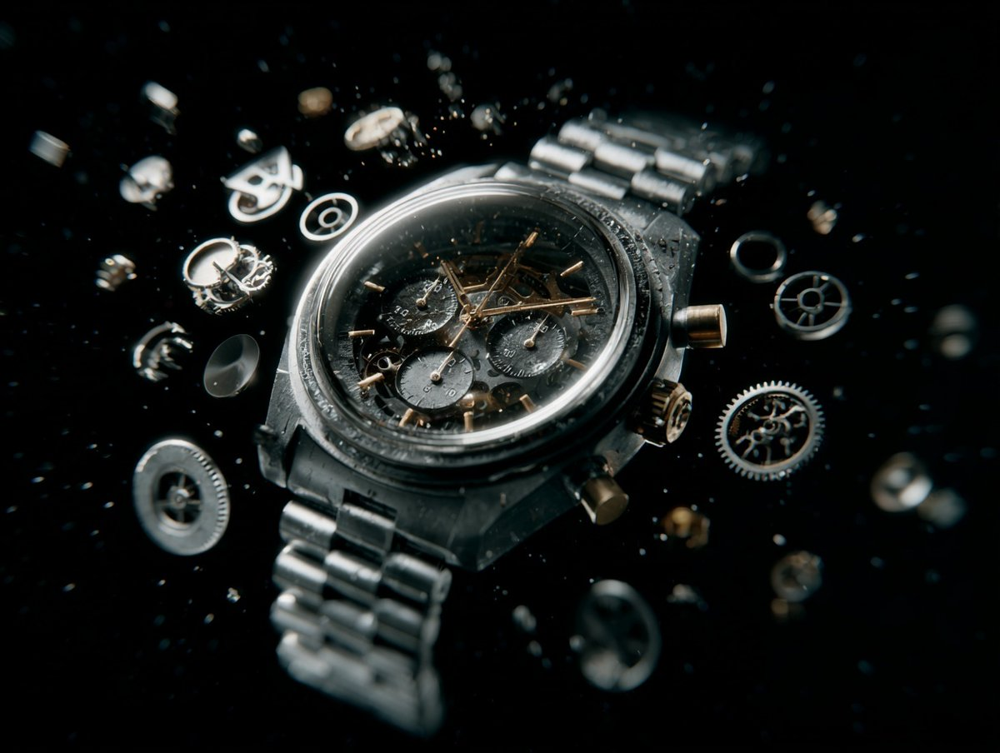</a></td><td width="50%"><a href="https://evolink.ai/gpt-image-2-prompts?utm_source=github&utm_medium=picture&utm_campaign=awesome-gpt-image-2-API-and-Prompts" target="_blank" rel="noopener noreferrer">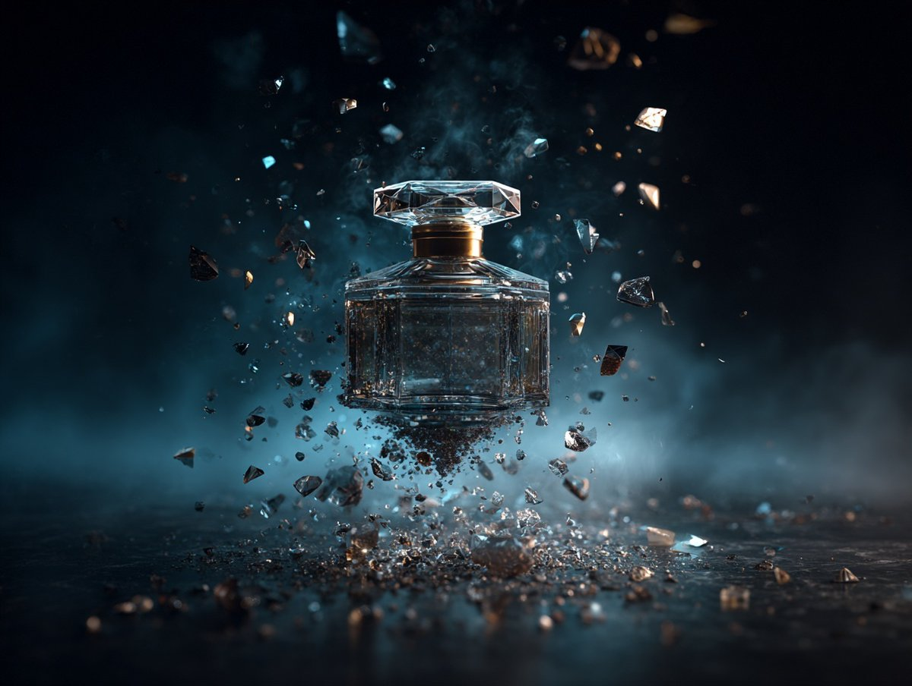</a></td></tr>
<tr><td width="50%"><a href="https://evolink.ai/gpt-image-2-prompts?utm_source=github&utm_medium=picture&utm_campaign=awesome-gpt-image-2-API-and-Prompts" target="_blank" rel="noopener noreferrer">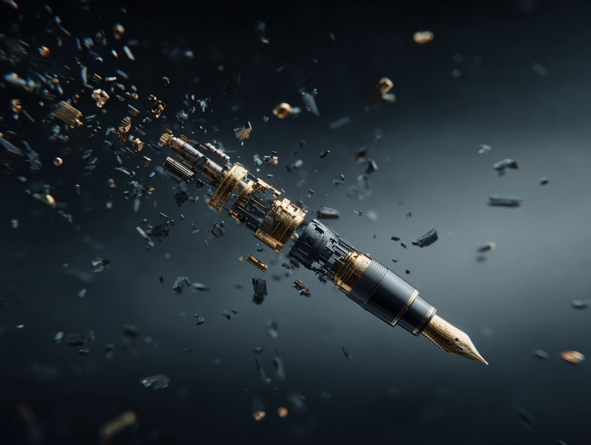</a></td><td width="50%"><a href="https://evolink.ai/gpt-image-2-prompts?utm_source=github&utm_medium=picture&utm_campaign=awesome-gpt-image-2-API-and-Prompts" target="_blank" rel="noopener noreferrer">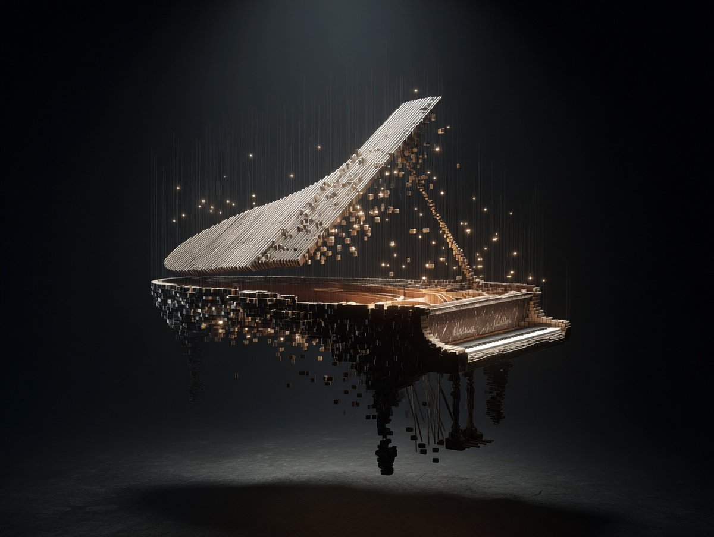</a></td></tr>
</table>

**Prompt:**

```
[PRODUCT] reassembling in midair from scattered pieces, reverse-disintegration effect, mechanical precision, each component suspended at a different depth, dark void background, high-concept product advertising, cinematic VFX.
```

## 🍌 Portrait & Photography Cases

> **126 curated cases** — [Explore all Portrait & Photography Prompts →](cases/portrait.md)

<!-- Case 124: Convenience Store Neon Portrait (by @BubbleBrain) -->
### Case 124: [Convenience Store Neon Portrait](https://x.com/BubbleBrain/status/2045167461147042202) (by [@BubbleBrain](https://x.com/BubbleBrain))

|                                                                                                                                                                                                 Output                                                                                                                                                                                                |
| :---------------------------------------------------------------------------------------------------------------------------------------------------------------------------------------------------------------------------------------------------------------------------------------------------------------------------------------------------------------------------------------------------: |
| <a href="https://evolink.ai/gpt-image-2-prompts?utm_source=github&utm_medium=picture&utm_campaign=awesome-gpt-image-2-API-and-Prompts" target="_blank" rel="noopener noreferrer"></a> |

**Prompt:**

```
35mm film photography with harsh convenience store fluorescent lighting mixed with colorful neon signs from outside, authentic film grain, high contrast, slight color cast, cinematic street editorial style, intimate medium shot, early 20s sexy Chinese female idol with ultra-realistic delicate refined Chinese features, seductive almond-shaped fox eyes with natural double eyelids, high nose bridge, small sharp V-shaped jawline, flawless porcelain skin with cool ivory undertone and visible specular highlights from fluorescent light, subtle skin texture and micro pores, natural dewy makeup with soft flush on cheeks, glossy natural pink lips slightly parted, subtle natural freckles across nose and cheeks, long dark brown hair in a messy high ponytail with many loose strands falling around face and neck, wearing an oversized white button-up shirt as the only top, unbuttoned at the top with deep cleavage and loosely tied at the waist, paired with a tiny black pleated mini skirt, barefoot in simple white slides, seductive casual leaning pose against the glass door of a 24-hour convenience store at late night, body slightly arched, one leg bent with foot resting against the door frame, the other leg straight, one hand holding a bottle of iced drink, the other hand lightly pulling the hem of her mini skirt, intensely seductive playful yet slightly vulnerable gaze straight at the viewer with soft doe eyes full of quiet temptation and teasing smile, bright cold fluorescent store light from inside mixed with pink and blue neon glow from outside signs, realistic reflections on glass door, blurred convenience store interior with shelves and snacks in background, authentic 35mm film color grading with harsh lighting and neon accents, extremely sharp yet soft skin rendering, natural hair strands, realistic fabric wrinkles and drape on the oversized shirt and mini skirt, no plastic skin, no digital over-sharpening, no airbrushing, no blemishes, no moles, no oily skin, no watermark, no text, authentic late-night convenience store atmosphere
```

<!-- Case 124: Ink-Etched Family Portrait (by @gdb) -->
### Case 124: [Ink-Etched Family Portrait](https://x.com/gdb/status/2048184698195870102) (by [@gdb](https://x.com/gdb))

|                                                                                                                                                                                               Output                                                                                                                                                                                              |
| :-----------------------------------------------------------------------------------------------------------------------------------------------------------------------------------------------------------------------------------------------------------------------------------------------------------------------------------------------------------------------------------------------: |
| <a href="https://evolink.ai/gpt-image-2-prompts?utm_source=github&utm_medium=picture&utm_campaign=awesome-gpt-image-2-API-and-Prompts" target="_blank" rel="noopener noreferrer"></a> |

**Prompt:**

```
A black-and-white hand-drawn family portrait in the style of detailed pen-and-ink crosshatching on textured white paper, showing 4 people seated closely together in a casual candid composition. On the left, an adult man in a dark baseball cap worn backward and a dark T-shirt leans into the frame, with a crossbody sling bag worn across his chest and visible zipper details. On the right, an adult woman with curly hair tied up in a loose high bun wears a light T-shirt with large collegiate block letters reading {argument name="shirt text" default="CITY"}. In the center are 2 young children sitting close together, both with short curly hair and matching light-colored T-shirts printed all over with strawberries. The child on the left leans inward with one arm crossing the other child, and the child on the right tilts their head slightly upward. The adults frame the children protectively, creating a warm family snapshot feeling. Render the whole image as a monochrome etched illustration with dense fine-line hatching, engraved shadows, crisp contour lines, and a realistic yet artistic likeness, with no color, no background setting beyond a plain light paper texture, and a vertical portrait crop.
```

<!-- Case 124: Chibi 3D Mini Me Photo Effect (by @miratechtool) -->
### Case 124: [Chibi 3D Mini Me Photo Effect](https://x.com/miratechtool/status/2051691169592033488) (by [@miratechtool](https://x.com/miratechtool))

|                                                                                                                                                                                                 Output                                                                                                                                                                                                |
| :---------------------------------------------------------------------------------------------------------------------------------------------------------------------------------------------------------------------------------------------------------------------------------------------------------------------------------------------------------------------------------------------------: |
| <a href="https://evolink.ai/gpt-image-2-prompts?utm_source=github&utm_medium=picture&utm_campaign=awesome-gpt-image-2-API-and-Prompts" target="_blank" rel="noopener noreferrer"></a> |

**Prompt:**

```
Mini "chibi 3D" versions of the same person appear around the original photo - sitting, climbing, playing, interacting with objects - with realistic shadows and depth. Keep base image unchanged. Add soft handwritten text: "Little versions of me... living my quiet moments." Include tiny props text like "You got this ♡". Cinematic, cozy, viral aesthetic.
```

<!-- Case 124: Wimbledon Broadcast Crowd Shot (by @Mavericks_Prod) -->

### Case 124: [Wimbledon Broadcast Crowd Shot](https://x.com/Mavericks_Prod/status/2054342640439566739) (by [@Mavericks_Prod](https://x.com/Mavericks_Prod))

|                                                                                                                                                                                                 Output                                                                                                                                                                                                 |
| :----------------------------------------------------------------------------------------------------------------------------------------------------------------------------------------------------------------------------------------------------------------------------------------------------------------------------------------------------------------------------------------------------: |
| <a href="https://evolink.ai/gpt-image-2-prompts?utm_source=github&utm_medium=picture&utm_campaign=awesome-gpt-image-2-API-and-Prompts" target="_blank" rel="noopener noreferrer"></a> |

**Prompt:**

```
A screenshot from a live Wimbledon TV broadcast during a packed Centre Court match. The camera cuts to the audience, an unbelievably attractive woman in her 20s with long black hair, flawless skin, elegant makeup, and a luxurious aura, seated in the VIP section wearing a sophisticated cream-white low-cut summer outfit with subtle jewelry. She smiles naturally while reacting to the match, unaware she's on camera. Wealthy spectators and champagne glasses around her, old-money tennis atmosphere, shallow depth of field. Full live tennis broadcast overlay: scoreboard, network watermark, broadcast graphics, 16:9 aspect ratio. The image looks exactly like a real TV screenshot, telephoto broadcast lens, realistic live color grading, slight compression artifacts, interlacing grain, subtle motion blur, imperfect live-camera framing.
```

<!-- Case 124: Rainy Street Golden Portrait (by @harboriis) -->

### Case 124: [Rainy Street Golden Portrait](https://x.com/harboriis/status/2054238941482733685) (by [@harboriis](https://x.com/harboriis))

|                                                                                                                                                                                                Output                                                                                                                                                                                                |
| :--------------------------------------------------------------------------------------------------------------------------------------------------------------------------------------------------------------------------------------------------------------------------------------------------------------------------------------------------------------------------------------------------: |
| <a href="https://evolink.ai/gpt-image-2-prompts?utm_source=github&utm_medium=picture&utm_campaign=awesome-gpt-image-2-API-and-Prompts" target="_blank" rel="noopener noreferrer"></a> |

**Prompt:**

```
Ultra-realistic cinematic street photography of a young man standing alone on a rainy urban sidewalk during golden hour sunset in Mumbai, India. He is leaning casually against a black metal roadside railing while looking down at his smartphone, wearing an oversized black hoodie, loose dark blue cargo jeans, and clean white sneakers. Messy textured black hair moving slightly in the wind. Moody introspective vibe.

Wide-angle composition with dramatic depth and strong leading lines from the wet pavement and railings. Reflective rain-soaked street surface glowing with warm sunset light. Vintage street lamps lining the sidewalk. Historic Gothic architecture inspired by Chhatrapati Shivaji Maharaj Terminus visible on the right side, detailed stone textures and clock tower. Modern skyscrapers fading into atmospheric haze in the distant background, creating a blend of old and new Mumbai cityscape.

Soft cinematic clouds filling the sky with warm orange, peach, and golden tones. A flying bird silhouette crossing the sky. Light traffic with black-and-yellow taxis and blurred cars moving through the street. Realistic puddle reflections, subtle motion blur, volumetric lighting, atmospheric perspective, ultra-detailed textures, natural shadows, realistic skin tones.

Shot on Sony A7R IV, 35mm lens, f/1.8, shallow depth of field, HDR photography, photorealistic, cinematic color grading, warm highlights with cool shadows, highly detailed urban realism, editorial photography style, 8K ultra resolution.
```

<!-- Case 124: Cozy Cafe Editorial Portrait (by @sha_zdiii) -->

### Case 124: [Cozy Cafe Editorial Portrait](https://x.com/sha_zdiii/status/2054047328420634927) (by [@sha_zdiii](https://x.com/sha_zdiii))

|                                                                                                                                                                                                Output                                                                                                                                                                                                |
| :--------------------------------------------------------------------------------------------------------------------------------------------------------------------------------------------------------------------------------------------------------------------------------------------------------------------------------------------------------------------------------------------------: |
| <a href="https://evolink.ai/gpt-image-2-prompts?utm_source=github&utm_medium=picture&utm_campaign=awesome-gpt-image-2-API-and-Prompts" target="_blank" rel="noopener noreferrer"></a> |

**Prompt:**

```
.

Ultra-realistic cozy Japanese-Korean café photography featuring a cute young [Japanese/Korean] couple sitting together naturally in a trendy aesthetic café. The young couple should look stylish and youthful, wearing [fashion style/outfit colors], smiling softly and enjoying desserts together.
The table is beautifully filled with [desserts/foods] such as pancakes, strawberry cakes, macarons, croissants, pastries, iced coffees, matcha lattes, fruit desserts, and aesthetic drinks arranged in a visually satisfying composition. Add small aesthetic café props like [flowers/ribbons/books/candles/pearls/notebooks] on the table for a premium Pinterest moodboard feel.
Soft [lighting style] lighting enters through the café windows creating dreamy highlights, creamy shadows, glossy reflections on drinks, and realistic dessert textures. Background should contain softly blurred [Japanese/Korean] signs, glowing café boards, handwritten Japanese text, neon typography, and aesthetic city café elements for an authentic Tokyo/Seoul vibe.
Add cute scrapbook-style doodles and handwritten notes around the image in [doodle color] ink — tiny hearts, stars, sparkles, ribbons, arrows, smiley sketches, bows, diary stickers, and handwritten café notes.
Color palette should focus on [color theme] tones. Style inspired by viral Pinterest café photography, Korean lifestyle aesthetics, Japanese cozy café culture, dreamy Gen-Z romance mood, shallow depth of field, cinematic composition, ultra realistic food textures, soft blurry background, ultra detailed realistic photography, clean aesthetic layout, 8k.
```

<!-- Case 124: Watercolor Fashion Sketch (by @Naiknelofar788) -->

### Case 124: [Watercolor Fashion Sketch](https://x.com/Naiknelofar788/status/2054741712011223312) (by [@Naiknelofar788](https://x.com/Naiknelofar788))

|                                                                                                                                                                                               Output                                                                                                                                                                                              |
| :-----------------------------------------------------------------------------------------------------------------------------------------------------------------------------------------------------------------------------------------------------------------------------------------------------------------------------------------------------------------------------------------------: |
| <a href="https://evolink.ai/gpt-image-2-prompts?utm_source=github&utm_medium=picture&utm_campaign=awesome-gpt-image-2-API-and-Prompts" target="_blank" rel="noopener noreferrer"></a> |

**Prompt:**

```
Transform the uploaded photo into a full-body watercolor fashion illustration in the style of an elegant runway design sketch. Preserve the original outfit, pose, silhouette, colors, fabrics, accessories, shoes, hairstyle and overall styling from the photo. Do not redesign the clothing. Use elongated fashion-sketch proportions The clothing should remain realistic and recognizable, with accurate cut, fit, folds, fabric texture, prints and details. Style: high-fashion watercolor illustration, loose expressive ink lines, delicate pencil contour, transparent watercolor washes, soft shadows, painterly texture, minimalist editorial mood. White or very light background, clean composition, full body centered, lots of negative space. Elegant, modern, airy, like a professional fashion designer sketch.
```

<!-- Case 124: Retro Newsstand Fashion Scene (by @harboriis) -->

### Case 124: [Retro Newsstand Fashion Scene](https://x.com/harboriis/status/2054484765001306285) (by @harboriis)

|                                                                                                                                                                                                 Output                                                                                                                                                                                                |
| :---------------------------------------------------------------------------------------------------------------------------------------------------------------------------------------------------------------------------------------------------------------------------------------------------------------------------------------------------------------------------------------------------: |
| <a href="https://evolink.ai/gpt-image-2-prompts?utm_source=github&utm_medium=picture&utm_campaign=awesome-gpt-image-2-API-and-Prompts" target="_blank" rel="noopener noreferrer"></a> |

**Prompt:**

```
A cinematic fashion editorial scene of 8 diverse young adults gathered around a vintage urban newsstand kiosk with a bold "NEWSSTAND" sign, set in a gritty indoor street environment with worn concrete floors, dark industrial walls, and subtle urban details. Newspapers fly dynamically through the air in mid-motion, creating layered depth and energy with natural motion blur. The group is styled in coordinated 90s-inspired retro streetwear - oversized jackets, layered fits, sunglasses, caps, and muted earth tones. (olive green, brown, cream, navy). Composition is carefully balanced: one subject leans casually against the kiosk holding a newspaper, one sits confidently on a cream vintage scooter in the foreground, another rests on a teal scooter, while others stand or sit on chairs with relaxed, confident poses and subtle attitude. Shot from a slightly elevated angle (top-down perspective), wide 35mm lens, maintaining natural proportions. Lighting is soft cinematic with warm highlights and diffused shadows, creating a premium fashion campaign mood. Background includes scattered newspapers, a red fire hydrant, and industrial textures for realism. Ultra-detailed, photorealistic, shallow depth of field, crisp subject focus, soft film grain, natural color grading, high-end magazine aesthetic, 4K quality.
```

<!-- Case 124: Early 1990s Flash Portrait (by @bmx_ai13) -->

### Case 124: [Early 1990s Flash Portrait](https://x.com/bmx_ai13/status/2054459126084718785) (by [@bmx_ai13](https://x.com/bmx_ai13))

|                                                                                                                                                                                               Output                                                                                                                                                                                               |
| :------------------------------------------------------------------------------------------------------------------------------------------------------------------------------------------------------------------------------------------------------------------------------------------------------------------------------------------------------------------------------------------------: |
| <a href="https://evolink.ai/gpt-image-2-prompts?utm_source=github&utm_medium=picture&utm_campaign=awesome-gpt-image-2-API-and-Prompts" target="_blank" rel="noopener noreferrer"></a> |

**Prompt:**

```
Early 1990s Flash Camera Portrait GPT image 2 on ChatGPT Prompt Template. Use the uploaded image as the main reference. Transform the uploaded photo into a realistic candid portrait with an early 1990s digital camera aesthetic. Preserve the subject’s identity, facial features, pose, outfit, and overall composition, but restyle the image with harsh blown-out flash highlights, subtle red-eye effect, low-resolution image quality, raw snapshot imperfections, nostalgic flash-filter styling, and a vintage timestamp look. The final image should feel candid, imperfect, and authentic, like an old retro party or personal snapshot taken with an early consumer digital camera. Keep the background dark or naturally subdued when appropriate, maintain a direct-flash look, and give the image a raw, unpolished, memory-like atmosphere. Include: - harsh direct camera flash - overexposed or blown-out highlights - subtle red-eye effect - low-resolution / soft digital detail - slight grain or noisy texture - authentic retro snapshot feeling - vintage date/timestamp aesthetic in one corner - candid, natural, imperfect energy Avoid: - cartoon or anime style - overly polished beauty retouching - studio lighting - ultra-sharp modern DSLR look - glossy AI skin - text, logos, watermarks, or graphic overlays other than the timestamp aesthetic - distorted anatomy or altered identity Make the aspect ratio 3:4
```

👉 **See all 68 Portrait & Photography prompt cases →**

<!-- Case 124: Origami Portrait Illustration (by @Inshrah_ali_) -->
### Case 124: [Origami Portrait Illustration](https://x.com/Inshrah_ali_/status/2055696156211179912) (by [@Inshrah_ali_](https://x.com/Inshrah_ali_))

|                                                                                                                                                                                                 Output                                                                                                                                                                                                |
| :---------------------------------------------------------------------------------------------------------------------------------------------------------------------------------------------------------------------------------------------------------------------------------------------------------------------------------------------------------------------------------------------------: |
| <a href="https://evolink.ai/gpt-image-2-prompts?utm_source=github&utm_medium=picture&utm_campaign=awesome-gpt-image-2-API-and-Prompts" target="_blank" rel="noopener noreferrer"></a> |

**Prompt:**

```
Ultra-detailed origami paper art portrait of given picture, entirely crafted from meticulously folded paper layers and intricate geometric origami shapes. Realistic paper texture with visible creases and handcrafted folds, defining a low-poly facial structure. Elegant Japanese-inspired aesthetic. Layered paper background featuring delicate cherry blossoms, majestic mountains, stylized sun motifs, and abstract folded patterns. Luxurious gold, black, cream, and white color palette. she wears a football jersey made from artfully folded paper fabric. Dramatic cinematic studio lighting, casting ultra-realistic shadows and creating profound depth. A highly detailed handcrafted paper sculpture, presented in a premium gallery artwork style. Sharp focus, sophisticated composition, and tactile paper texture. Masterpiece quality, 8k ultra detailed. Toy-free, no plastic, no CGI look.
```

<!-- Case 124: Luxury Portrait With Tiny Alter Ego (by @Professor_134) -->
### Case 124: [Luxury Portrait With Tiny Alter Ego](https://x.com/Professor_134/status/2055561008626950422) (by [@Professor_134](https://x.com/Professor_134))

|                                                                                                                                                                                                    Output                                                                                                                                                                                                   |
| :---------------------------------------------------------------------------------------------------------------------------------------------------------------------------------------------------------------------------------------------------------------------------------------------------------------------------------------------------------------------------------------------------------: |
| <a href="https://evolink.ai/gpt-image-2-prompts?utm_source=github&utm_medium=picture&utm_campaign=awesome-gpt-image-2-API-and-Prompts" target="_blank" rel="noopener noreferrer"></a> |

**Prompt:**

```
- Ultra-cinematic luxury portrait of a fashionable young man standing confidently beside his tiny animated counterpart inside a sophisticated studio setup. The adult character has thick styled black hair, deep brown eyes, a perfectly trimmed beard, warm tan skin, and a calm charismatic smile. He wears an elegant matte-black tuxedo with a fitted black shirt, luxury wristwatch, and minimal jewelry, exuding a modern gentleman aesthetic. His posture is composed with hands clasped naturally in front of him while leaning subtly against a textured charcoal wall.

Next to him stands a miniature stylized version of himself designed in high-end 3D animated character style, featuring oversized sparkling eyes, soft youthful facial proportions, glossy hair, expressive eyebrows, and adorable Pixar-inspired detailing. The child version mirrors the exact outfit and pose of the adult, creating a visually emotional “future meets childhood” composition.

The background is a dark cinematic studio wall with subtle warm gradients, textured concrete finish, and handwritten artistic signature typography painted casually on the wall. Ambient golden lighting softly wraps around both characters, producing realistic highlights, cinematic shadows, and luxury editorial depth. The mood feels emotional, premium, stylish, and heartwarming.

Shot using a professional full-frame portrait lens, shallow depth of field, ultra-sharp focus on faces, soft blurred background, realistic fabric folds, detailed skin texture, ray-traced reflections, cinematic contrast, rich black tones, and premium color grading.

Style references: luxury fashion campaign, Pixar realism, Disney-inspired miniature character design, high-end magazine photography, Unreal Engine 5 realism, Octane Render, volumetric lighting, ultra-detailed 8K masterpiece, elegant masculine aesthetic, modern studio portrait, emotionally cinematic composition.
Generate image using uploaded image as reference
```

<!-- Case 124: Ink Glyph Portrait (by @harboriis) -->
### Case 124: [Ink Glyph Portrait](https://x.com/harboriis/status/2055560455494738411) (by @harboriis)

|                                                                                                                                                                                           Output                                                                                                                                                                                           |
| :----------------------------------------------------------------------------------------------------------------------------------------------------------------------------------------------------------------------------------------------------------------------------------------------------------------------------------------------------------------------------------------: |
| <a href="https://evolink.ai/gpt-image-2-prompts?utm_source=github&utm_medium=picture&utm_campaign=awesome-gpt-image-2-API-and-Prompts" target="_blank" rel="noopener noreferrer"></a> |

**Prompt:**

```
Use the uploaded photo as the main face reference. Preserve the exact facial structure, skin tone, beard shape, nose, eyes and expression from the reference image. A dramatic, high-impact portrait rendered in an expressive ink sketch and mixed-media illustration style, using the uploaded image for exact facial likeness and proportions. The man is shown in side profile, his presence intense and chaotic. His face and upper body are layered with cryptic handwritten  text, symbols, and abstract glyphs, partially wrapping around facial contours, suggesting inner turmoil and hidden meaning He wears a dark, abstract jacket, heavily texture strokes, sharp angular linework, and vibrant ink creating a raw, rebellious visual energy. The illu bold and experimental, blending fine pen detaili aggressive brush marks, splashes, and controll The background is a pale, aged parchment ton grain, faded paper texture, delicate linework, in! stains-evoking an old manuscript  Or forgotten High contrast, expressive composition, artistic with precision, editorial art meets conceptual il intense, and emotionally charged
```

<!-- Case 124: Y2K Cyber-Pop Editorial Shot (by @noorlewisx) -->
### Case 124: [Y2K Cyber-Pop Editorial Shot](https://x.com/noorlewisx/status/2055507148541493282) (by [@noorlewisx](https://x.com/noorlewisx))

|                                                                                                                                                                                                Output                                                                                                                                                                                                |
| :--------------------------------------------------------------------------------------------------------------------------------------------------------------------------------------------------------------------------------------------------------------------------------------------------------------------------------------------------------------------------------------------------: |
| <a href="https://evolink.ai/gpt-image-2-prompts?utm_source=github&utm_medium=picture&utm_campaign=awesome-gpt-image-2-API-and-Prompts" target="_blank" rel="noopener noreferrer"></a> |

**Prompt:**

```
Don’t alter my facial feature. Create me a wide editorial shot of a girl leaning dramatically across a cluttered floor/desk in a chaotic Y2K cyber-pop room, low front-facing angle with cinematic framing. Moody cool-toned lighting mixed with warm highlights, glossy flash photography feel, dreamy magazine-editorial atmosphere. Long sleek jet-black hair with center part, soft pale glam makeup, subtle blush, glossy gradient red lips, large doll-like eyes with soft eyeliner and lashes. Red fitted tank top and dark mini skirt, colorful manicure, slightly messy dramatic pose with arms stretched forward, intense direct gaze at camera. Surrounding scene filled with scattered random objects, cables, gadgets, accessories, glittery props, and bedroom clutter for a chaotic pop-girl aesthetic. Collage-style edit layered with floating heart gems, cut-out eyes, sticker elements, scrapbook graphics, fake text-message popups, polaroid frames, magazine cutout of the girl, bold typography overlays, hyperpop/K-pop editorial vibe, nostalgic Y2K internet aesthetic, glossy fashion-campaign energy. Scale ratio 4:3
```

<!-- Case 124: Cozy Doodle Lifestyle Photo (by @Sairah_0) -->
### Case 124: [Cozy Doodle Lifestyle Photo](https://x.com/Sairah_0/status/2055500670564991079) (by @Sairah_0)

|                                                                                                                                                                                                Output                                                                                                                                                                                               |
| :-------------------------------------------------------------------------------------------------------------------------------------------------------------------------------------------------------------------------------------------------------------------------------------------------------------------------------------------------------------------------------------------------: |
| <a href="https://evolink.ai/gpt-image-2-prompts?utm_source=github&utm_medium=picture&utm_campaign=awesome-gpt-image-2-API-and-Prompts" target="_blank" rel="noopener noreferrer"></a> |

**Prompt:**

```
(Cozy Aesthetic Girl in Park)

Aesthetic lifestyle photography of a cute young woman sitting on a wooden park bench during autumn morning, wearing an oversized beige hoodie, white pants, and cream baseball cap, holding a takeaway coffee cup with eyes closed and peaceful smile, soft natural lighting, warm earthy tones, tote bag with kawaii face design beside her, bouquet of baby’s breath flowers, cozy calm vibe, cinematic depth of field, Pinterest aesthetic, soft brown and beige color palette. Add hand-drawn white doodles around the image including hearts, sparkles, arrows, clouds, smiley faces, and handwritten text like “coffee = my love”, “good morning”, “little things”, “Focus Believe Achieve”. Whimsical scrapbook style overlay, dreamy cozy mood, ultra detailed, realistic photography, Instagram aesthetic, soft shadows, candid composition.

Prompt : (Cozy Reading & Coffee Setup)

Warm cozy morning aesthetic near a window, open book being read beside a cup of coffee and lit candle, soft sunlight entering through the window, baby’s breath flowers in glass vase, beige and cream minimal decor, calming self-care atmosphere, soft fabric textures, neutral warm tones, peaceful hygge mood, cinematic lifestyle photography, Pinterest-inspired cozy setup, realistic details, shallow depth of field. Add cute white hand-drawn doodles and kawaii faces on the mug, candle, and vase, with handwritten notes like “Take time to make your soul happy”, “Cozy mood”, “little things”, “Book + coffee = perfect day”, plus hearts, arrows, sparkles, and cloud doodles. Dreamy soft aesthetic, warm natural glow, highly detailed, relaxing cozy-core vibe.
```


<!-- Case 125: Y2K Street-Art Editorial Poster (by @kingofdairyque) -->
### Case 125: [Y2K Street-Art Editorial Poster](https://x.com/kingofdairyque/status/2056273485131821345) (by @kingofdairyque)

|                                                                                                                                                                                                Output                                                                                                                                                                                                |
| :--------------------------------------------------------------------------------------------------------------------------------------------------------------------------------------------------------------------------------------------------------------------------------------------------------------------------------------------------------------------------------------------------: |
| <a href="https://evolink.ai/gpt-image-2-prompts?utm_source=github&utm_medium=picture&utm_campaign=awesome-gpt-image-2-API-and-Prompts" target="_blank" rel="noopener noreferrer"></a> |

**Prompt:**

```
hair instructions, controlling hairstyle, changing hairstyle, young female, young male, bad anatomy, extra fingers, deformed hands, stiff pose, awkward body lean, distorted sunglasses, warped face, asymmetrical eyes, blurry face, low quality, low resolution, muddy colors, overcluttered layout, too many stickers, unreadable typography, misspelled text, cheap poster design, random logos, watermark, cartoon-only style, duplicate subject, extra limbs, plastic skin.
```

<!-- Case 126: LEGO Miniature City Editorial (by @frametheory058) -->
### Case 126: [LEGO Miniature City Editorial](https://x.com/frametheory058/status/2056561951610921186) (by @frametheory058)

|                                                                                                                                                                                                Output                                                                                                                                                                                                |
| :--------------------------------------------------------------------------------------------------------------------------------------------------------------------------------------------------------------------------------------------------------------------------------------------------------------------------------------------------------------------------------------------------: |
| <a href="https://evolink.ai/gpt-image-2-prompts?utm_source=github&utm_medium=picture&utm_campaign=awesome-gpt-image-2-API-and-Prompts" target="_blank" rel="noopener noreferrer"></a> |

**Prompt:**

```
Use the uploaded reference image as the primary character reference.
Create a premium vertical 4:5 editorial illustration of the same character from the reference image, sitting at a cozy craft table and building a LEGO-style miniature diorama of [CITY NAME].
Only the character remains organic and natural. Everything else must be built entirely from visible LEGO-style bricks: landmarks, streets, bridges, rivers, lakes, trees, vehicles, trains, people, cafés, shops, food stalls, parks, signs, boa
```

<!-- Case 127: Fashion Collage Multi-Style Portrait (by @Mind_Boticni) -->
### Case 127: [Fashion Collage Multi-Style Portrait](https://x.com/Mind_Boticni/status/2056350780840611954) (by @Mind_Boticni)

|                                                                                                                                                                                                Output                                                                                                                                                                                                |
| :--------------------------------------------------------------------------------------------------------------------------------------------------------------------------------------------------------------------------------------------------------------------------------------------------------------------------------------------------------------------------------------------------: |
| <a href="https://evolink.ai/gpt-image-2-prompts?utm_source=github&utm_medium=picture&utm_campaign=awesome-gpt-image-2-API-and-Prompts" target="_blank" rel="noopener noreferrer"></a> |

**Prompt:**

```
Create a premium 1:1 ultra-stylish fashion collage advertisement featuring the same young handsome bearded male model across multiple cinematic portrait styles inside one single high-end composition. The model should have sharp jawline, textured beard, messy stylish hair, attractive confident expression, modern masculine aura, and luxury Gen-Z street fashion styling. Entire mood should feel bold, dark, mysterious, and visually addictive — designed for viral social media aesthetics. Theme: midnig
```

<!-- Case 128: Busan Travel Journal Illustration (by @Sairah_0) -->
### Case 128: [Busan Travel Journal Illustration](https://x.com/Sairah_0/status/2056580402761155037) (by @Sairah_0)

|                                                                                                                                                                                                Output                                                                                                                                                                                                |
| :--------------------------------------------------------------------------------------------------------------------------------------------------------------------------------------------------------------------------------------------------------------------------------------------------------------------------------------------------------------------------------------------------: |
| <a href="https://evolink.ai/gpt-image-2-prompts?utm_source=github&utm_medium=picture&utm_campaign=awesome-gpt-image-2-API-and-Prompts" target="_blank" rel="noopener noreferrer"></a> |

**Prompt:**

```
Dreamy Busan Korea travel journal illustration, cozy vintage scrapbook aesthetic, watercolor and ink art style, red-haired girl sitting at a seaside café writing in a notebook, cream knitted cardigan, floral dress, cinematic ocean view, colorful Gamcheon Culture Village houses on cliffside, Korean signs, travel stamps, boarding pass, handwritten notes, postcards, maps, tape stickers, seashells, coffee cup, retro camera on wooden table, soft pastel tones, warm sunlight, detailed paper textures, w
```

<!-- Case 129: Cinematic Volleyball Sports Portrait (by @meng_dagg695) -->
### Case 129: [Cinematic Volleyball Sports Portrait](https://x.com/meng_dagg695/status/2056590467622744500) (by @meng_dagg695)

|                                                                                                                                                                                                Output                                                                                                                                                                                                |
| :--------------------------------------------------------------------------------------------------------------------------------------------------------------------------------------------------------------------------------------------------------------------------------------------------------------------------------------------------------------------------------------------------: |
| <a href="https://evolink.ai/gpt-image-2-prompts?utm_source=github&utm_medium=picture&utm_campaign=awesome-gpt-image-2-API-and-Prompts" target="_blank" rel="noopener noreferrer"></a> |

**Prompt:**

```
Ultra-realistic cinematic sports portrait of a young athletic woman playing volleyball outdoors on a sunny tropical day, captured mid-action while gently tossing/spinning a colorful volleyball upward with one hand. She is standing on an outdoor sports court surrounded by green mesh fencing, lush tropical plants, palm leaves, and soft natural greenery in the background.
```

<!-- Case 130: 3D Designer-Toy Portrait (by @iamsofiaijaz) -->
### Case 130: [3D Designer-Toy Portrait](https://x.com/iamsofiaijaz/status/2056569264262517002) (by @iamsofiaijaz)

|                                                                                                                                                                                                Output                                                                                                                                                                                                |
| :--------------------------------------------------------------------------------------------------------------------------------------------------------------------------------------------------------------------------------------------------------------------------------------------------------------------------------------------------------------------------------------------------: |
| <a href="https://evolink.ai/gpt-image-2-prompts?utm_source=github&utm_medium=picture&utm_campaign=awesome-gpt-image-2-API-and-Prompts" target="_blank" rel="noopener noreferrer"></a> |

**Prompt:**

```
Stylized 3D designer-toy portrait, centered symmetrical close-up composition, maintain the exact face, hairstyle, and facial proportions of the character in the reference image, [GLASSES: e.g. oversized translucent cat-eye glasses / no glasses / chunky black frames], [EYES: e.g. sharp green eyes / dark brown eyes], [FACE DETAILS: e.g. freckles,, silver ear piercings], soft neutral facial expression with cool detached attitude,  streetwear-inspired badges / no hat], [OUTFIT: e.g. chunky neon-gree
```

<!-- Case 131: Dark Silhouette Rim-Light Portrait (by @XSydneyFan) -->
### Case 131: [Dark Silhouette Rim-Light Portrait](https://x.com/XSydneyFan/status/2056427756213465521) (by @XSydneyFan)

|                                                                                                                                                                                                Output                                                                                                                                                                                                |
| :--------------------------------------------------------------------------------------------------------------------------------------------------------------------------------------------------------------------------------------------------------------------------------------------------------------------------------------------------------------------------------------------------: |
| <a href="https://evolink.ai/gpt-image-2-prompts?utm_source=github&utm_medium=picture&utm_campaign=awesome-gpt-image-2-API-and-Prompts" target="_blank" rel="noopener noreferrer"></a> |

**Prompt:**

```
.Ultra realistic dark silhouette portrait of a stylish young woman in side profile pose, deep black background, dramatic rim lighting highlighting hair and jawline edges, wearing stylish trendy sunglasses, DSLR photography style, ultra HD 8K, realistic facial outline, premium fashion edition
2:3ar
```

<!-- Case 132: Cozy Bedroom Korean Girl Portrait (by @john_my07) -->
### Case 132: [Cozy Bedroom Korean Girl Portrait](https://x.com/john_my07/status/2056609974852497451) (by @john_my07)

|                                                                                                                                                                                                Output                                                                                                                                                                                                |
| :--------------------------------------------------------------------------------------------------------------------------------------------------------------------------------------------------------------------------------------------------------------------------------------------------------------------------------------------------------------------------------------------------: |
| <a href="https://evolink.ai/gpt-image-2-prompts?utm_source=github&utm_medium=picture&utm_campaign=awesome-gpt-image-2-API-and-Prompts" target="_blank" rel="noopener noreferrer"></a> |

**Prompt:**

```
Ultra-realistic cozy bedroom portrait of the same beautiful Korean girl from the previous images, maintaining identical facial appearance, silky long black hair, glossy eyes, soft blush makeup, youthful Korean beauty aesthetic, and realistic skin texture consistency.
She is lying comfortably on her stomach across a soft cream-colored bed in her cozy bedroom at night, posing playfully toward the camera with a gentle relaxed smile. Her legs are bent upward behind her while resting her chin softly
```

<!-- Case 133: Anime Brand Campaign Portrait (by @ChillaiKalan__) -->
### Case 133: [Anime Brand Campaign Portrait](https://x.com/ChillaiKalan__/status/2056580787538161753) (by @ChillaiKalan__)

|                                                                                                                                                                                                Output                                                                                                                                                                                                |
| :--------------------------------------------------------------------------------------------------------------------------------------------------------------------------------------------------------------------------------------------------------------------------------------------------------------------------------------------------------------------------------------------------: |
| <a href="https://evolink.ai/gpt-image-2-prompts?utm_source=github&utm_medium=picture&utm_campaign=awesome-gpt-image-2-API-and-Prompts" target="_blank" rel="noopener noreferrer"></a> |

**Prompt:**

```
Semi-realistic anime style young Korean woman in the uploaded image, ORBIT brand campaign, oversized nuclear orange and white technical jacket, wide black pants, futuristic sneakers, vivid orange seamless backdrop, chrome silver props, circular orbital shapes, sharp flash photography, premium streetwear hype drop energy, clean fashion editorial.
```

<!-- Case 134: Woman in Crystal Perfume Bottle (by @MrDasOnX) -->
### Case 134: [Woman in Crystal Perfume Bottle](https://x.com/MrDasOnX/status/2056413830687899819) (by @MrDasOnX)

|                                                                                                                                                                                                Output                                                                                                                                                                                                |
| :--------------------------------------------------------------------------------------------------------------------------------------------------------------------------------------------------------------------------------------------------------------------------------------------------------------------------------------------------------------------------------------------------: |
| <a href="https://evolink.ai/gpt-image-2-prompts?utm_source=github&utm_medium=picture&utm_campaign=awesome-gpt-image-2-API-and-Prompts" target="_blank" rel="noopener noreferrer"></a> |

**Prompt:**

```
Ultra-realistic surreal conceptual portrait of a distressed middle-aged woman trapped inside an elegant transparent crystal perfume bottle filled halfway with pale pink perfume liquid. The bottle is upright and centered, featuring a faceted glass body with a luxurious gold spray nozzle and cap. Tiny condensation droplets and fine mist residue cling to the inner glass, catching the light. A soft layer of shimmering perfume vapor swirls inside the bottle around the woman’s shoulders and chest leve
```

<!-- Case 135: Summer Campus Tesla Lifestyle Poster (by @Shinning1010) -->
### Case 135: [Summer Campus Tesla Lifestyle Poster](https://x.com/Shinning1010/status/2056334868963881144) (by @Shinning1010)

|                                                                                                                                                                                                Output                                                                                                                                                                                                |
| :--------------------------------------------------------------------------------------------------------------------------------------------------------------------------------------------------------------------------------------------------------------------------------------------------------------------------------------------------------------------------------------------------: |
| <a href="https://evolink.ai/gpt-image-2-prompts?utm_source=github&utm_medium=picture&utm_campaign=awesome-gpt-image-2-API-and-Prompts" target="_blank" rel="noopener noreferrer"></a> |

**Prompt:**

```
Create a premium summer campus lifestyle Tesla poster focused mainly on an adult East Asian female model with a casual cute campus look. Use the uploaded portrait photo only for appearance and hairstyle, preserving face shape, facial features, hairstyle, skin tone, body proportion, and overall temperament. Scene: sunny summer university campus, clean tree-lined walkway, bright greenery, warm daylight, relaxed youthful lifestyle atmosphere. The model is the visual center, clear face, natural swee
```

<!-- Case 136: Bubble-Tea Shop Action Portrait (by @heyfatema) -->
### Case 136: [Bubble-Tea Shop Action Portrait](https://x.com/heyfatema/status/2056415080783499427) (by @heyfatema)

|                                                                                                                                                                                                Output                                                                                                                                                                                                |
| :--------------------------------------------------------------------------------------------------------------------------------------------------------------------------------------------------------------------------------------------------------------------------------------------------------------------------------------------------------------------------------------------------: |
| <a href="https://evolink.ai/gpt-image-2-prompts?utm_source=github&utm_medium=picture&utm_campaign=awesome-gpt-image-2-API-and-Prompts" target="_blank" rel="noopener noreferrer"></a> |

**Prompt:**

```
Use case: identity-preserve style-transfer
Asset type: vertical photorealistic action portrait for social post
Primary request: create a dynamic bubble-tea shop action portrait using the uploaded portrait photo as the appearance reference for the person.
Scene/backdrop: a bright modern bubble-tea counter interior with stainless steel panels, glass display edges, overhead circular lights, drink-making equipment, and a dramatic low-angle view from near the floor. Pink strawberry milk tea splashes
```

<!-- Case 137: Night Outdoor Portrait (by @chatgptpaglu) -->
### Case 137: [Night Outdoor Portrait](https://x.com/chatgptpaglu/status/2056603808403485006) (by @chatgptpaglu)

|                                                                                                                                                                                                Output                                                                                                                                                                                                |
| :--------------------------------------------------------------------------------------------------------------------------------------------------------------------------------------------------------------------------------------------------------------------------------------------------------------------------------------------------------------------------------------------------: |
| <a href="https://evolink.ai/gpt-image-2-prompts?utm_source=github&utm_medium=picture&utm_campaign=awesome-gpt-image-2-API-and-Prompts" target="_blank" rel="noopener noreferrer"></a> |

**Prompt:**

```
A medium-shot photograph of a young woman with wavy, light brown hair and soft, rosy makeup, posing outdoors at night. She is wearing a slightly oversized black t-shirt with small white text on the left chest, pulling the shirt up slightly with both hands to reveal her midriff and the waistband of black underwear peeking out from low-rise, faded blue denim jeans. She is leaning against a white metal balcony railing, looking off-camera to her right with a neutral expression. The background
```

<!-- Case 138: Fashion Blueprint Editorial Sheet (by @ZephyraLeigh) -->
### Case 138: [Fashion Blueprint Editorial Sheet](https://twitter.com/ZephyraLeigh/status/2056770705677775247) (by [@ZephyraLeigh](https://x.com/ZephyraLeigh))

| Output |
| :----: |
| <a href="https://evolink.ai/gpt-image-2-prompts?utm_source=github&utm_medium=readme&utm_campaign=awesome-gpt-image-2-API-and-Prompts" target="_blank" rel="noopener noreferrer"></a> |

**Prompt:**

```
Fashion blueprint sheet of a stylish young woman posing beside a bright orange wall, half-body fashion editorial view with detailed outfit annotations and luxury styling callouts. Long sleek dark hair, soft glam makeup, silver drop earrings, layered silver necklaces, fitted dark brown cropped tube top, oversized pastel mint-green blazer with structured shoulders, matching high-waisted wide-leg trousers, elegant silver chain detail attached to blazer, relaxed confident pose with one hand in pocket.

Surrounding the model are fashion infographic elements, jewelry breakdowns, fabric texture descriptions, tailoring notes, pose analysis, accessory close-ups, cinematic sunlight reflections, modern Korean street-fashion aesthetic, editorial photography style, ultra detailed, professional fashion concept sheet, 8k, 1744x2336
```

<!-- Case 139: Joyful Street Portrait with Drink (by @rovvmut_) -->
### Case 139: [Joyful Street Portrait with Drink](https://twitter.com/rovvmut_/status/2056786034864927229) (by [@rovvmut_](https://x.com/rovvmut_))

| Output |
| :----: |
| <a href="https://evolink.ai/gpt-image-2-prompts?utm_source=github&utm_medium=readme&utm_campaign=awesome-gpt-image-2-API-and-Prompts" target="_blank" rel="noopener noreferrer"></a> |

**Prompt:**

```
A medium low-angle shot of a joyful young woman with dark hair and straight bangs, smiling brightly against a vibrant, clear blue sky. She wears a white graphic t-shirt featuring three landscape panels. In her right hand, she holds up a clear plastic cup filled with bright orange juice, featuring a white hand-drawn doodle of a smiley face on the side. Whimsical, hand-drawn white digital doodles are overlaid around her: stylized headphones rest around her neck, musical notes and stars float above her head, and glowing white motion outlines trace her silhouette. Bright, natural daylight evenly illuminates the scene, enhancing the playful, energetic pop-art aesthetic.
```

<!-- Case 140: Portrait Collage Film Strip Poster (by @robertsmith_ai) -->
### Case 140: [Portrait Collage Film Strip Poster](https://twitter.com/robertsmith_ai/status/2056766784846606727) (by [@robertsmith_ai](https://x.com/robertsmith_ai))

| Output |
| :----: |
| <a href="https://evolink.ai/gpt-image-2-prompts?utm_source=github&utm_medium=readme&utm_campaign=awesome-gpt-image-2-API-and-Prompts" target="_blank" rel="noopener noreferrer"></a> |

**Prompt:**

```
High-end portrait collage poster in vertical format. The background contains four layered rounded strips displaying black-and-white film-like images of a curly-haired male model wearing dark sunglasses in varied poses. In front, a vivid color cutout of the same character is placed to the left, dressed in an unbuttoned soft pink shirt, styled like a luxury fashion campaign with dramatic lighting and depth.
```

<!-- Case 141: Reference-Based Portrait Consistency (by @mehvishs25) -->
### Case 141: [Reference-Based Portrait Consistency](https://twitter.com/mehvishs25/status/2056770900125790595) (by [@mehvishs25](https://x.com/mehvishs25))

| Output |
| :----: |
| <a href="https://evolink.ai/gpt-image-2-prompts?utm_source=github&utm_medium=readme&utm_campaign=awesome-gpt-image-2-API-and-Prompts" target="_blank" rel="noopener noreferrer"></a> |

**Prompt:**

```
Use the uploaded reference image as the exact facial identity reference for the girl. Maintain the same facial structure, eyes, nose, lips, hairstyle, skin tone, beauty details, and overall appearance consistency throughout the image.

Ultra-realistic portrait of the same girl from the reference image standing beside the large classroom windows in an empty Korean classroom during daytime, posing from the front side while looking directly at the camera with a soft calm smile. One hand gently resting in her hair, relaxed confident posture, modern youthful Korean fashion aesthetic. Wearing a fitted long black ribbed top with full sleeves and light gray washed jeans, elegant casual styling. Long silky black hair flowing naturally, glossy eyes, soft natural blush makeup, realistic skin texture, dreamy youthful Korean beauty aesthetic.

Bright natural sunlight streaming through the classroom windows, creating soft cinematic highlights and realistic shadows across the room. Authentic Korean classroom interior with wooden desks, black chairs, green chalkboard, South Korean flag on the wall, clean neutral walls, polished floors, and trees visible outside the windows.

Calm slice-of-life atmosphere, minimalist Korean school aesthetic, candid model pose, soft daylight photography, shallow depth of field, cinematic composition, highly detailed, photorealistic classroom environment, luxury lifestyle editorial feel, soft glow, realistic DSLR photography, peaceful modern mood.
```

<!-- Case 142: London Fashion Street Portrait (by @ShamiWeb3) -->
### Case 142: [London Fashion Street Portrait](https://twitter.com/ShamiWeb3/status/2056904361792716894) (by [@ShamiWeb3](https://x.com/ShamiWeb3))

| Output |
| :----: |
| <a href="https://evolink.ai/gpt-image-2-prompts?utm_source=github&utm_medium=readme&utm_campaign=awesome-gpt-image-2-API-and-Prompts" target="_blank" rel="noopener noreferrer"></a> |

**Prompt:**

```
Photorealistic cinematic fashion video set on an elegant London shopping street inspired by Bond Street. A stylish British woman in her late 20s walks confidently past a luxury boutique. She wears gold earrings, a burgundy double-breasted blazer, matching mini skirt, a light blue ruffled silk blouse, a structured dark red leather shoulder bag, and metallic pointed heels. Her chestnut hair is styled in a sleek low bun.
Her phone rings. She glances at the screen, stops gracefully, and answers. A male voice asks, “Hello there, can you please scan your outfit?” She smiles and replies in a soft British accent, “I guess so.”
The camera performs a smooth head-to-toe scan, displaying elegant text labels for each outfit item, then ends on a confident editorial pose in front of the boutique window.
Bright natural sunlight, shallow depth of field, smooth gimbal movement, luxury editorial aesthetic, polished and sophisticated mood, 9:16 vertical, 15 seconds.
```

<!-- Case 143: Travel Selfie Portrait Reference (by @linaa_ai) -->
### Case 143: [Travel Selfie Portrait Reference](https://twitter.com/linaa_ai/status/2056777746265858158) (by [@linaa_ai](https://x.com/linaa_ai))

| Output |
| :----: |
| <a href="https://evolink.ai/gpt-image-2-prompts?utm_source=github&utm_medium=readme&utm_campaign=awesome-gpt-image-2-API-and-Prompts" target="_blank" rel="noopener noreferrer"></a> |

**Prompt:**

```
Asset type: portrait image for social post
Primary request: create a photorealistic travel selfie portrait, using the uploaded portrait photo as the appearance reference for the person.
Scene/backdrop: an open alpine meadow under a vivid blue sky, surrounded overhead by hundreds of colorful Tibetan prayer flags arranged in a circular spiral canopy, with distant green hills and bright daylight.
Subject: a young woman with the recognizable facial structure, eyes, hairline direction, and natural skin texture from the uploaded portrait photo, wearing a bright cyan outdoor jacket, white hiking pants, a mustard yellow knit beanie, sunglasses resting on the hat, and a backpack.
Style/medium: ultra-realistic mobile travel photography with a dynamic action-camera feel, crisp but natural detail, lively social-media adventure portrait.
Composition/framing: vertical 3:4 frame, extreme wide-angle perspective, low-to-high selfie composition, one hand reaching toward the camera in the foreground with strong perspective enlargement, face in the midground, prayer flags forming a colorful radial tunnel above her head, energetic candid smile.
Lighting/mood: brilliant high-altitude midday sun, visible lens flare near the upper left, sparkling backlight, bright optimistic mood, high clarity, realistic shadows on grass.
Color palette: saturated cyan, mustard yellow, red, orange, green, white, and sky blue, clean contrast, sunlit alpine freshness.
Textures/retouching: believable fabric texture, natural skin pores, realistic hair strands, clean optical sharpness on the face, shallow foreground hand blur, small falling snowflakes or white petals crossing the lens.
Constraints: preserve the person's recognizable appearance from the uploaded portrait photo; no watermark; no logo; no text; no caption; no signature.
Avoid: plastic beauty-filter skin, over-smoothed face, distorted hands, extra fingers, warped prayer flags, unreadable markings on clothing, artificial CGI look

Negative Prompt：

watermark, logo, text, caption, signature, AI label, brand mark, extra fingers, missing fingers, fused fingers, deformed hands, oversized malformed palm, asymmetrical eyes, crossed eyes, warped face, plastic skin, waxy skin, over-smoothed beauty filter, blurry face, low detail, low resolution, heavy compression artifacts, distorted anatomy, duplicate person, bad perspective, bent flag strings, warped flags, fake CGI look, overexposed face, muddy colors
```

<!-- Case 144: Ultra-Realistic Phone-Style Portrait (by @AiwithZohaib) -->
### Case 144: [Ultra-Realistic Phone-Style Portrait](https://twitter.com/AiwithZohaib/status/2056835104824312018) (by [@AiwithZohaib](https://x.com/AiwithZohaib))

| Output |
| :----: |
| <a href="https://evolink.ai/gpt-image-2-prompts?utm_source=github&utm_medium=readme&utm_campaign=awesome-gpt-image-2-API-and-Prompts" target="_blank" rel="noopener noreferrer"></a> |

**Prompt:**

```
Ultra-realistic, almost indistinguishable-from-real close-up portrait in a casual phone photo style.

Use the uploaded image as the identity reference, fully preserving the natural appearance and atmosphere of the same woman.
The face and overall appearance must remain 100% identical to the reference image, without altering any facial proportions or features.

Do not change:

Lip shape or lip size

Eyes

Nose

Face shape

Overall facial harmony and identity

Full photorealism.
No AI-generated feeling — it should look like a random candid photo taken on a mobile phone.
Not a polished glossy beauty shoot, but a natural, slightly imperfect phone snapshot.

Close-up portrait framed to shoulder level.
Soft and elegant pose.
Face slightly turned to the side.
No direct eye contact with the camera — natural sideways gaze.
Expression calm, natural, almost neutral.
The image should feel like a spontaneously captured moment rather than a posed photoshoot.

Hair styled in a natural slightly messy updo.
Face-framing bangs and loose strands around the face.
A few flyaway hairs and subtle disheveled texture.
Effortless beauty aesthetic with imperfectly styled hair.

Ultra-natural skin texture with realistic pores and subtle imperfections.
Soft mobile-phone lighting, realistic shadows, natural tonal range, authentic candid atmosphere.

The overall result should resemble a genuine smartphone portrait captured casually in real life, with cinematic realism and natural feminine elegance.
```

<!-- Case 145: Woodcut Engraving Portrait Style (by @zulkarnaimx) -->
### Case 145: [Woodcut Engraving Portrait Style](https://twitter.com/zulkarnaimx/status/2056778953273258275) (by [@zulkarnaimx](https://x.com/zulkarnaimx))

| Output |
| :----: |
| <a href="https://evolink.ai/gpt-image-2-prompts?utm_source=github&utm_medium=readme&utm_campaign=awesome-gpt-image-2-API-and-Prompts" target="_blank" rel="noopener noreferrer"></a> |

**Prompt:**

```
️

Black and white engraved portrait illustration of a person.
Drawn in classic woodcut / linocut engraving style, high contrast black ink on textured off-white paper background. Fine cross-hatching and line shading to create depth and shadow, bold black ink shadows under chin and around hair, strong contour lines, traditional printmaking aesthetic.
Minimal composition, centered portrait, no body visible, clean negative space, vintage editorial illustration style, ultra detailed linework, sharp crisp ink strokes, professional vector-ready engraving look, monochrome palette, dramatic contrast.
Negative Prompt:
color, watercolor, soft shading, blurred lines, low contrast, realistic photography, 3D render, anime style, cartoon style, messy sketch, thick uneven strokes, background objects, noisy texture, pixelated, distorted face, extra eyes, extra ears, bad anatomy, modern digital painting, glossy skin, overexposed highlights
```

<!-- Case 146: Pixar 3D Character Design Sheet (by @TechieBySA) -->
### Case 146: [Pixar 3D Character Design Sheet](https://twitter.com/TechieBySA/status/2056784334628036676) (by [@TechieBySA](https://x.com/TechieBySA))

| Output |
| :----: |
| <a href="https://evolink.ai/gpt-image-2-prompts?utm_source=github&utm_medium=readme&utm_campaign=awesome-gpt-image-2-API-and-Prompts" target="_blank" rel="noopener noreferrer"></a> |

**Prompt:**

```
“Create a Pixar 3D style character design sheet. Clean white background. Two characters side by side with a clean dividing line. Bold brushstroke-style title at the top: PAUL vs THE POLE VAULT. Subtitle beneath: One pole. One shot. Straight up.
LEFT SIDE — PAUL
Large name in bold black. Underneath: "The bar was never the problem."
Hero portrait — Paul isolated on clean white. No background. Pixar 3D man, mid 20s, lean athletic build, electric blue athletics vest with thin gold stripe on shoulder, white shorts, white spikes with electric blue detail. Focused determined expression. Holding a long silver pole horizontally in both hands, slightly crouched forward. Just Paul on white.
Three poses beneath:

Full sprint down the runway, pole angled forward low, eyes locked ahead, every muscle firing.
Inverted at full height — body perfectly upside down, pole bent at maximum flex, toes pointed straight at the sky.
Landing in the pit, arms raised, head turned back to check the bar. Pure joy.

SPEED ████████░░ Enough to get airborne
COURAGE ██████████ Required at that height
GRIP ██████████ Non negotiable
HEIGHT CLEARED █████████░ Still climbing
HEART RATE AT PEAK ██████████ Do not check
RIGHT SIDE — THE POLE VAULT
Large name in bold black. Underneath: "It has never missed. Only the athlete does."
Hero portrait — the pole vault apparatus isolated on clean white. Tall yellow standards, bright red crossbar at full height, blue crash mat below. Still. Imposing. Just the apparatus on white.
Three poses beneath:

Bar sitting perfectly still on the standards. Unbothered. Waiting.
Bar shaking mid-vault as Paul's body passes over — millimeters of clearance.
Bar still. Settled. Unmoved. It was never going anywhere.

HEIGHT ██████████ Non negotiable
REMORSE ░░░░░░░░░░ It is a bar. It does not come down for anyone.
BOTTOM STRIP — five cinematic close-up panels bleeding into each other, some transparent, no hard boxes:
Paul's white spikes on the red rubber runway surface, pole tip visible at the edge · Silver pole at maximum bend, pure white background, nothing else · Extreme close-up of Paul's face — jaw set, eyes locked forward, pure focus, sweat visible · Paul fully inverted against bright blue sky, body horizontal, red bar inches from his chest · Paul's hands releasing the pole mid-air, arms exploding upward, pure joy, crowd blur behind him
THE POLE BENDS. THE BAR STAYS. PAUL DOES NOT KNOW HOW.
STYLE NOTES: Pixar 3D vivid rendering. Clean white background on both character sides. Electric blue stat bars throughout. Bottom strip cinematic and tight — close-ups bleeding into each other with transparent edges like a film production sheet, not boxed panels with full backgrounds. Paul identical across all poses. Maximum brightness and color throughout.”
```

<!-- Case 147: Matcha Goddess Beauty Portrait (by @NyaiiBubu) -->
### Case 147: [Matcha Goddess Beauty Portrait](https://twitter.com/NyaiiBubu/status/2056817669668737442) (by [@NyaiiBubu](https://x.com/NyaiiBubu))

| Output |
| :----: |
| <a href="https://evolink.ai/gpt-image-2-prompts?utm_source=github&utm_medium=readme&utm_campaign=awesome-gpt-image-2-API-and-Prompts" target="_blank" rel="noopener noreferrer"></a> |

**Prompt:**

```
👇

ultra realistic surreal beauty editorial portrait, matcha goddess aesthetic, ethereal asian woman with glossy dewy skin, face covered in dripping liquid matcha cream, surreal cosmetic food fusion, floating matcha cubes, matcha powder particles, green tea mousse textures, edible haute couture, cinematic luxury skincare campaign, dreamy fantasy atmosphere, glowing olive green tones, wet reflective skin, delicate floral accents, suspended droplets, gold flakes, soft volumetric lighting, macro beauty photography, shallow depth of field, highly detailed skin texture, elegant feminine pose, luxury fashion editorial, surreal dessert inspired composition, artistic liquid dynamics, photorealistic, cinematic bokeh background, ultra detailed, 8k, soft glow, clean composition, no text, no logo, no product packaging, vertical 9:16
```

<!-- Case 148: Vintage Camera LCD Screen Shot (by @ZaraElira4) -->
### Case 148: [Vintage Camera LCD Screen Shot](https://twitter.com/ZaraElira4/status/2056786815978524772) (by [@ZaraElira4](https://x.com/ZaraElira4))

| Output |
| :----: |
| <a href="https://evolink.ai/gpt-image-2-prompts?utm_source=github&utm_medium=readme&utm_campaign=awesome-gpt-image-2-API-and-Prompts" target="_blank" rel="noopener noreferrer"></a> |

**Prompt:**

```
A realistic close-up shot of a small digital camera screen glowing brightly in a dark indoor environment. Displayed on the LCD is a candid early-2010s style photograph of a young East Asian woman with long dark wavy hair standing beside a wooden shelf packed tightly with colorful comic books and magazines.

She wears a black spaghetti-strap top with a loose white cardigan hanging casually from both shoulders and faded blue jeans. Captured mid-laugh while turning her face slightly sideways, her expression feels spontaneous and natural, with hair falling softly across part of her cheek.

The harsh direct flash from the compact camera creates strong highlights on her face and cardigan while flattening shadows in the background, producing an authentic nostalgic digicam aesthetic. Slight motion blur and digital grain enhance the candid realism.

Camera UI overlays are visible across the LCD screen, including the timestamp “8. 1. 2012 3:15 AM,” exposure data “1/30 F3.4 ISO 100,” focus indicators, and a small green battery symbol in the corner.

The image preserves visible screen pixel structure, slight glare reflections, chromatic softness, and compressed digital texture. Outside the LCD, the surrounding darkness fades smoothly into blur, emphasizing the glowing nostalgic screen.

Shot to resemble an authentic Sony Cyber-shot point-and-shoot camera from the early 2010s using a CCD sensor with vintage digital rendering and imperfect flash exposure.
```


<!-- Case 149: 写实感人物竖版照片 (by @liyue_ai) -->
### Case 149: [写实感人物竖版照片](https://x.com/liyue_ai/status/2057371613059002495) (by [@liyue_ai](https://x.com/liyue_ai))

| Output |
| :----: |
| <a href="https://evolink.ai/gpt-image-2-prompts?utm_source=github&utm_medium=readme&utm_campaign=awesome-gpt-image-2-API-and-Prompts" target="_blank" rel="noopener noreferrer"></a> |

**Prompt:**

```
生成一张 9:16 竖版写实感人物照片，参考高级手机自拍质感，但不要完全普通生活照。整体像是用 iPhone 前置摄像头在温馨卧室中拍摄的精致自拍，保留柔和美型、干净构图和自然高级感。画质为真实手机照片质感，有轻微噪点、轻微柔焦和自然光感，但人物依然精致、漂亮、肤质自然干净，不要变成粗糙低质照片。

画面中是一位成年东方女性，坐在温馨卧室床上，上半身近景自拍构图，镜头略微从上方俯拍，人物位于画面中央偏右，头部微微低下，视线安静看向右下方，表情自然、平静、温柔，嘴唇自然闭合，整体气质柔和、成熟、安静。

人物拥有浅蓝色或冰蓝色长发，发丝自然蓬松，有轻微凌乱感，部分头发垂落在脸侧和肩颈周围。人物保持精致写实美型，脸型柔和自然，五官清秀，皮肤白皙但不过度磨皮，可保留少量真实肤质纹理、细小毛孔、轻微肤色不均和几处很淡的小黑痣，但整体仍然干净、柔和、好看。不要明显暗沉，不要粗糙脏感。

人物身材丰腴，肩颈线条柔和，胸部饱满，不卡通化。服装为浅蓝色丝缎吊带睡裙，带白色蕾丝花边，胸前有简洁小蝴蝶结和自然褶皱，布料柔软贴合身体，呈现真实丝缎材质光泽。人物一只手自然轻轻拉住肩带或肩部附近衣料，手指数量正常，姿态自然。

背景为温馨卧室，有床铺、浅色床品、木质床头柜、暖黄色床头灯、窗帘和柔和室内光。背景轻微虚化，保留真实居家空间感。光线为室内暖光与自然光混合，略微偏暖，画面柔和、亲密、生活化，但保持干净高级。

整体风格：写实手机自拍、高级自然美型、轻微 iPhone 前置摄像头质感、柔和暖光、自然肤质、真实比例、温馨卧室、精致但不过度商业修图。

负面要求：
不要二次元，不要3D CG，不要摄影棚大片，不要低质粗糙照片，不要过度噪点，不要明显脏感，不要过度磨皮，不要塑料皮肤，不要畸形手指，不要多余手指，不要背景纯白。
```

<!-- Case 150: Y2K Japanese Street Editorial Poster (by @noorlewisx) -->
### Case 150: [Y2K Japanese Street Editorial Poster](https://x.com/noorlewisx/status/2057349206025847224) (by [@noorlewisx](https://x.com/noorlewisx))

| Output |
| :----: |
| <a href="https://evolink.ai/gpt-image-2-prompts?utm_source=github&utm_medium=readme&utm_campaign=awesome-gpt-image-2-API-and-Prompts" target="_blank" rel="noopener noreferrer"></a> |

**Prompt:**

```
Create a bold Y2K Japanese street-editorial collage poster with a clean high-fashion magazine aesthetic, gritty paper textures, torn magazine cutouts, distressed ink splashes, and urban Tokyo-inspired design.
```

<!-- Case 151: Editorial Male Portrait (by @frametheory058) -->
### Case 151: [Editorial Male Portrait](https://x.com/frametheory058/status/2057309251048206778) (by [@frametheory058](https://x.com/frametheory058))

| Output |
| :----: |
| <a href="https://evolink.ai/gpt-image-2-prompts?utm_source=github&utm_medium=readme&utm_campaign=awesome-gpt-image-2-API-and-Prompts" target="_blank" rel="noopener noreferrer"></a> |

**Prompt:**

```
Ultra-realistic 8K editorial male portrait of the uploaded man, using his exact face as the ONLY identity reference — preserve 100% facial structure, jawline, hairstyle volume, beard texture, skin tone, eye shape, pores, and natural imperfections with zero beautification or face alteration. Luxury “quiet wealth” aesthetic blended with cinematic Instagram masculinity. Centered close-up composition, direct eye contact, calm dominant expression, slightly serious mood, no smile. Styled in a fitted black turtleneck under a premium black tailored blazer, no accessories. Dark emerald-green cinematic studio gradient background with soft atmospheric depth. Shot on an 85mm lens at f/1.8 with razor-sharp focus on the eyes, creamy bokeh, ultra-detailed skin texture, visible beard strands, realistic hair fibers, HDR dynamic range, deep contrast shadows, subtle rim light around hair and jawline, soft key light from front-left sculpting the face naturally. Premium GQ magazine color grading, luxury fashion campaign vibe, hyper-realistic photorealism, dramatic yet minimal composition, insanely detailed, rich blacks, elite masculine aura, emotionally captivating, instantly viral social media quality, masterpiece-level realism, natural cinematic skin, modern billionaire aesthetic, studio perfection, award-winning editorial photography --ar 4:5
```

<!-- Case 152: Avant-Garde Tokyo Fashion Zine Poster (by @john_my07) -->
### Case 152: [Avant-Garde Tokyo Fashion Zine Poster](https://x.com/john_my07/status/2057319214739046552) (by [@john_my07](https://x.com/john_my07))

| Output |
| :----: |
| <a href="https://evolink.ai/gpt-image-2-prompts?utm_source=github&utm_medium=readme&utm_campaign=awesome-gpt-image-2-API-and-Prompts" target="_blank" rel="noopener noreferrer"></a> |

**Prompt:**

```
Avant-garde Tokyo fashion zine poster with a refined neo-Y2K editorial aesthetic, inspired by underground Japanese street magazines and luxury urban campaigns. Layered collage composition featuring weathered paper textures, fragmented magazine clippings, faded xerox marks, distressed ink smears, scratched film overlays, and contemporary Harajuku-inspired graphic design.
Primary visual: a dominant cinematic beauty portrait occupying the upper half of the poster, intense direct gaze with razor-sharp eye detail, naturally textured skin, softly glossy lips, loosely pinned messy hair strands, no eyewear, subtle moody rim lighting, calm yet powerful expression, photographed like a luxury street-fashion campaign with ultra-realistic DSLR depth and authentic facial detail.
Secondary visuals: exactly two smaller ripped-frame portraits near the lower section, each showing different moods and camera perspectives, arranged asymmetrically like taped instant-film snapshots layered over torn paper pieces.
Graphic styling: oversized experimental Japanese typography integrated into the composition, minimal condensed English captions, faded metro signage fragments, barcode labels, editorial stamps, folded newspaper textures, masking tape strips, rough brush marks, grainy analog imperfections, layered cut-paper shadows, and sophisticated magazine-inspired spacing.
Overall mood: clean but rebellious, premium Japanese street-editorial energy, cinematic contrast, muted neutral palette with charcoal, ivory, faded silver, and washed earth tones, subtle flash photography feel, raw fashion photography realism, modern visual culture poster design, highly detailed luxury collage artwork, sharp focus, authentic print imperfections, ultra high resolution, 8K aesthetic, absolutely no kawaii elements, no pastel tones, no cartoon styling.
```

<!-- Case 153: Miki Style Line Art Portrait (by @ChillaiKalan__) -->
### Case 153: [Miki Style Line Art Portrait](https://x.com/ChillaiKalan__/status/2057286038624878604) (by [@ChillaiKalan__](https://x.com/ChillaiKalan__))

| Output |
| :----: |
| <a href="https://evolink.ai/gpt-image-2-prompts?utm_source=github&utm_medium=readme&utm_campaign=awesome-gpt-image-2-API-and-Prompts" target="_blank" rel="noopener noreferrer"></a> |

**Prompt:**

```
​A precise line art illustration portrait in the distinctive Miki style, with clean, defined dark contours and minimal, subtle watercolor wash coloring.
Subject: A gender-neutral single person with natural medium-length dark hair, wearing round wire-rimmed glasses and a simple dark blue-gray knit sweater, in a clean, soft profile view (facing either left or right). They hold a large bouquet of soft pink and white flowers (roses and small wildflowers) as seen in image_3/4, with one hand visible.
Background: A minimalist background with a smooth, matte finish of a single color tone (e.g., warm beige or pale mint, as requested), with a very subtle, almost unnoticeable, watercolor paper texture.
Lighting & Color: Soft diffused natural daylight from the upper-left, illuminating the subject's face gently. A pastel color palette with warm beige/mint tones.
Composition: Profile chest-up bust shot portrait, composed cleanly, with a calm, nostalgic atmosphere.
```

<!-- Case 154: Korean Beauty Ultra-Realistic Portrait (by @ZephyraLeigh) -->
### Case 154: [Korean Beauty Ultra-Realistic Portrait](https://x.com/ZephyraLeigh/status/2057315596862370103) (by [@ZephyraLeigh](https://x.com/ZephyraLeigh))

| Output |
| :----: |
| <a href="https://evolink.ai/gpt-image-2-prompts?utm_source=github&utm_medium=readme&utm_campaign=awesome-gpt-image-2-API-and-Prompts" target="_blank" rel="noopener noreferrer"></a> |

**Prompt:**

```
low quality, blurry, distorted anatomy, extra fingers, bad hands, unrealistic smile, messy hair, cartoon, anime, watermark, logo, text, noisy image, oversaturated colors, poorly drawn face, low resolution, bad proportions. 1744x2336
```

<!-- Case 155: Cinematic B&W Portrait (by @Ciri_ai) -->
### Case 155: [Cinematic B&W Portrait](https://x.com/Ciri_ai/status/2057318412175757523) (by [@Ciri_ai](https://x.com/Ciri_ai))

| Output |
| :----: |
| <a href="https://evolink.ai/gpt-image-2-prompts?utm_source=github&utm_medium=readme&utm_campaign=awesome-gpt-image-2-API-and-Prompts" target="_blank" rel="noopener noreferrer"></a> |

**Prompt:**

```
A hyper-realistic, cinematic black-and-white portrait of a woman caught in mid-motion, her face partially obscured by sweeping hair strands and intentional motion blur. The subject is framed from the shoulders up, slightly off-center, with her head turning laterally as if pulled by momentum. Long exposure creates luminous horizontal light streaks behind her, suggesting an urban night environment dissolving into abstraction.
```

<!-- Case 156: Artistic Sketch Portrait Young Man (by @iamsofiaijaz) -->
### Case 156: [Artistic Sketch Portrait Young Man](https://x.com/iamsofiaijaz/status/2057440838033252767) (by [@iamsofiaijaz](https://x.com/iamsofiaijaz))

| Output |
| :----: |
| <a href="https://evolink.ai/gpt-image-2-prompts?utm_source=github&utm_medium=readme&utm_campaign=awesome-gpt-image-2-API-and-Prompts" target="_blank" rel="noopener noreferrer"></a> |

**Prompt:**

```
Create a unique artistic sketch-style portrait of a modern young man wearing black sunglasses, with textured pencil and ink drawing effects mixed with abstract collage elements. Change the shirt color to deep olive green with soft watercolor shading. Add layered geometric frames around the face, expressive cross-hatching, ink splashes, handwritten typography notes, and contemporary fashion mood-board aesthetics. Keep the hairstyle detailed and voluminous with realistic sketch strokes. Use an off-white textured paper background with artistic grunge accents, dynamic composition, and editorial magazine-style illustration. High detail, cinematic lighting, modern urban art style, creative mixed-media sketch effect.
```

<!-- Case 157: NBA Legend Mid-Air Action Poster (by @Taaruk_) -->
### Case 157: [NBA Legend Mid-Air Action Poster](https://x.com/Taaruk_/status/2057491440406810988) (by [@Taaruk_](https://x.com/Taaruk_))

| Output |
| :----: |
| <a href="https://evolink.ai/gpt-image-2-prompts?utm_source=github&utm_medium=readme&utm_campaign=awesome-gpt-image-2-API-and-Prompts" target="_blank" rel="noopener noreferrer"></a> |

**Prompt:**

```
Dynamic NBA legend poster design, iconic basketball superstar in mid-air action pose performing dunk, jumpshot, or intense celebration, cinematic sports illustration style, highly detailed muscular anatomy, dramatic motion, realistic face with painterly polygon brush texture, explosive paint splashes behind character matching team colors, bold typography with player name in huge vertical letters, motivational quote text layout, sports stats and achievements infographic, clean minimal cream background, modern editorial composition.
```

<!-- Case 158: Korean Beauty Fashion Portrait (by @Sheldon056) -->
### Case 158: [Korean Beauty Fashion Portrait](https://x.com/Sheldon056/status/2057296658191483236) (by [@Sheldon056](https://x.com/Sheldon056))

| Output |
| :----: |
| <a href="https://evolink.ai/gpt-image-2-prompts?utm_source=github&utm_medium=readme&utm_campaign=awesome-gpt-image-2-API-and-Prompts" target="_blank" rel="noopener noreferrer"></a> |

**Prompt:**

```
Create a high-quality “chibi sticker diary portrait” based on the uploaded real-life photo. Preserve the subject’s original identity, realistic facial structure, hairstyle, hair color, glasses, outfit, pose, proportions, lighting, and background. Keep the main subject photorealistic and do not transform the entire image into a full illustration.
```

<!-- Case 159: Cinematic Football Portrait Poster (by @de_mon010) -->
### Case 159: [Cinematic Football Portrait Poster](https://x.com/de_mon010/status/2057375542652064220) (by [@de_mon010](https://x.com/de_mon010))

| Output |
| :----: |
| <a href="https://evolink.ai/gpt-image-2-prompts?utm_source=github&utm_medium=readme&utm_campaign=awesome-gpt-image-2-API-and-Prompts" target="_blank" rel="noopener noreferrer"></a> |

**Prompt:**

```
Ultra realistic cinematic football poster of a stylish young South Asian male footballer with voluminous messy black hair, sharp jawline, trimmed beard, glowing fair skin, wearing Portugal national team red jersey with number 7. Multi-layered dramatic sports collage composition with three different poses — smiling front portrait pointing at Portugal badge, intense side profile close-up, and back pose showing custom name “HASANUR 7” on jersey. Dynamic action shot at the bottom celebratingon football field with clenched fists and soccer ball. Dark stormy sky with lightning, glowing stadium lights, red smoke flares, flying embers, Portugal flag waving in background, intense red and blue cinematic color grading, ultra detailed facial features, realistic skin texture, high contrast sports photography style, epic FIFA World Cup poster aesthetic, shallow depth of field, hyper realistic, 8K, vertical wallpaper composition.
```

<!-- Case 160: Switzerland Watercolor Travel Poster (by @Sairah_0) -->
### Case 160: [Switzerland Watercolor Travel Poster](https://x.com/Sairah_0/status/2057302629408276624) (by [@Sairah_0](https://x.com/Sairah_0))

| Output |
| :----: |
| <a href="https://evolink.ai/gpt-image-2-prompts?utm_source=github&utm_medium=readme&utm_campaign=awesome-gpt-image-2-API-and-Prompts" target="_blank" rel="noopener noreferrer"></a> |

**Prompt:**

```
(Switzerland Poster)
```

<!-- Case 161: Cinematic Lifestyle Outdoor Portrait (by @aiwithaly) -->
### Case 161: [Cinematic Lifestyle Outdoor Portrait](https://x.com/aiwithaly/status/2057417304628248645) (by [@aiwithaly](https://x.com/aiwithaly))

| Output |
| :----: |
| <a href="https://evolink.ai/gpt-image-2-prompts?utm_source=github&utm_medium=readme&utm_campaign=awesome-gpt-image-2-API-and-Prompts" target="_blank" rel="noopener noreferrer"></a> |

**Prompt:**

```
Cinematic lifestyle portrait of a cheerful young woman sitting on a rustic wooden bench in a lush botanical courtyard, holding an iced coffee in a clear plastic cup with straw, smiling naturally at camera, short wavy dark brown hair, soft natural makeup, oversized pastel pink graphic t-shirt with vintage sun illustration, white shorts, white chunky sneakers with orange soles, one leg extended toward camera creating dramatic perspective, relaxed summer aesthetic, golden hour sunlight filtering through tropical leaves, luxury university campus or historic garden background with stone architecture and large windows, shallow depth of field, warm tones, candid street photography style, ultra realistic skin texture, cozy youthful vibe, DSLR quality, high detail, photorealistic, dynamic low-angle composition, soft shadows, fashion editorial look, 8k.
```

<!-- Case 162: Luxury Cycling Storyboard Poster (by @Strength04_X) -->
### Case 162: [Luxury Cycling Storyboard Poster](https://x.com/Strength04_X/status/2057348086247358551) (by [@Strength04_X](https://x.com/Strength04_X))

| Output |
| :----: |
| <a href="https://evolink.ai/gpt-image-2-prompts?utm_source=github&utm_medium=readme&utm_campaign=awesome-gpt-image-2-API-and-Prompts" target="_blank" rel="noopener noreferrer"></a> |

**Prompt:**

```
- Step 1: Generate storyboard with GPT Image 2
```

<!-- Case 163: Y2K Japanese Street Collage Poster (by @Kashberg_0) -->
### Case 163: [Y2K Japanese Street Collage Poster](https://x.com/Kashberg_0/status/2057288879150182779) (by [@Kashberg_0](https://x.com/Kashberg_0))

| Output |
| :----: |
| <a href="https://evolink.ai/gpt-image-2-prompts?utm_source=github&utm_medium=readme&utm_campaign=awesome-gpt-image-2-API-and-Prompts" target="_blank" rel="noopener noreferrer"></a> |

**Prompt:**

```
Create a bold Y2K Japanese street-editorial collage poster with a clean high-fashion magazine aesthetic, gritty paper textures, torn magazine cutouts, distressed ink splashes, and urban Tokyo-inspired design.
```

<!-- Case 164: Cosmic Garden Fantasy Portrait (by @DoctorAmna11) -->
### Case 164: [Cosmic Garden Fantasy Portrait](https://x.com/DoctorAmna11/status/2057463557349117968) (by [@DoctorAmna11](https://x.com/DoctorAmna11))

| Output |
| :----: |
| <a href="https://evolink.ai/gpt-image-2-prompts?utm_source=github&utm_medium=readme&utm_campaign=awesome-gpt-image-2-API-and-Prompts" target="_blank" rel="noopener noreferrer"></a> |

**Prompt:**

```
Ultra-realistic cinematic fantasy-science portrait of a beautiful young female scientist inside a futuristic bio-cosmic laboratory garden at night, inspired by dreamy sci-fi storytelling. She is leaning over a glowing holographic solar system projection floating above a sleek glass table, gently touching a luminous orbit line with curiosity and wonder. Her facial features are soft, elegant, and expressive with natural makeup, thick defined eyebrows, warm smile, glowing skin, and loosely tied dark brown hair with cinematic flyaway strands.
```

<!-- Case 165: Streetwear Magazine Cover Portrait (by @harboriis) -->
### Case 165: [Streetwear Magazine Cover Portrait](https://x.com/harboriis/status/2057402894014689418) (by [@harboriis](https://x.com/harboriis))

| Output |
| :----: |
| <a href="https://evolink.ai/gpt-image-2-prompts?utm_source=github&utm_medium=readme&utm_campaign=awesome-gpt-image-2-API-and-Prompts" target="_blank" rel="noopener noreferrer"></a> |

**Prompt:**

```
vertical streetwear magazine cover template, in a warm chocolate brown color palette. The layout includes one large, high-fashion main portrait at the top and two smaller, candid polaroid-style photos layered at the bottom with torn-paper edges. The entire composition is covered in a distressed, vintage overlay with textured paper scratches. It features bold vertical Japanese typography on the left, a barcode in the top right corner, and various graphic design elements like stamps,technical text
snippets, and grunge borders, creating a cohesive Japanese street-culture aesthetic.
```

<!-- Case 166: Cat-Eye Glasses Fashion Portrait (by @ChillaiKalan__) -->
### Case 166: [Cat-Eye Glasses Fashion Portrait](https://x.com/ChillaiKalan__/status/2057542507928736240) (by [@ChillaiKalan__](https://x.com/ChillaiKalan__))

| Output |
| :----: |
| <a href="https://evolink.ai/gpt-image-2-prompts?utm_source=github&utm_medium=readme&utm_campaign=awesome-gpt-image-2-API-and-Prompts" target="_blank" rel="noopener noreferrer"></a> |

**Prompt:**

```
A young woman with long, dark hair and striking cat-eye glasses is captured in a studio portrait against a solid blue background. She is turned away from the camera, looking over her shoulder with a confident gaze. Her makeup is subtle, with a focus on rosy cheeks and a warm-toned lipstick. She wears a dark, high-necked top that accentuates the curve of her neck and shoulder. The lighting is dramatic, with a strong light source from the left, casting a bright highlight on her face and shoulder, while the right side of her body and hair fall into shadow. The overall mood is sophisticated and alluring.
```

<!-- Case 167: Bold Monochrome Identity Portrait (by @harboriis) -->
### Case 167: [Bold Monochrome Identity Portrait](https://x.com/harboriis/status/2057475687276253495) (by [@harboriis](https://x.com/harboriis))

| Output |
| :----: |
| <a href="https://evolink.ai/gpt-image-2-prompts?utm_source=github&utm_medium=readme&utm_campaign=awesome-gpt-image-2-API-and-Prompts" target="_blank" rel="noopener noreferrer"></a> |

**Prompt:**

```
Use my uploaded image as the face reference.
```

<!-- Case 168: Clean Tech Advertisement Poster (by @Strength04_X) -->
### Case 168: [Clean Tech Advertisement Poster](https://x.com/Strength04_X/status/2057389379971334309) (by [@Strength04_X](https://x.com/Strength04_X))

| Output |
| :----: |
| <a href="https://evolink.ai/gpt-image-2-prompts?utm_source=github&utm_medium=readme&utm_campaign=awesome-gpt-image-2-API-and-Prompts" target="_blank" rel="noopener noreferrer"></a> |

**Prompt:**

```
- A clean tech advertisement poster. A stylish young woman in a white minimalist outfit tilts her head with eyes closed enjoying music beside a giant white wireless earbud case 2.5x her height open and glowing softly, "AURA" engraved on the case lid in silver. Pure clean white background with subtle soft shadows and faint sound wave lines. Ultra minimal thin sans-serif typography "AURA" in light grey filling the background.
```

<!-- Case 169: Flat Vector Editorial Pattern Illustration (by @Goodmanprotocol) -->
### Case 169: [Flat Vector Editorial Pattern Illustration](https://x.com/Goodmanprotocol/status/2057347670130511912) (by [@Goodmanprotocol](https://x.com/Goodmanprotocol))

| Output |
| :----: |
| <a href="https://evolink.ai/gpt-image-2-prompts?utm_source=github&utm_medium=readme&utm_campaign=awesome-gpt-image-2-API-and-Prompts" target="_blank" rel="noopener noreferrer"></a> |

**Prompt:**

```
Create a sophisticated flat-vector editorial pattern illustration of [Chicago bulls], composed as a seamless lifestyle-art collage combining iconic landmarks, local culture, vacation scenes, and symbolic city objects.
```

<!-- Case 170: Korean Beauty Identity Portrait (by @linaa_ai) -->
### Case 170: [Korean Beauty Identity Portrait](https://x.com/linaa_ai/status/2057400518604206372) (by [@linaa_ai](https://x.com/linaa_ai))

| Output |
| :----: |
| <a href="https://evolink.ai/gpt-image-2-prompts?utm_source=github&utm_medium=readme&utm_campaign=awesome-gpt-image-2-API-and-Prompts" target="_blank" rel="noopener noreferrer"></a> |

**Prompt:**

```
Using the provided reference image, create an ultra-realistic Korean street-fashion editorial portrait of a stylish young woman posing outdoors beside a bold orange wall under bright natural sunlight. She is wearing an oversized pastel mint green blazer with structured tailoring, matching high-waisted wide-leg trousers, and a fitted dark brown cropped tube top. Add luxury silver accessories including statement earrings, layered necklaces, rings, and a decorative chain detail attached to the blazer. She has long sleek straight dark brown hair, flawless porcelain skin, soft glam makeup with nude matte lips, sharp brows, and a confident elegant expression. Relaxed fashion pose with one hand against the wall, modern chic attitude. Background features clear blue sky, soft urban scenery, cinematic sunlight shadows, and vibrant color contrast between the orange wall and mint outfit. High-fashion editorial photography, Vogue Korea inspired, luxury street style aesthetic, ultra-detailed fabric textures, realistic skin detail, sharp focus, soft depth of field, premium color grading, photorealistic, 85mm lens, 8k. Negative Prompt: low quality, blurry, bad anatomy, distorted face, extra fingers, bad hands, oversaturated colors, messy hair, duplicate accessories, cartoon, anime, watermark, logo, text, noisy image, low resolution, unrealistic skin, poorly drawn features. 1744x2336
```

<!-- Case 171: Hollywood Luxury Anime Fashion Portrait (by @Mind_Boticni) -->
### Case 171: [Hollywood Luxury Anime Fashion Portrait](https://x.com/Mind_Boticni/status/2057519900676280623) (by [@Mind_Boticni](https://x.com/Mind_Boticni))

| Output |
| :----: |
| <a href="https://evolink.ai/gpt-image-2-prompts?utm_source=github&utm_medium=readme&utm_campaign=awesome-gpt-image-2-API-and-Prompts" target="_blank" rel="noopener noreferrer"></a> |

**Prompt:**

```
Create a premium 1:1 Hollywood-style luxury anime fashion editorial collage featuring the same stylish Japanese college male anime character with perfectly consistent facial identity across all frames. The character should have sharp anime facial design (clean jawline, expressive eyes, refined proportions) with ultra-detailed semi-realistic anime shading.Include multiple cinematic moments: close-up beauty anime portrait with soft glowing skin, walking through neon Tokyo streets in designer streetwear, sitting in modern university classroom with confident calm expression, rooftop golden hour silhouette with wind effects, and stylish mirror selfie in luxury dorm room.Use cinematic anime lighting, soft bloom, depth of field, film grain, and luxury editorial composition.Add layered magazine collage style with torn paper textures, glossy reflections
```

<!-- Case 172: Identity Reference Beauty Portrait (by @heyfatema) -->
### Case 172: [Identity Reference Beauty Portrait](https://x.com/heyfatema/status/2057345382800306192) (by [@heyfatema](https://x.com/heyfatema))

| Output |
| :----: |
| <a href="https://evolink.ai/gpt-image-2-prompts?utm_source=github&utm_medium=readme&utm_campaign=awesome-gpt-image-2-API-and-Prompts" target="_blank" rel="noopener noreferrer"></a> |

**Prompt:**

```
Use only my uploaded portrait photo as the identity reference. Accurately preserve my real face shape, facial proportions, facial contours, skin tone, hairstyle outline, hair volume, hairline, and overall natural presence. Do not turn me into another person. Do not over-beautify the face. Do not create an influencer-style face, plastic skin, or anime look.
```

<!-- Case 173: Pixel Art Character Portrait (by @oggii_0) -->
### Case 173: [Pixel Art Character Portrait](https://x.com/oggii_0/status/2057504810598089187) (by [@oggii_0](https://x.com/oggii_0))

| Output |
| :----: |
| <a href="https://evolink.ai/gpt-image-2-prompts?utm_source=github&utm_medium=readme&utm_campaign=awesome-gpt-image-2-API-and-Prompts" target="_blank" rel="noopener noreferrer"></a> |

**Prompt:**

```
Create a cute and stylish pixel-art illustration based on the uploaded image in the style of:
```

<!-- Case 174: Negative Prompt Portrait Template (by @ZephyraLeigh) -->
### Case 174: [Negative Prompt Portrait Template](https://x.com/ZephyraLeigh/status/2057633608459059272) (by [@ZephyraLeigh](https://x.com/ZephyraLeigh))

| Output |
| :----: |
| <a href="https://evolink.ai/gpt-image-2-prompts?utm_source=github&utm_medium=readme&utm_campaign=awesome-gpt-image-2-API-and-Prompts" target="_blank" rel="noopener noreferrer"></a> |

**Prompt:**

```
low quality, blurry, distorted face, extra fingers, bad hands, duplicate facial features, unrealistic reflection, cartoon, anime, watermark, logo, text, noisy image, oversaturated colors, poorly drawn eyes, bad anatomy, broken proportions, low resolution.
```

<!-- Case 175: Identity Reference Fashion Portrait (by @mehvishs25) -->
### Case 175: [Identity Reference Fashion Portrait](https://x.com/mehvishs25/status/2057635435330064495) (by [@mehvishs25](https://x.com/mehvishs25))

| Output |
| :----: |
| <a href="https://evolink.ai/gpt-image-2-prompts?utm_source=github&utm_medium=readme&utm_campaign=awesome-gpt-image-2-API-and-Prompts" target="_blank" rel="noopener noreferrer"></a> |

**Prompt:**

```
Use the uploaded reference image as the exact facial identity reference for the girl. Preserve her real facial structure, eye shape, nose, lips, jawline, skin tone, hairstyle essence, and overall appearance consistency throughout the entire poster. Maintain accurate identity realism with natural skin texture and authentic facial proportions.
Create an avant-garde Tokyo street-fashion editorial collage poster with a sophisticated neo-Y2K Japanese magazine aesthetic. Inspired by underground Harajuku fashion zines, luxury streetwear campaigns, and raw urban print design. Composition built from layered torn-paper textures, distressed xerox scans, folded magazine scraps, scratched film overlays, faded ink marks, and gritty editorial collage elements.
Main composition: one large cinematic close-up portrait of the same girl from the reference image dominating the upper section of the poster. Strong eye contact with sharp realistic eye detail, naturally glossy lips, subtle skin imperfections, softly tied messy hair with loose strands framing the face, no glasses, no exaggerated makeup, calm but magnetic expression. Lighting should feel like premium DSLR flash photography mixed with cinematic shadow gradients, creating a modern luxury fashion-campaign atmosphere.
Lower composition: exactly two smaller collage portraits of the same girl placed asymmetrically near the bottom, styled like ripped instant-film photographs taped onto the layout. Each frame should show different facial expressions, angles, and poses while maintaining perfect facial identity consistency with the reference image.
Design elements: oversized experimental Japanese typography, small minimal English captions, subtle Tokyo subway signage fragments, barcode labels, newspaper clipping textures, masking tape pieces, distressed brush strokes, folded paper shadows, vintage print imperfections, halftone grain, layered editorial cutouts, and premium fashion-magazine spacing.
Color palette and mood: muted neutral tones with charcoal black, faded white, soft silver, washed beige, and subtle cool-gray highlights. Clean but rebellious high-fashion energy, cinematic contrast, raw streetwear editorial moodboard aesthetic, ultra-realistic RAW DSLR photography feel, luxury Japanese graphic design style, sharp focus, highly detailed textures, authentic print wear, ultra detailed, 8K quality.
Avoid: pastel colors, kawaii styling, cartoon elements, bubbles, exaggerated neon effects, anime aesthetics, overly colorful backgrounds, unrealistic beauty filters, duplicated faces, distorted anatomy, or fake AI-looking skin.
```

<!-- Case 176: Pixar 3D Character Design Sheet (by @TechieBySA) -->
### Case 176: [Pixar 3D Character Design Sheet](https://x.com/TechieBySA/status/2057511465884557754) (by [@TechieBySA](https://x.com/TechieBySA))

| Output |
| :----: |
| <a href="https://evolink.ai/gpt-image-2-prompts?utm_source=github&utm_medium=readme&utm_campaign=awesome-gpt-image-2-API-and-Prompts" target="_blank" rel="noopener noreferrer"></a> |

**Prompt:**

```
“Create a Pixar 3D style character design sheet. Clean white background. Two characters side by side with a clean dividing line. Bold brushstroke-style title at the top: STEVE VS THE PLANK. Subtitle beneath: 60 seconds. Feels like a week.
```

<!-- Case 177: Automotive Design Deconstruction Poster (by @Gdgtify) -->
### Case 177: [Automotive Design Deconstruction Poster](https://x.com/Gdgtify/status/2057541939587878914) (by [@Gdgtify](https://x.com/Gdgtify))

| Output |
| :----: |
| <a href="https://evolink.ai/gpt-image-2-prompts?utm_source=github&utm_medium=readme&utm_campaign=awesome-gpt-image-2-API-and-Prompts" target="_blank" rel="noopener noreferrer"></a> |

**Prompt:**

```
You are an AI automotive designer that deconstructs any object's aerodynamic philosophy, material science, and functional poetry to birth a drivable sculpture. SEMANTIC INFERENCE FRAMEWORK Kinetic DNA Analysis:  Motion Signature: Is it about cutting through or flowing with? Power Source Metaphor: Does it suggest electric silence or combustion rage? Stance Philosophy: Does it crouch predatory or float serene?  Transmutation Logic: When the object embodies:  Sharp edges, aggressive angles, predatory stance, weapon-like intent → Manifest as: Track-Focused Hypercar (exposed carbon, active aero, GT3 energy)  When the object embodies:  Smooth curves, organic flow, biomimicry, effortless grace → Manifest as: Electric Grand Tourer (seamless body, hidden intakes, silent luxury)  When the object embodies:  Brutalist geometry, industrial strength, utilitarian honesty → Manifest as: Safari Rally Weapon (lifted suspension, protective armor, adventure-ready)  OUTPUT: Full car render (3/4 front view), interior detail shot, spec sheet (0-60, top speed, powertrain), brand collaboration ("Pagani x Cactus Edition").
```

<!-- Case 178: Japanese Graffiti Portrait Poster (by @robertsmith_ai) -->
### Case 178: [Japanese Graffiti Portrait Poster](https://x.com/robertsmith_ai/status/2057627319263707543) (by [@robertsmith_ai](https://x.com/robertsmith_ai))

| Output |
| :----: |
| <a href="https://evolink.ai/gpt-image-2-prompts?utm_source=github&utm_medium=readme&utm_campaign=awesome-gpt-image-2-API-and-Prompts" target="_blank" rel="noopener noreferrer"></a> |

**Prompt:**

```
Create a high-detail portrait poster in a bold Japanese graffiti-inspired art style, combining modern urban street aesthetics with expressive Japanese visual culture. The poster should feature dynamic graffiti typography, layered spray-paint textures, hand-drawn symbols, abstract paint splashes, neon brush strokes, urban sticker elements, Japanese calligraphy accents, and decorative ornaments that strongly reinforce the energetic atmosphere of the design. The overall composition should feel artistic, rebellious, fashionable, and visually striking, while still maintaining a premium editorial poster quality instead of looking messy or overdone. Humanity somehow turned vandalism into luxury wall art. Impressive species. The subject must not replicate the exact pose or expression from the reference photo. Instead, create a completely new pose that feels natural, confident, and full of life. The expression should appear emotionally expressive, charismatic, and engaging, avoiding stiff, awkward, flat, or emotionless body language. The pose should reflect the elegance and sophistication commonly seen in international fashion models, with stylish posture, natural movement, and subtle attitude that enhances the overall cinematic fashion aesthetic. The outfit should feature contemporary stylish casual fashion with strong visual appeal. Avoid plain or repetitive clothing designs. Use fashionable layering, modern streetwear inspiration, premium casual styling, and a balanced combination of colors, patterns, textures, and fabric types that create a rich and non-monotonous appearance. The clothing should feel trendy, fashionable, youthful, and visually premium while still fitting naturally into the Japanese graffiti poster concept. The background and poster decorations should be filled with thematic urban Japanese-inspired visual elements such as graffiti walls, spray textures, painted symbols, urban signage, layered stickers, modern Japanese graphic motifs, abstract shapes, paint drips, street fashion aesthetics, and stylish decorative compositions that enhance depth and artistic intensity without distracting from the subject. Lighting should feel cinematic and fashionable, with strong contrast, clean highlights, realistic skin texture, and high-end editorial poster quality. The final result must look like a premium modern street-fashion campaign poster with highly detailed textures, balanced composition, vibrant color harmony, realistic proportions, ultra-sharp focus, and immersive visual storytelling. Ultra-detailed, highly aesthetic, premium composition, realistic texture rendering, fashionable urban atmosphere, cinematic quality, poster-ready design, 8K ultra high resolution.
```

<!-- Case 179: Brand Identity Portrait (by @Shinning1010) -->
### Case 179: [Brand Identity Portrait](https://x.com/Shinning1010/status/2057332420383494441) (by [@Shinning1010](https://x.com/Shinning1010))

| Output |
| :----: |
| <a href="https://evolink.ai/gpt-image-2-prompts?utm_source=github&utm_medium=readme&utm_campaign=awesome-gpt-image-2-API-and-Prompts" target="_blank" rel="noopener noreferrer"></a> |

**Prompt:**

```
Use my uploaded portrait photo as the only identity reference. Preserve only the person’s real facial features, face shape, hairstyle, hair color, skin tone, and overall temperament. Generate an ultra-realistic close-up portrait in natural light. The subject is shown in side profile, gently lowering her head toward a blooming white lily. The flower is placed in the foreground and covered with visible dewdrops. Warm golden backlight comes from the side and behind, creating a soft glowing rim light on the hair, with slight lens flare and a shallow depth of field. The background is a dark green natural blur. The expression is calm, soft, and natural, with the subject not looking at the camera. Keep realistic skin texture, clear eyelashes, and detailed hair strands. The overall mood is romantic, clean, dreamy, and cinematic, like a summer morning photo. Vertical 9:16, high-quality realistic photography, no text, no watermark
```

<!-- Case 180: Outdoor Lifestyle Open Sky Portrait (by @Shorelyn_) -->
### Case 180: [Outdoor Lifestyle Open Sky Portrait](https://x.com/Shorelyn_/status/2057304323047240086) (by [@Shorelyn_](https://x.com/Shorelyn_))

| Output |
| :----: |
| <a href="https://evolink.ai/gpt-image-2-prompts?utm_source=github&utm_medium=readme&utm_campaign=awesome-gpt-image-2-API-and-Prompts" target="_blank" rel="noopener noreferrer"></a> |

**Prompt:**

```
Vibe: outdoor lifestyle · introspective · open sky
```

<!-- Case 181: 高级男性魅力人像 (by @liyue_ai) -->
### Case 181: [高级男性魅力人像](https://x.com/liyue_ai/status/2057382771035898059) (by [@liyue_ai](https://x.com/liyue_ai))

| Output |
| :----: |
| <a href="https://evolink.ai/gpt-image-2-prompts?utm_source=github&utm_medium=readme&utm_campaign=awesome-gpt-image-2-API-and-Prompts" target="_blank" rel="noopener noreferrer"></a> |

**Prompt:**

```
生成一张具有强烈男性魅力和高级视觉冲击力的人像作品，画幅比例为 {画幅比例}。

这不是普通证件照，不是廉价写真，不是网红自拍，也不是夸张霸总风照片，而是一张兼具高级商业人像、电影人物海报、个人品牌视觉和社交平台传播感的男性魅力形象图。

如果用户上传了自拍头像：请以用户上传的自拍头像为核心参考，保留人物的真实身份识别度，包括脸型轮廓、五官比例、眉眼气质、发型基础、年龄感、肤色倾向和面部特征。在保持本人可识别的基础上，对人物进行高级视觉转译：优化面部光影结构；强化眉骨、鼻梁、下颌线和面部轮廓；提升眼神的稳定感和故事感；让发型更干净利落；让皮肤质感更自然清爽；让整体气质更成熟、更自信、更有身份感。

如果用户没有上传自拍头像：默认生成一位成年中国男性，五官端正自然，气质大方得体，干净成熟，身材匀称，肩颈舒展，发型清爽，表情冷静自信，整体符合中国大众审美中的高级男性魅力。
```

<!-- Case 182: 沙滩场景丰腴人物写真 (by @Adam38363368936) -->
### Case 182: [沙滩场景丰腴人物写真](https://x.com/Adam38363368936/status/2057402803954631086) (by [@Adam38363368936](https://x.com/Adam38363368936))

| Output |
| :----: |
| <a href="https://evolink.ai/gpt-image-2-prompts?utm_source=github&utm_medium=readme&utm_campaign=awesome-gpt-image-2-API-and-Prompts" target="_blank" rel="noopener noreferrer"></a> |

**Prompt:**

```
写实风格，超高精细。20岁出头的成年女性，黑色自然长发，透明感的肌肤，可爱而华丽的面容，带着自然且略带羞涩的微笑。背景是南国度假地的黄昏海滩，白沙、平静的海面、淡粉色与橙色的天空，远景是椰子树。女性穿着米白色的优雅简约比基尼，肩上轻轻披着一件白色薄纱衬衫。她站在沙滩上，双手轻轻交叠在身前，对着镜头露出灿烂的笑容。充满幸福感和余韵的氛围。人物位于画面中央，占据较大比例，并留出少许黄昏天空的空白。不添加任何文字或标志。注重清纯、透明感、华丽和特别感。这是一张高完成度、充满余韵的照片。
```

<!-- Case 183: Photorealistic Editorial Seated Portrait (by @zulkarnaimx) -->
### Case 183: [Photorealistic Editorial Seated Portrait](https://x.com/zulkarnaimx/status/2057406867585057106) (by [@zulkarnaimx](https://x.com/zulkarnaimx))

| Output |
| :----: |
| <a href="https://evolink.ai/gpt-image-2-prompts?utm_source=github&utm_medium=readme&utm_campaign=awesome-gpt-image-2-API-and-Prompts" target="_blank" rel="noopener noreferrer"></a> |

**Prompt:**

```
Photorealistic editorial portrait of a relaxed young man seated on minimalist white stone stairs in soft directional sunlight, three-quarter full-body composition, centered framing with leading lines of the steps. He wears a light blue linen button-up shirt with open collar and rolled sleeves, beige slim chinos, and white leather sneakers with pale blue accents; black classic sunglasses, short neatly styled dark hair, warm medium skin tone, confident casual expression. Crisp natural leaf shadows cast on a pale wall in the background, high-key neutral palette, soft warm color grading, subtle film-like grain. Shallow depth of field, sharp subject, soft bokeh in background, balanced contrast, detailed fabric texture and skin tones, realistic reflections on sunglasses. Cinematic lifestyle fashion photography, high resolution, f/2.8, ISO 100, natural sunlight golden-hour feel, slight vignette, clean modern aesthetic.
```

<!-- Case 184: Soft Aesthetic Fashion Magazine Cover (by @SimplyAnnisa) -->
### Case 184: [Soft Aesthetic Fashion Magazine Cover](https://x.com/SimplyAnnisa/status/2057408066300080297) (by [@SimplyAnnisa](https://x.com/SimplyAnnisa))

| Output |
| :----: |
| <a href="https://evolink.ai/gpt-image-2-prompts?utm_source=github&utm_medium=readme&utm_campaign=awesome-gpt-image-2-API-and-Prompts" target="_blank" rel="noopener noreferrer"></a> |

**Prompt:**

```
Ultra-realistic soft aesthetic fashion magazine cover portrait of a young East Asian girl with short messy black bob hair wearing a beige wide-brim hat, white blouse, oversized dark cardigan, and deep red ribbon bow tie. Minimal luxury Korean editorial vibe, warm beige monochrome palette, cinematic natural window light, soft shadows, dreamy atmosphere, shallow depth of field, photoreal skin texture, delicate facial features, calm expression, centered composition. Luxury typography layout design with huge serif title "ELEGANCE" at the top, handwritten script text "Timeless", elegant fashion magazine graphics, tiny editorial texts, minimalist premium branding, clean spacing, aesthetic magazine cover composition, Vogue-inspired layout, subtle film grain, cozy autumn mood.
```

<!-- Case 185: Pakistan Miniature World Map Poster (by @AIwithAliya) -->
### Case 185: [Pakistan Miniature World Map Poster](https://x.com/AIwithAliya/status/2057538178672943460) (by [@AIwithAliya](https://x.com/AIwithAliya))

| Output |
| :----: |
| <a href="https://evolink.ai/gpt-image-2-prompts?utm_source=github&utm_medium=readme&utm_campaign=awesome-gpt-image-2-API-and-Prompts" target="_blank" rel="noopener noreferrer"></a> |

**Prompt:**

```
Create an ultra-detailed hyper-realistic 9:16 cinematic miniature world map of Pakistan, designed as a premium luxury travel-poster masterpiece where the entire country appears as a massive handcrafted floating island civilization suspended in soft atmospheric clouds. The terrain must showcase dramatic elevation and geographic diversity, including the towering snow-covered peaks of the Karakoram and Himalayas (featuring K2), lush green valleys of Hunza and Swat, dense forests, glowing rivers like the Indus, crystal-blue coastlines along the Arabian Sea, cascading waterfalls, expansive deserts like Thar and Cholistan, fertile farmland of Punjab, and serene lakes. Include futuristic cities blended with historical richness: Karachi as a sprawling coastal megacity with glowing harbor lights.
```

<!-- Case 186: Japanese Film Aesthetic Airport Portrait (by @BubbleBrain) -->
### Case 186: [Japanese Film Aesthetic Airport Portrait](https://x.com/BubbleBrain/status/2057447124162560213) (by [@BubbleBrain](https://x.com/BubbleBrain))

| Output |
| :----: |
| <a href="https://evolink.ai/gpt-image-2-prompts?utm_source=github&utm_medium=readme&utm_campaign=awesome-gpt-image-2-API-and-Prompts" target="_blank" rel="noopener noreferrer"></a> |

**Prompt:**

```
Use case: photorealistic-natural. Asset type: editorial portrait variant, target composition 1600x1088 landscape.

Primary request: Japanese negative film aesthetic, summer, soft natural sunlight, slightly overexposed highlights, low contrast, muted faded colors, subtle grain, nostalgic memory-like realism. Adult Korean female idol in her mid-20s, beautiful and calm, subtle sensual presence through natural gesture only, relaxed body line and effortless charm. Tasteful editorial portrait, no nudity, no explicit pose, no watermark, no readable text, no extra people.

Scene/backdrop: Incheon airport observation deck near a glass wall, pale runway haze outside, empty metal benches, morning light, minimal architecture.

Wardrobe: oversized crisp white shirt loosely open at collar, light wash denim shorts, white sneakers.
```
<!-- Case 258: Korean Fashion Collage Poster (by @saniaspeaks_) -->
### Case 258: Korean Fashion Collage Poster

**Source**: [@saniaspeaks_](https://x.com/saniaspeaks_/status/2059447270115029120)

**Prompt**:
```
Young Korean woman in ultra-realistic style in the uploaded image, elegant collage poster, fitted black t-shirt with minimalist logo, black denim shorts, black high-top Nike sneakers, long straight silky dark black hair with soft strands framing the face, glossy nude peach lips, Douyin-style makeup, winged eyeliner, soft pink blush, radiant skin, long eyelashes, dual composition with large portrait and full-length flowing hair, golden cinematic lighting, ink splash effects, luxurious white background, ultra-detailed, 8K, 3:4.
```

**Output**:

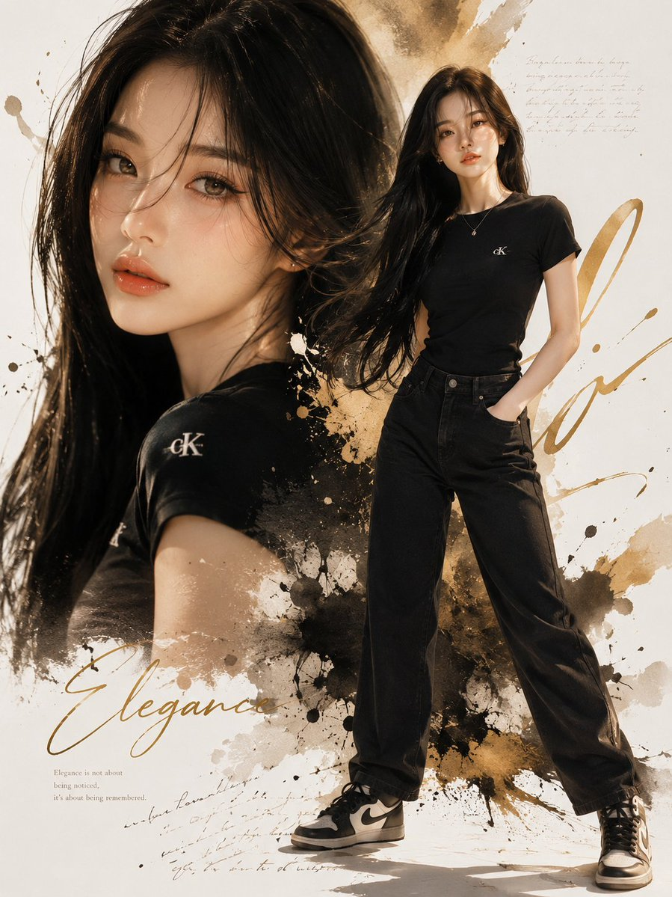

<!-- Case 259: Dreamy Japanese Summer Portrait (by @Taaruk_) -->
### Case 259: Dreamy Japanese Summer Portrait

**Source**: [@Taaruk_](https://x.com/Taaruk_/status/2060752935588630990)

**Prompt**:
```
Ultra-cinematic Japanese street photography,
dreamy summer afternoon in a quiet suburban neighborhood, beautiful young woman standing among vibrant wildflowers and orange cosmos flowers, towering cumulus clouds filling the sky, huge rainbow arching overhead, warm golden hour sunlight, nostalgic anime-inspired atmosphere, soft wind moving hair, candid pose looking into the distance, utility poles and power lines creating urban Japanese aesthetics, shallow depth of field, foreground flower bokeh, rich colors, Kodak Portra 400 film look, dreamy glow, volumetric lighting, natural skin tones, highly detailed face, environmental portrait, low-angle composition, storytelling photography, cozy summer mood, cinematic color grading, photorealistic, masterpiece, 85mm lens, f/1.8, HDR, ultra detailed, soft bloom, realistic shadows, vibrant yet natural tones, editorial fashion photography, Instagram-worthy aesthetic, 8k.
```

**Output**:


---
<!-- Case 260: Grunge Fashion Editorial Collage (by @AvelyrahnAI) -->
### Case 260: Grunge Fashion Editorial Collage

**Source**: [@AvelyrahnAI](https://x.com/AvelyrahnAI/status/2060732082599743586)

**Prompt**:
```
A high-fashion editorial portrait of a stylish woman with a long, thick French side-braid hair, wearing sleek black designer sunglasses, a premium oversized beige t-shirt tucked into tailored beige trousers. She is wearing a minimalist thick gold chain necklace and a luxury silver watch, posing elegantly with one hand gently touching the back of her neck and looking away with a confident smile.The background is a creative grunge black-and-white collage art featuring a Pegasus illustration, a vintage police car, a classic Chanel perfume bottle, newspaper textures, and vinyl records with white sticker cutout borders. Cinematic studio lighting, sharp focus, magazine cover aesthetic, 8K resolution.
```

**Output**:

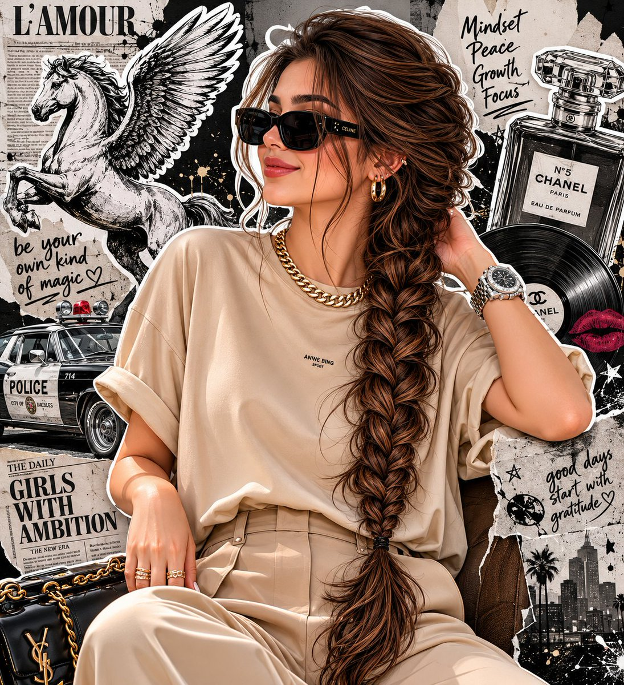

---
<!-- Case 261: Pop-Fashion Photobooth Strips (by @Mind_Boticni) -->
### Case 261: Pop-Fashion Photobooth Strips

**Source**: [@Mind_Boticni](https://x.com/Mind_Boticni/status/2060959441889948116)

**Prompt**:
```
Photorealistic modern pop-fashion photobooth strip arrangement placed on a colorful gradient acrylic desk, top-down cinematic view. Three strips with SAME stylish young woman, consistent identity in all portraits.

Left strip: powerful direct gaze, edgy fashion pose, slightly tilted head, confident attitude.
Center strip: warm natural smile, candid moment, soft laughing expression, relaxed elegance.
Right strip: artistic over-the-shoulder glance, calm eyes-closed pose, reflective dreamy look, gentle emotion.

Vibrant contemporary aesthetic with neon pink, sky blue, and warm yellow highlights, ultra-clean studio lighting, glossy printed strips with crisp edges. Modern props like LED lights, fashion magazines, aesthetic accessories, and minimal luxury items. High-fashion digital editorial vibe, colorful, trendy, visually striking composition.
```

**Output**:


<!-- Case 262: Boho Stone-Wall Portrait (by @iamaiistudio) -->
### Case 262: [Boho Stone-Wall Portrait](https://x.com/iamaiistudio/status/2061600215073996840) (by [@iamaiistudio](https://x.com/iamaiistudio))

| Output |
| :----: |
| <a href="https://evolink.ai/gpt-image-2-prompts?utm_source=github&utm_medium=picture&utm_campaign=awesome-gpt-image-2-API-and-Prompts" target="_blank" rel="noopener noreferrer"></a> |

**Prompt:**

```
Create an ultra-photorealistic 3:4 editorial portrait of a young adult woman with Ana de Armas-inspired features, a fair natural complexion, a slender fit build, and long dark chestnut-brown hair in loose, slightly messy waves that fall across part of her face. She stands in soft daylight against a textured stone masonry wall made of large irregular gray and beige blocks, giving the scene a natural outdoor or semi-outdoor architectural backdrop.

Pose her leaning lightly against the wall with her body angled, looking downward instead of at the camera for a candid, introspective mood. Her right hand rests gently near her chest and neck with relaxed, splayed fingers, while her left hand hangs by her side holding a dark green crocodile-texture cowboy boot. Keep the expression quiet, moody, artistic, and softly feminine.

Style her in an off-the-shoulder cottagecore boho mini dress made from a lightweight cotton or linen blend. The dress has a red to off-red base, a small delicate floral print with purple and yellow wildflowers, a sweetheart neckline, puffed short sleeves, a corset-style bodice, and a ruffled tiered skirt. Add a thin black choker necklace, multiple silver rings, and a red beaded bracelet on the left wrist.

Use soft diffused natural daylight with even front illumination and gentle shadows. The aesthetic should feel bohemian, chic, feminine, candid, and slightly soft-grunge. Shoot as a thigh-up medium portrait from eye level with an 85mm prime lens, f/2.8 depth of field, flattering portrait compression, and sharp focus on the subject, dress texture, realistic skin pores, fabric details, and stone wall texture. Render in ultra-detailed 8k photorealism with high-end photography quality, realistic material fidelity, and a polished Unreal Engine 5 or premium editorial photo finish.
```
<!-- Case 263: Ink Manuscript Side Portrait (by @iamaiistudio) -->
### Case 263: [Ink Manuscript Side Portrait](https://x.com/iamaiistudio/status/2061539512300511530) (by [@iamaiistudio](https://x.com/iamaiistudio))

| Output |
| :----: |
| <a href="https://evolink.ai/gpt-image-2-prompts?utm_source=github&utm_medium=picture&utm_campaign=awesome-gpt-image-2-API-and-Prompts" target="_blank" rel="noopener noreferrer"></a> |

**Prompt:**

```
Use the uploaded photo as the primary face reference. Preserve the person's exact facial structure, skin tone, beard shape, nose, eyes, expression, likeness, and proportions from the reference image.

Create a dramatic, high-impact side-profile portrait in an expressive ink sketch and mixed-media illustration style. The man should feel intense, chaotic, and emotionally charged, with his face and upper body layered in cryptic handwritten text, abstract symbols, and glyph-like marks that wrap around the facial contours, suggesting inner turmoil and hidden meaning.

Dress him in a dark abstract jacket built from heavy textured strokes, sharp angular linework, vibrant ink accents, fine pen details, aggressive brush marks, splashes, and controlled smears. The visual language should feel raw, rebellious, bold, experimental, and editorial, blending precise illustration with conceptual art.

Use a pale aged-parchment background with subtle grain, faded paper texture, delicate linework, ink stains, and the feeling of an old manuscript or forgotten document. Keep the composition high contrast, expressive, intense, and artistically precise.
```
<!-- Case 264: Window-Light Cinematic Portrait (by @Ozayrr_irl) -->
### Case 264: [Window-Light Cinematic Portrait](https://x.com/Ozayrr_irl/status/2061439592549466615) (by [@Ozayrr_irl](https://x.com/Ozayrr_irl))

| Output |
| :----: |
| <a href="https://evolink.ai/gpt-image-2-prompts?utm_source=github&utm_medium=picture&utm_campaign=awesome-gpt-image-2-API-and-Prompts" target="_blank" rel="noopener noreferrer"></a> |

**Prompt:**

```
Use the exact same face from the reference image and generate a Ultra realistic cinematic portrait of that man with defined facial features, dark tousled hair, intense eyes. Shot from mid-chest up. Scene: sitting beside a large old wooden-framed window in a minimal dark room, early morning golden sunlight streaming through the glass in dramatic god rays  visible light beams cutting through floating dust particles in the air. The window light strikes directly across one side of his face, creating razor-sharp light and shadow divide. Half his face brilliantly golden, half consumed in deep natural shadow. The window frame casts a cross-shadow pattern across his chest and shoulder. Dust particles visibly floating and glowing in the light beams. Wearing a simple white linen shirt slightly unbuttoned. Background: dark moody room interior barely visible. Expression: contemplative, lost in thought, gazing toward the window light. Raw, natural, cinematic perfection. Vertical 9:13 format. Ultra photorealistic, 8K, no text overlays, cinematic color grading.
```

<!-- Case 265: Futuristic Martial Arts Heroine Portrait (by @vireonixx) -->
### Case 265: [Futuristic Martial Arts Heroine Portrait](https://x.com/vireonixx/status/2062352968364818576) (by [@vireonixx](https://x.com/vireonixx))

| Output |
| :----: |
| <a href="https://evolink.ai/gpt-image-2-prompts?utm_source=github&utm_medium=picture&utm_campaign=awesome-gpt-image-2-API-and-Prompts" target="_blank" rel="noopener noreferrer"></a> |

**Prompt:**

```
Ultra-photorealistic cinematic portrait of a legendary futuristic martial arts heroine standing in the center of a luxury fashion-editorial composition. She wears an elegant crimson and black combat outfit inspired by contemporary haute couture and advanced athletic armor, featuring intricate embroidered patterns, premium silk textures, carbon-fiber accents, metallic details, and subtle illuminated elements integrated into the design.

The character is captured in a dynamic low stance, one hand extended forward and the other resting near her waist, projecting calm confidence and immense strength. Her facial features are exceptionally realistic with natural beauty, perfectly balanced proportions, visible skin pores, subtle freckles, fine facial hairs, realistic skin translucency, delicate imperfections, soft blush tones, detailed lips with natural moisture, and ultra-sharp eye detail. Deep hazel eyes display complex iris structures, realistic reflections, and cinematic catchlights.

Her long dark hair flows naturally through the frame, with thousands of individually rendered strands, realistic flyaway hairs, subtle movement, and premium salon-quality shine. Decorative fabric ornaments and metallic accessories add visual interest while maintaining realism.

The composition incorporates an artistic mixed-media gallery backdrop featuring fragmented photographic panels, oversized close-up facial details, layered fashion-magazine elements, torn-edge textures, floating geometric shapes, translucent acrylic sheets, and contemporary luxury-brand advertising aesthetics. The background remains predominantly bright and minimalist with sophisticated negative space.

Wardrobe materials showcase extraordinary realism including premium satin, brushed metal, woven fabric, polished leather, textured embroidery, reflective surfaces, and physically accurate material responses. Every fold, stitch, seam, wrinkle, and fabric tension point is visible with microscopic precision.

Captured using a medium-format professional camera system, 110mm portrait lens, ultra-high dynamic range imaging, shallow depth of field, razor-sharp focus on the eyes, cinematic studio lighting with a large diffused key light, subtle rim illumination, controlled fill lighting, realistic shadow transitions, luxury fashion photography quality, and premium commercial advertising aesthetics.

Hyper-detailed skin rendering, subsurface scattering, realistic global illumination, advanced ray tracing, physically based rendering, volumetric atmosphere, ultra-clean composition, museum-quality portrait photography, luxury campaign aesthetics, editorial masterpiece, award-winning fashion photography, extraordinary realism, 32k detail, ultra-high fidelity textures, cinematic depth, breathtaking realism, next-generation rendering quality, photorealistic perfection.
```

<!-- Case 266: Under-Glass Worms-Eye Crowd Shot (by @iamaiistudio) -->
### Case 266: [Under-Glass Worms-Eye Crowd Shot](https://x.com/iamaiistudio/status/2062205313877762389) (by [@iamaiistudio](https://x.com/iamaiistudio))

| Output |
| :----: |
| <a href="https://evolink.ai/gpt-image-2-prompts?utm_source=github&utm_medium=picture&utm_campaign=awesome-gpt-image-2-API-and-Prompts" target="_blank" rel="noopener noreferrer"></a> |

**Prompt:**

```
Camera placed directly beneath a completely transparent glass floor, pointing straight up. Pedestrians walk across the surface above. Pure blue sky fills the background. No buildings, walls, or edges in frame. The glass is perfectly seamless and nearly imperceptible. Extremely close viewpoint to the underside of the walking figures. People moving mostly left to right. Shoe soles fill the foreground up close.
```


<!-- Case 267: Black-and-White Identity Collage Grid (by @mehvishs25) -->
### Case 267: [Black-and-White Identity Collage Grid](https://x.com/mehvishs25/status/2063293613514330224) (by [@mehvishs25](https://x.com/mehvishs25))

| Output |
| :----: |
| <a href="https://evolink.ai/gpt-image-2-prompts?utm_source=github&utm_medium=picture&utm_campaign=awesome-gpt-image-2-API-and-Prompts" target="_blank" rel="noopener noreferrer"></a> |

**Prompt:**

```
Edit the photo while preserving the subject’s exact facial features and identity. Create a high-resolution vertical portrait composition (9:16), ultra-detailed, sharp focus throughout, no background blur, rendered with a premium 8K editorial finish.

Design the image as a sophisticated black-and-white fashion portrait collage arranged in a 2×3 grid, featuring six unique frames of the same young woman in a clean, minimalist indoor studio environment. The overall aesthetic should feel elegant, cinematic, intimate, and effortlessly stylish, inspired by timeless monochrome fashion editorials and luxury magazine photography.

Hair is long, reaching the waist, colored a cool ash-brown with subtle gray undertones. Styled in a Korean-inspired hush cut with soft face-framing layers, airy see-through bangs, and sleek straight lengths that gently curve outward at the ends. The texture appears silky, healthy, and glossy, with a few natural flyaway strands for realism.

Beauty styling remains refined and understated: luminous hydrated skin, naturally feathered brows, subtle brown eyeliner, soft mascara, muted nude lips with a velvety finish, and barely-there blush for a fresh editorial appearance.

Wardrobe consists of a fitted white rib-knit tank top paired with relaxed high-waisted vintage-wash denim jeans, visible in selected frames. Accessories include matte black nail art, delicate silver hoop earrings, multiple silver rings, and a slim silver wristwatch, contributing to a contemporary fashion-editorial mood.

Collage Frame Concepts:

• Frame 1 — Tight portrait crop, fingertips resting softly against the cheek, direct eye contact, confident yet gentle expression.

• Frame 2 — Casual seated pose on a sofa, body turned slightly to one side, gaze directed away from the camera in a contemplative moment.

• Frame 3 — Relaxed reclining position with one knee bent, leaning comfortably into an arm, creating a graceful editorial silhouette.

• Frame 4 — Arms lifted behind the head, posture open and self-assured, subtle lean backward conveying effortless confidence.

• Frame 5 — Emotional close portrait with a slight head tilt and closed eyes, emphasizing calmness and quiet introspection.

• Frame 6 — Front-facing seated composition with composed expression and subtle movement through the hair for a natural, candid feel.

Environment remains intentionally simple: a light-toned studio wall with a neutral sofa appearing selectively across certain frames. The background should support the subject without drawing attention away from her.

Lighting is soft and diffused, resembling natural window light in a professional studio. Gentle directional shadows create depth and dimensionality, while a faint rim light subtly separates the hair from the background. Avoid harsh flash or strong contrast.

Captured with the quality and detail associated with professional mirrorless cameras such as a Canon EOS R5 or Sony A7R IV. Use a combination of intimate close-ups and medium-length portraits, primarily at eye level with occasional slightly elevated angles. Emphasize balanced magazine-style compositions and natural visual flow across the collage.

Final processing should feature a rich monochrome conversion with smooth tonal transitions, lifted shadows, restrained contrast, delicate 35mm film grain, a soft matte finish, and exceptional detail retention in both skin texture and hair, echoing the look of classic high-fashion editorial photography.
```

<!-- Case 268: Plush Mascot Companion Portrait (by @doctorwasif) -->
### Case 268: [Plush Mascot Companion Portrait](https://x.com/doctorwasif/status/2063304967218475072) (by [@doctorwasif](https://x.com/doctorwasif))

<table>
<tr><td width="50%"><a href="https://evolink.ai/gpt-image-2-prompts?utm_source=github&utm_medium=picture&utm_campaign=awesome-gpt-image-2-API-and-Prompts" target="_blank" rel="noopener noreferrer"></a></td><td width="50%"><a href="https://evolink.ai/gpt-image-2-prompts?utm_source=github&utm_medium=picture&utm_campaign=awesome-gpt-image-2-API-and-Prompts" target="_blank" rel="noopener noreferrer"></a></td></tr>
<tr><td width="50%"><a href="https://evolink.ai/gpt-image-2-prompts?utm_source=github&utm_medium=picture&utm_campaign=awesome-gpt-image-2-API-and-Prompts" target="_blank" rel="noopener noreferrer"></a></td><td width="50%"><a href="https://evolink.ai/gpt-image-2-prompts?utm_source=github&utm_medium=picture&utm_campaign=awesome-gpt-image-2-API-and-Prompts" target="_blank" rel="noopener noreferrer"></a></td></tr>
</table>

**Prompt:**

```
Use the uploaded portrait as the identity reference and preserve the person's recognizable facial features, hairstyle, skin tone, expression, fashion sense, and overall presence. Create a premium full-body portrait of the same person alongside a large custom-designed plush companion that feels like their mascot alter ego. The plush should be inspired by the subject's mood, facial impression, styling, posture, and overall energy rather than being a generic animal or mascot. Automatically choose a creature concept that best matches the person's unique vibe, avoiding predictable or stereotype-based selections. The mascot must clearly be an oversized plush toy with soft fuzzy fabrics, rounded shapes, detailed stitching, premium textures, and a collectible designer-toy aesthetic. Its design, expression, silhouette, and proportions should subtly reflect the person's character and visual identity. Build a harmonious color palette using cues from the subject's hair, skin tone, clothing, and atmosphere so the person, mascot, and scene feel naturally connected. Show both the person and plush fully visible from head to toe, including shoes and all parts of the mascot, with balanced framing and comfortable spacing. Choose a natural interaction that suits the subject, such as standing beside, sitting with, leaning on, lightly hugging, or casually engaging with the plush companion. Keep the person's expression relaxed, warm, and authentic with a subtle smile or calm gaze, avoiding stiff poses or mannequin-like appearances. If the original image only shows part of the outfit, intelligently complete the full look in a believable and stylish way. Place the scene in a clean, aesthetically pleasing environment such as a minimalist studio, cozy lifestyle setting, or refined editorial backdrop that complements both the person and mascot without distractions. The final image should feel charming, cozy, stylish, emotionally engaging, visually cohesive, and suitable for a high-end character campaign or social-media editorial. Avoid cropped bodies, hidden shoes, incomplete mascot visibility, generic animal choices, real animals, horror elements, cheap toy aesthetics, awkward poses, cluttered backgrounds, distorted anatomy, extra limbs, text, logos, or watermarks.
```


<!-- Case 269: Editorial Y2K Identity Grid (by @Ciri_ai) -->
### Case 269: [Editorial Y2K Identity Grid](https://x.com/Ciri_ai/status/2063592048150909396) (by [@Ciri_ai](https://x.com/Ciri_ai))

| Output |
| :----: |
| <a href="https://evolink.ai/gpt-image-2-prompts?utm_source=github&utm_medium=picture&utm_campaign=awesome-gpt-image-2-API-and-Prompts" target="_blank" rel="noopener noreferrer"></a> |

**Prompt:**

```
A vertical collage of three YZK photos. Using the uploaded selfie as the ONLY and exclusive face reference, keep the facial features, and facial structure exactly the same as the reference image. The character poses against a neutral light background. A girl with a beautiful, voluminous hairstyle, seemingly styled with a brush, wearing foxy makeup and pronounced, angled lashes. In the first photo, she's very close to the camera, looking at it with one eye and winking. In the second photo, she's turned away, her head coquettishly turned toward the lens, her hairstyle slightly covering her face, but not too much. In the third photo, she's looking very close to the lens, her hair to the side, thus covering her left eye, pouting and looking forward. Close-up and medium shot, minimalist composition, vintage digital texture, slight blur, glamorous atmosphere. Photo taken on iPhone 17 Pro Max with flash.
```

<!-- Case 270: Cool Grey Editorial 3x3 (by @Mind_Boticni) -->
### Case 270: [Cool Grey Editorial 3x3](https://x.com/Mind_Boticni/status/2063587170519314754) (by [@Mind_Boticni](https://x.com/Mind_Boticni))

| Output |
| :----: |
| <a href="https://evolink.ai/gpt-image-2-prompts?utm_source=github&utm_medium=picture&utm_campaign=awesome-gpt-image-2-API-and-Prompts" target="_blank" rel="noopener noreferrer"></a> |

**Prompt:**

```
Editorial 3x3 grid in a cool-grey seamless backdrop. Character (face characteristics 100% same as uploaded image) wearing a charcoal sleeveless dress. Lighting: large overhead softbox, faint side bounce.

Shots include: 1. tight cheek + neck close-up with blurred finger foreground (85mm, f/1.8); 2. eyes locked to lens, top-light reflection visible (85mm, f/2.0); 3. monochrome chin-on-hand portrait with strong frame fill (50mm, f/2.2); 4. half-obscured over-shoulder shot through blurred dress strap (85mm, f/2.0); 5. head-on close-up with intersecting shadows across face (50mm, f/2.5); 6. angled raw portrait with tousled hair (85mm, f/2.2); 7. tight detail of hands resting near collarbone (50mm, f/3.2); 8. seated half-body profile with blurred frame edges (35mm, f/4.5); 9. profile macro with single water droplet highlight (85mm, f/1.9). RAW, smooth contrast, editorial softness.
```

<!-- Case 271: Black-and-White Fashion Grid (by @j_smeaton99) -->
### Case 271: [Black-and-White Fashion Grid](https://x.com/j_smeaton99/status/2063661848478859690) (by [@j_smeaton99](https://x.com/j_smeaton99))

| Output |
| :----: |
| <a href="https://evolink.ai/gpt-image-2-prompts?utm_source=github&utm_medium=picture&utm_campaign=awesome-gpt-image-2-API-and-Prompts" target="_blank" rel="noopener noreferrer"></a> |

**Prompt:**

```
Edit the photo while preserving the subject’s exact facial features and identity. Create a high-resolution vertical portrait composition (9:16), ultra-detailed, sharp focus throughout, no background blur, rendered with a premium 8K editorial finish.

Design the image as a sophisticated black-and-white fashion portrait collage arranged in a 2×3 grid, featuring six unique frames of the same young woman in a clean, minimalist indoor studio environment. The overall aesthetic should feel elegant, cinematic, intimate, and effortlessly stylish, inspired by timeless monochrome fashion editorials and luxury magazine photography.

Hair is long, reaching the waist, colored a cool ash-brown with subtle gray undertones. Styled in a Korean-inspired hush cut with soft face-framing layers, airy see-through bangs, and sleek straight lengths that gently curve outward at the ends. The texture appears silky, healthy, and glossy, with a few natural flyaway strands for realism.

Beauty styling remains refined and understated: luminous hydrated skin, naturally feathered brows, subtle brown eyeliner, soft mascara, muted nude lips with a velvety finish, and barely-there blush for a fresh editorial appearance.

Wardrobe consists of a fitted white rib-knit tank top paired with relaxed high-waisted vintage-wash denim jeans, visible in selected frames. Accessories include matte black nail art, delicate silver hoop earrings, multiple silver rings, and a slim silver wristwatch, contributing to a contemporary fashion-editorial mood.

Collage Frame Concepts:

• Frame 1 — Tight portrait crop, fingertips resting softly against the cheek, direct eye contact, confident yet gentle expression.

• Frame 2 — Casual seated pose on a sofa, body turned slightly to one side, gaze directed away from the camera in a contemplative moment.

• Frame 3 — Relaxed reclining position with one knee bent, leaning comfortably into an arm, creating a graceful editorial silhouette.

• Frame 4 — Arms lifted behind the head, posture open and self-assured, subtle lean backward conveying effortless confidence.

• Frame 5 — Emotional close portrait with a slight head tilt and closed eyes, emphasizing calmness and quiet introspection.

• Frame 6 — Front-facing seated composition with composed expression and subtle movement through the hair for a natural, candid feel.

Environment remains intentionally simple: a light-toned studio wall with a neutral sofa appearing selectively across certain frames. The background should support the subject without drawing attention away from her.

Lighting is soft and diffused, resembling natural window light in a professional studio. Gentle directional shadows create depth and dimensionality, while a faint rim light subtly separates the hair from the background. Avoid harsh flash or strong contrast.

Captured with the quality and detail associated with professional mirrorless cameras such as a Canon EOS R5 or Sony A7R IV. Use a combination of intimate close-ups and medium-length portraits, primarily at eye level with occasional slightly elevated angles. Emphasize balanced magazine-style compositions and natural visual flow across the collage.

Final processing should feature a rich monochrome conversion with smooth tonal transitions, lifted shadows, restrained contrast, delicate 35mm film grain, a soft matte finish, and exceptional detail retention in both skin texture and hair, echoing the look of classic high-fashion editorial photography.
```

<!-- Case 272: Nightlife Restaurant Flash Collage (by @ZephyraLeigh) -->
### Case 272: [Nightlife Restaurant Flash Collage](https://x.com/ZephyraLeigh/status/2063656432864842045) (by [@ZephyraLeigh](https://x.com/ZephyraLeigh))

| Output |
| :----: |
| <a href="https://evolink.ai/gpt-image-2-prompts?utm_source=github&utm_medium=picture&utm_campaign=awesome-gpt-image-2-API-and-Prompts" target="_blank" rel="noopener noreferrer"></a> |

**Prompt:**

```
Using the provided reference image, create an ultra-realistic candid nightlife fashion photoshoot of a beautiful young woman at a trendy upscale restaurant lounge at night.

She has a slim figure, long voluminous dark brown hair, flawless glowing skin, soft glam makeup, glossy nude lips, subtle eyeliner, and an effortlessly confident expression.

She is wearing a fitted deep red halter-neck crop top with a plunging neckline, paired with low-rise charcoal gray vintage-wash denim jeans. Accessories include a small black quilted shoulder bag with a silver chain strap, delicate bracelets, and minimal jewelry.

Create a 3-photo vertical collage capturing different candid poses:

1. Looking down with eyes closed, one hand resting on her chest.

2. Side pose with hair tied into a loose ponytail, looking over her shoulder.

3. Standing confidently with one hand raised near her hair, showing the outfit clearly.

The setting is a crowded luxury restaurant with rattan chairs, candlelit tables, warm ambient lighting, arched windows, hanging greenery, and guests dining in the background. Shot using direct on-camera flash, creating a nostalgic early-2000s paparazzi aesthetic with slightly overexposed highlights and authentic nightlife energy.

Pinterest aesthetic, Instagram nightlife photography, candid fashion editorial, luxury restaurant atmosphere, realistic skin texture, film-camera flash look, subtle grain, warm tones, shallow depth of field, trendy influencer style, photorealistic, Vogue nightlife editorial, DSLR flash photography, 35mm lens, high-fashion social media content, masterpiece, best quality, ultra realistic, 8K.
```

<!-- Case 273: Vintage Newsstand Double Exposure (by @AiwithZohaib) -->
### Case 273: [Vintage Newsstand Double Exposure](https://x.com/AiwithZohaib/status/2063754827017101475) (by [@AiwithZohaib](https://x.com/AiwithZohaib))

| Output |
| :----: |
| <a href="https://evolink.ai/gpt-image-2-prompts?utm_source=github&utm_medium=picture&utm_campaign=awesome-gpt-image-2-API-and-Prompts" target="_blank" rel="noopener noreferrer"></a> |

**Prompt:**

```
The generated image uses the uploaded image as a reference for the character, wearing a high-necked, tight-fitting black long-sleeved dress. A cluster of withered wood and orange-pink flowers lies beside an old newsstand, the grainy texture of vintage film interwoven, the blurred background with noticeable trailing shadows, and the double-image effect creating a fantastical atmosphere. A bewitchingly beautiful girl, carrying flowers, is shown in profile, her fair skin delicate and translucent.

Her exquisite face is blurred with motion, the outline of her figure slightly swaying with the panning camera, the soft focus making the image even more hazy and languid. A warm-toned, low-saturation filter enhances the effect, her long, backlit hair glowing with a soft glow, the messy strands sweeping wildly across her jawline, the details concealing a captivating yet dangerous allure.Cute movements add dynamism, the motion blur blending with the film grain, creating a trendy, Instagram-worthy image while the blurred image outlines a dynamic scene full of story, cleverly balancing bewitching and sweetness.
Follow : @AiwithZohaib
```


<!-- Case 274: Fashion Casting Contact Sheet (by @Ciri_ai) -->
### Case 274: [Fashion Casting Contact Sheet](https://x.com/Ciri_ai/status/2064027400426709259) (by [@Ciri_ai](https://x.com/Ciri_ai))

| Output |
| :----: |
| <a href="https://evolink.ai/gpt-image-2-prompts?utm_source=github&utm_medium=picture&utm_campaign=awesome-gpt-image-2-API-and-Prompts" target="_blank" rel="noopener noreferrer"></a> |

**Prompt:**

```
Black-and-white fashion casting contact sheet of [HUMAN] with [HAIR], arranged in a clean 2x2 grid of four close portrait frames against [BACKGROUND], wearing [CLOTHING] and [ACCESSORY]. Each frame shows a different expression and angle: [EXPRESSIONS]. Soft studio lighting, crisp monochrome contrast, natural skin texture, visible facial details, clean plain backdrop, subtle film grain, high-end editorial test shoot, minimal styling, intimate camera distance, professional portrait photography, aspect ratio 4:5.
```


<!-- Case 275: Identity-Locked Portrait Edit (by @Kashberg_0) -->
### Case 275: [Identity-Locked Portrait Edit](https://x.com/Kashberg_0/status/2064022776600760625) (by [@Kashberg_0](https://x.com/Kashberg_0))

| Output |
| :----: |
| <a href="https://evolink.ai/gpt-image-2-prompts?utm_source=github&utm_medium=picture&utm_campaign=awesome-gpt-image-2-API-and-Prompts" target="_blank" rel="noopener noreferrer"></a> |

**Prompt:**

```
Use the uploaded portrait as the identity reference for the subject's face, hairstyle, facial structure, skin tone, expression, and overall impression.

Create a high-quality realistic emotional portrait of the same person with a soft sad mood and visible tears.

Core concept:
- a delicate, emotionally touching close-up portrait
- the subject looks quietly sad, as if holding back emotions
- the mood should feel fragile, intimate, soft, and beautiful
- the image should feel like a polished Korean-style emotional portrait

Identity:
- preserve the subject's recognizable identity
- keep the same face shape, eyes, nose, lips, jawline, hairstyle, and overall vibe
- do not make the face look generic or overly different
- keep the beauty natural and believable

Expression:
- slightly sad expression
- soft watery eyes
- one or two visible tear streaks running down the cheek
- lips softly closed or slightly parted
- emotional but restrained, not exaggerated
- the sadness should feel quiet, longing, and delicate

Styling:
- long dark hair with soft natural texture
- a few loose strands falling across the face
- clean natural makeup
- luminous skin
- simple dark top or minimal clothing visible
- overall styling should remain clean and understated so the face is the focus

Lighting:
- soft, moody lighting
- gentle highlights on the eyes, nose, lips, and tear tracks
- subtle shadow depth
- dark or muted background
- the lighting should feel intimate and cinematic, not harsh

Composition:
- vertical portrait composition
- close-up framing
- place the face in the upper half of the frame
- the center of the face should sit slightly above the vertical midpoint
- the eyes should fall around the upper-middle area of the image
- avoid placing the face too low in the frame
- keep the composition visually balanced and elegant

Mood and style:
- Korean emotional beauty portrait
- soft, melancholic, dreamy, intimate
- elegant and photogenic
- emotionally expressive without looking dramatic
- beautiful but slightly heartbreaking

Important visual priority:
- preserve identity clearly
- the face must remain the main focus
- tears should be visible but subtle
- expression should feel naturally sad and emotionally convincing
- the portrait should look beautiful, soft, and emotionally immersive

Negative prompt:
- no exaggerated crying
- no distorted face
- no cartoon style
- no anime style
- no harsh flash
- no messy background
- no over-retouched plastic skin
- no exaggerated smile
- no low-resolution image
- no text
- no watermark
```


<!-- Case 276: High Angle Cinematic Portrait (by @AvelyrahnAI) -->
### Case 276: [High Angle Cinematic Portrait](https://x.com/AvelyrahnAI/status/2064547040508662240) (by [@AvelyrahnAI](https://x.com/AvelyrahnAI))

| Output |
| :----: |
| <a href="https://evolink.ai/gpt-image-2-prompts?utm_source=github&utm_medium=picture&utm_campaign=awesome-gpt-image-2-API-and-Prompts" target="_blank" rel="noopener noreferrer"></a> |

**Prompt:**

```
Edit foto wanita tersebut menjadi potret High Angle Sinematik dari seorang wanita muda yang cantik dari sudut pandang belakang. Fokus utamanya adalah pada bahu, lengan, dan sebagian wajahnya yang menghadap ke samping dengan ekspresi tenang. Riasan flawess natural eye shadow semi peach-brown lembut, bulu mata lentik, blush on tipis peach lembut dengan lisptik glossy peach lembut, rambut lurusnya tersanggul keatas agak longgar sedikit ada helaian rambut samping kanan-kirinya membingkai wajahnya. Ia mengenakan atasan sweater rajut dengan model sabrina berwarna cokelat muda. Tekstur kulitnya terlihat sangat halus di bawah siraman cahaya matahari yang terfilter. Latar belakang di outdoor buram (bokeh). Wajahnya menoleh ke samping melihat ke sikataran dengan ekspresi tenang dan sendu.

Pencahayaan dan Warna :
Foto ini menggunakan teknik pencahayaan yang kontras (terang-gelap). Cahaya matahari jatuh di bagian bahu dan wajahnya, sementara bagian lainnya tenggelam dalam bayangan. Terdapat bayangan siluet dedaunan atau ranting yang jatuh di punggung dan wajah wanita tersebut, memberikan kesan ia berada di bawah pohon saat matahari mulai terbenam (golden hour).
Palet Warna: Didominasi oleh warna-warna hangat seperti oranye, golden hour, cokelat yang dikontraskan dengan latar belakang yang redup.

Komposisi dan Estetika
Depth of Field: Latar belakangnya sangat buram (bokeh), membuat subjek wanita menonjol. Kesan yang ditampilkan adalah kelembutan, ketenangan. Foto ini tidak terasa seperti foto potret biasa, melainkan lebih seperti potongan adegan dari sebuah film drama puitis.
Foto ini memiliki atmosfer yang sangat melankolis, artistik, dan sinematik. Komposisinya bermain dengan kontras antara cahaya hangat dan bayangan yang dalam, menciptakan kesan misterius namun intim.
```

<!-- Case 277: Chiaroscuro Hyper-realistic Portrait (by @iamsofiaijaz) -->
### Case 277: [Chiaroscuro Hyper-realistic Portrait](https://x.com/iamsofiaijaz/status/2064545265521217953) (by [@iamsofiaijaz](https://x.com/iamsofiaijaz))

| Output |
| :----: |
| <a href="https://evolink.ai/gpt-image-2-prompts?utm_source=github&utm_medium=picture&utm_campaign=awesome-gpt-image-2-API-and-Prompts" target="_blank" rel="noopener noreferrer"></a> |

**Prompt:**

```
Create a hyper-realistic 8K cinematic portrait of the uploaded person in a dramatic chiaroscuro style. The subject is seated at a three-quarter angle, leaning slightly forward with a relaxed yet commanding posture. His face is turned slightly away from the camera, not looking at the lens, with one side of the face sharply illuminated and the opposite side fading into deep, velvety black shadow.
His expression is contemplative.
His hands are near the chest in a natural, precise pose, with the fingers gently and correctly interlocked. One wrist clearly shows a luxury black chronograph watch with a detailed metal link bracelet, and one hand wears a subtle silver ring. He is dressed in a sharp black suit jacket over a white dress shirt with the top buttons open, showing refined fabric texture and natural folds.
The background is solid seamless black. Use strong directional studio lighting with rich contrast, clean shadow falloff, and realistic skin texture. Highlight fine details such as hair strands, beard bristles, eye moisture, facial texture, the watch face, metal bracelet reflections, and the silver ring. Shot with an 85mm portrait lens look, shallow depth of field, premium commercial photography, ultra-sharp focus, smooth natural skin transitions, cinematic contrast, no artificial plastic skin, no extra fingers, no distorted hands, no messy anatomy.
```

<!-- Case 278: Kawaii Character Side Profile Portrait (by @VIBEQUIRKLABS) -->
### Case 278: [Kawaii Character Side Profile Portrait](https://x.com/VIBEQUIRKLABS/status/2064543699460354240) (by [@VIBEQUIRKLABS](https://x.com/VIBEQUIRKLABS))

| Output |
| :----: |
| <a href="https://evolink.ai/gpt-image-2-prompts?utm_source=github&utm_medium=picture&utm_campaign=awesome-gpt-image-2-API-and-Prompts" target="_blank" rel="noopener noreferrer"></a> |

**Prompt:**

```
Create a photorealistic editorial portrait of one 20-year-old Japanese or Korean female portrait subject with white frame, thin-frame glasses, worn normally on the face, lenses aligned over the eyes and small teardrop gemstone earring detail, delicate understated sparkle, natural basic body, about 160-165 cm visual height, balanced torso-to-leg ratio around 4:6, young seductive alluring beauty face, magnetic feminine facial balance, defined eyes and lips, collarbone-length layered hair, airy natural volume, soft face-framing movement, soft black-tea brown hair, muted brown-black salon tone. She is sitting on a chair that naturally fits the current scene. The setting is British record listening corner, turntable setup, stacked vinyl sleeves, bookshelf speakers, aged wood cabinet, lamp fixture, small side table, indoor rainy-day daylight environment, dim grey window brightness. She wears gothic casual knit-and-ruffle outfit, fitted knit top, lace camisole layer, large ribbon bow, high-waist layered ruffle mini skirt. Inspired by Leslie Kee, polished commercial portrait image language. Camera positioned on the subject's left side, 90-degree left profile view, ultra shallow depth of field.
```

<!-- Case 279: Monochrome Vector Vogue Portrait (by @noorlewisx) -->
### Case 279: [Monochrome Vector Vogue Portrait](https://x.com/noorlewisx/status/2064539506305561076) (by [@noorlewisx](https://x.com/noorlewisx))

| Output |
| :----: |
| <a href="https://evolink.ai/gpt-image-2-prompts?utm_source=github&utm_medium=picture&utm_campaign=awesome-gpt-image-2-API-and-Prompts" target="_blank" rel="noopener noreferrer"></a> |

**Prompt:**

```
Transform the subject into a striking high-contrast monochrome vector portrait, rendered in a premium black-and-white comic book illustration style with crisp cel-shading, bold geometric shapes, and ultra-clean vector linework. Preserve the subject's facial features, hairstyle, expression, and overall likeness with high accuracy.

The subject is a stylish young woman with long flowing hair, wearing an open dark oversized shirt layered over a fitted white crew-neck T-shirt. She accessorizes with a minimalist square pendant necklace, elegant earrings, and a pair of fashionable sunglasses resting naturally on top of her head, seamlessly integrated into her hairstyle.

Illuminate the portrait with intense red neon rim lighting that traces the contours of her hair, face, shoulders, and clothing, creating a dramatic glow against the monochrome artwork. The red highlights should add depth, separation, and a futuristic cinematic atmosphere without overpowering the black-and-white design.

Set against a pure black background, emphasizing strong contrast and visual impact. Style the artwork with sharp vector edges, bold shadows, clean negative space, graphic-novel aesthetics, modern streetwear fashion energy, and premium poster-quality composition. Ultra-detailed yet minimalist, edgy, contemporary, visually powerful, and magazine-cover worthy. Strong confident female presence, cinematic attitude, luxury editorial feel, and flawless vector illustration quality.
```

<!-- Case 280: Minimalist Vogue Editorial Cover (by @vireonixx) -->
### Case 280: [Minimalist Vogue Editorial Cover](https://x.com/vireonixx/status/2064536416592552092) (by [@vireonixx](https://x.com/vireonixx))

| Output |
| :----: |
| <a href="https://evolink.ai/gpt-image-2-prompts?utm_source=github&utm_medium=picture&utm_campaign=awesome-gpt-image-2-API-and-Prompts" target="_blank" rel="noopener noreferrer"></a> |

**Prompt:**

```
Create a sophisticated high-fashion magazine cover portrait using the provided reference image only for the subject's identity and facial features. Transform the scene into a minimalist Vogue-inspired editorial cover that emphasizes timeless style, intellectual elegance, and refined simplicity.

COMPOSITION & FRAMING:
Vertical magazine cover format, approximately 4:5 aspect ratio. Upper-torso portrait composition, framed from mid-abdomen to slightly above the head. Subject positioned centrally with balanced negative space around the figure for luxury editorial typography. Clean, uncluttered layout with strong visual breathing room. Direct engagement with the camera creates intimacy and authority.

POSE & BODY LANGUAGE:
Thoughtful fashion-editorial pose with one hand partially covering the lower face, fingers resting naturally near the nose and lips. Opposite arm folded across the body creating subtle structure. Relaxed shoulders. Slight forward lean. Natural posture conveying intelligence, creativity, and effortless confidence. The pose should feel spontaneous rather than staged.

FACIAL EXPRESSION:
Quiet confidence, introspective gaze, subtle mystery, calm sophistication. Eyes focused directly toward the camera with a soft yet engaging expression. Emotion should communicate intelligence, artistic sensibility, modern elegance, and understated charisma. No exaggerated smile.

FASHION STYLING:
Minimalist luxury wardrobe centered around a crisp oversized white shirt. Premium cotton fabric with visible texture and natural folds. Open collar with clean lines. Slightly oversized silhouette creating modern proportions. Sleeves casually rolled or relaxed. Styling reflects contemporary luxury, Scandinavian minimalism, and timeless fashion essentials.

ACCESSORIES:
Thin silver metal-frame eyeglasses with minimalist design. Luxury wristwatch featuring a clean dial, refined metallic case, and understated elegance. Accessories should appear functional, sophisticated, and premium
```

<!-- Case 281: Cinematic Street Photography Portrait (by @frametheory058) -->
### Case 281: [Cinematic Street Photography Portrait](https://x.com/frametheory058/status/2064536055366480248) (by [@frametheory058](https://x.com/frametheory058))

| Output |
| :----: |
| <a href="https://evolink.ai/gpt-image-2-prompts?utm_source=github&utm_medium=picture&utm_campaign=awesome-gpt-image-2-API-and-Prompts" target="_blank" rel="noopener noreferrer"></a> |

**Prompt:**

```
Create an ultra-realistic cinematic street photography portrait of me on a busy city street. Keep my face exactly the same as in the reference photo — same facial structure, eyes, nose, lips, hairstyle, skin tone, proportions, and overall identity. Do not alter, beautify, or reinterpret my appearance in any way.

I am standing confidently in the center of the frame wearing an oversized black hoodie, relaxed cargo pants, and casual streetwear. My expression is playful, slightly mischievous, and natural, as if I’m proudly showing my creative side.

I’m holding a large white poster board in front of me.

The poster should contain only ONE hand-drawn sketch illustration of me. No multiple portraits or variations.

The sketch should be:

Black-and-white pencil drawing

Highly detailed

Realistic facial resemblance

Expressive line art

Artist sketchbook style

Clean white background

Subtle shading

Visible hand-drawn pencil strokes

Confident creator energy

At the bottom of the sketch, write:

[Name]

Around the sketch, add only a few minimal doodles:

Tiny stars

Small hearts

Paper airplane

Light sketch arrows

Subtle creative marks

Keep the poster simple, clean, and powerful.

The mood should feel creative, inspiring, authentic, artistic, and documentary-like, as if it’s part of a creator movement campaign.

Style: ultra-realistic street portrait, natural lighting, shallow depth of field, soft background blur, premium editorial photography, magazine-quality image, cinematic storytelling, Pinterest aesthetic, creator-brand campaign, emotional and relatable, professional photography, 8K masterpiece.

The contrast between the real me and the hand-drawn sketch version of me should be the main visual focus, creating a strong artist-versus-art effect. The single sketch on the poster must remain the clear focal point.

Aspect ratio: 4:5
```

<!-- Case 282: Winter Wolf Cinematic Portrait (by @iamaiistudio) -->
### Case 282: [Winter Wolf Cinematic Portrait](https://x.com/iamaiistudio/status/2064409499906224232) (by [@iamaiistudio](https://x.com/iamaiistudio))

| Output |
| :----: |
| <a href="https://evolink.ai/gpt-image-2-prompts?utm_source=github&utm_medium=picture&utm_campaign=awesome-gpt-image-2-API-and-Prompts" target="_blank" rel="noopener noreferrer"></a> |

**Prompt:**

```
://t.co/1ZKQNHa8h4

prompt:

Cinematic winter portrait of a young pale-skinned woman with long dark snow-dusted hair, standing closely behind a majestic gray wolf. She wears a fur-lined heavy winter coat, expression intense, calm and soulful, direct eye contact with camera. The wolf is calm and watchful with thick frost-covered fur and sharp golden intelligent eyes. Both subjects centered symmetrically, ultra-sharp focus on both sets of eyes. Background: softly blurred snow-covered forest, gentle snowfall, cold mist. Lighting: soft natural overcast winter light with diffused shadows, cinematic cool tones, subtle warmth in skin and eyes. Style: fine-art wildlife and cinematic portrait photography, ultra-realistic, 8K quality detail. Mood: quiet intensity, mystery, primal bond, reverence for nature. Portrait orientation, 2:3 aspect ratio.

#AIart #GPTImage2
```

<!-- Case 283: Full Shot Man White Chair (by @JamilAI55) -->
### Case 283: [Full Shot Man White Chair](https://x.com/JamilAI55/status/2064548739419947299) (by [@JamilAI55](https://x.com/JamilAI55))

| Output |
| :----: |
| <a href="https://evolink.ai/gpt-image-2-prompts?utm_source=github&utm_medium=picture&utm_campaign=awesome-gpt-image-2-API-and-Prompts" target="_blank" rel="noopener noreferrer"></a> |

**Prompt:**

```
A full shot of a man sitting on a white chair with his legs crossed, wearing a dark button-down shirt, white pants, and white slides, uploaded face as reference, with an old-fashioned film camera on a tripod to his left, a potted green plant to his right, and various design-related elements scattered around him, including a notepad listing 'Creative Cloud' applications, a Polaroid photo with the words 'Creativity is Fun,' and text snippets like 'Be Different' and 'Dare to Stand Out,' all arranged in a collage style, with a color palette of muted blues, grays, and whites, and pops of color from the plant and text, creating a visually engaging and informative composition, reminiscent of a graphic design mood board, with a slightly desaturated look and a clean, modern aesthetic.
```

<!-- Case 284: Eiffel Tower Low Angle Fashion Portrait (by @CHAseUnre) -->
### Case 284: [Eiffel Tower Low Angle Fashion Portrait](https://x.com/CHAseUnre/status/2064514382756012487) (by [@CHAseUnre](https://x.com/CHAseUnre))

| Output |
| :----: |
| <a href="https://evolink.ai/gpt-image-2-prompts?utm_source=github&utm_medium=picture&utm_campaign=awesome-gpt-image-2-API-and-Prompts" target="_blank" rel="noopener noreferrer"></a> |

**Prompt:**

```
에펠탑 중앙 하단에서 카메라를 아래로 당당하게 내려다보는 로우 앵글 포즈입니다. 상체는 프레임 우측을 향해 45도 틀어져 있고, 고개를 돌려 카메라를 내려다 보고 있습니다. 바람에 날리는 머리카락 사이로 세련되고 쿨한 표정을 짓고 있으며, 카메라를 아련하면서도 자신감 넘치는 눈빛으로 가만히 응시하고 있습니다.

몸에 부드럽게 밀착되는 정갈하고 심플한 화이트 반소매 라운드넥 티셔츠를 입고 있습니다. 머리카락은 바람을 맞아 자연스럽게 볼륨감이 살아서 얼굴 주변으로 흩날리고 있습니다. 실버 금속 테에 은은한 보랏빛이 도는 반투명 렌즈의 스퀘어 선글라스를 착용했으며, 촉촉한 연분홍색 립글로스를 바른 내추럴하고 깨끗한 메이크업입니다.

인물에 대한 직접 조명은 전혀 없으며 에펠탑 아래에서 은은하게 자연광이 있을 뿐입니다. 바닥에서 하늘을 수직에 가깝게 올려다보는 극단적인 로우 앵글(웜즈 아이 뷰)로 촬영되었습니다. 화면 전체를 거대하게 감싸며 가로지르는 파리 에펠탑의 정교하고 거대한 짙은 회색 철골 격자 구조물이 배경입니다.
```


<!-- Case 285: Anime-Inspired Pastel Hoodie Portrait (by @de_mon010) -->
### Case 285: [Anime-Inspired Pastel Hoodie Portrait](https://x.com/de_mon010/status/2065247896287744162) (by [@de_mon010](https://x.com/de_mon010))

| Output |
| :----: |
| <a href="https://evolink.ai/gpt-image-2-prompts?utm_source=github&utm_medium=picture&utm_campaign=awesome-gpt-image-2-API-and-Prompts" target="_blank" rel="noopener noreferrer"></a> |

**Prompt:**

```
Semi-realistic anime-inspired portrait of a stylish man, delicate round-frame glasses, and a gentle confident expression. he wears an oversized pastel lilac hoodie with rolled sleeves paired with a flowing ivory joggers. Full-body composition, standing casually with relaxed posture. Behind his is an artistic collage of hand-drawn monochrome character studies, loose pencil sketches, manga panels, playful doodles, and handwritten notes scattered organically across the backdrop.Contemporary anime fashion illustration with mixed ink-and-pencil textures, clean linework, subtle cel shading, bright white background, magazine-cover aesthetic, highly detailed, ultra-sharp, vibrant yet elegant, 8K masterpiece.
```

<!-- Case 286: Italian Summer Afternoon Portrait (by @iamaiistudio) -->
### Case 286: [Italian Summer Afternoon Portrait](https://x.com/iamaiistudio/status/2065209349132501265) (by [@iamaiistudio](https://x.com/iamaiistudio))

| Output |
| :----: |
| <a href="https://evolink.ai/gpt-image-2-prompts?utm_source=github&utm_medium=picture&utm_campaign=awesome-gpt-image-2-API-and-Prompts" target="_blank" rel="noopener noreferrer"></a> |

**Prompt:**

```
prompt:

Ultra photorealistic portrait of a young woman with long straight dark brown hair, sun-kissed glowing skin, seated at an outdoor cafe table. She's wearing a white vintage Swiss dot corset mini dress with a sweetheart neckline, ruffled cap sleeves, front lace-up ribbon detailing, fitted bodice, and slightly sheer ruffled hem. Hands raised playfully covering her eyes, head tilted back laughing, red manicured nails, thin bracelet and ring on left hand. Setting: luxury outdoor hotel terrace at Hotel Florence, historic yellow building with "HOTEL FLORENCE" signage, lush green mountains in the background, cloudy blue sky, vintage globe street lamps, round glass-top table with two white ceramic coffee cups and a paperback book. Coquette cottagecore soft feminine luxury aesthetic. Natural bright afternoon sunlight, high contrast, sharp shadows on the table, backlighting creates a hair halo effect, warm vibrant color grading. DSLR 85mm portrait lens, f/2.8 shallow depth of field, 1/500s shutter, ISO 100, 8k RAW photo.

#AIart #GPTImage2
```

<!-- Case 287: Rainy Night Cinematic Portrait (by @iamaiistudio) -->
### Case 287: [Rainy Night Cinematic Portrait](https://x.com/iamaiistudio/status/2065194222408577258) (by [@iamaiistudio](https://x.com/iamaiistudio))

| Output |
| :----: |
| <a href="https://evolink.ai/gpt-image-2-prompts?utm_source=github&utm_medium=picture&utm_campaign=awesome-gpt-image-2-API-and-Prompts" target="_blank" rel="noopener noreferrer"></a> |

**Prompt:**

```
Full prompt:

Photorealistic cinematic close-up of a young woman in her early 30s, standing in a downpour at night with arms stretched wide and head tilted back, eyes shut, embracing the rain. Warm golden-orange backlight from the left side catches each raindrop, turning them into glowing particles around her silhouette. Soaking wet black tee clinging to her figure, water beading on her skin. Deep contrast between the dark background and the fiery orange sidelight. Expression radiates liberation and calm. Shot on an 85mm lens, f/1.8, 8K, shallow depth of field, vertical framing, dramatic cinematic atmosphere.

#AIart #GPTImage2
```

<!-- Case 288: 7-Panel Emotion Grid Portrait (by @iamaiistudio) -->
### Case 288: [7-Panel Emotion Grid Portrait](https://x.com/iamaiistudio/status/2065179623697306098) (by [@iamaiistudio](https://x.com/iamaiistudio))

| Output |
| :----: |
| <a href="https://evolink.ai/gpt-image-2-prompts?utm_source=github&utm_medium=picture&utm_campaign=awesome-gpt-image-2-API-and-Prompts" target="_blank" rel="noopener noreferrer"></a> |

**Prompt:**

```
Full prompt:

Grid layout with thin white gaps between panels and a subtle outer white border around the entire composition. Clean, modern UI aesthetic with slight rounded corners on every tile.

Panel 1: Joyful (Yellow). Warm yellow gradient. Arms raised overhead. Eyes shut. Wide open laugh. High-energy pose.
Panel 2: Shocked (Blue). Blue gradient. Both hands cupping cheeks. Eyes wide open. Mouth agape. Eyebrows arched high.
Panel 3: Stern (Red). Solid red background. Arms folded. Brows furrowed. Lips pressed tight. Dark hoodie.
Panel 4: Affectionate (Pink). Soft pink gradient. Cradling a small brown dog. Gentle smile. Cozy knit sweater.
Panel 5: Confident (Purple). Purple gradient. One hand resting on hip. Slight smirk. Graphic tee. Easy, relaxed stance.
Panel 6: Approving (Green). Green gradient. Baseball cap and denim jacket. Thumbs up. Relaxed smile.
Panel 7: Melancholy (Gray). Gray gradient. Eyes angled slightly downward. Inner brows slightly raised. Lips gently curved down.

#AIart #GPTImage2
```

<!-- Case 289: Cozy Pastel Morning Overhead Lifestyle (by @iamaiistudio) -->
### Case 289: [Cozy Pastel Morning Overhead Lifestyle](https://x.com/iamaiistudio/status/2065149291099021650) (by [@iamaiistudio](https://x.com/iamaiistudio))

<table>
<tr><td width="50%"><a href="https://evolink.ai/gpt-image-2-prompts?utm_source=github&utm_medium=picture&utm_campaign=awesome-gpt-image-2-API-and-Prompts" target="_blank" rel="noopener noreferrer"></a></td><td width="50%"><a href="https://evolink.ai/gpt-image-2-prompts?utm_source=github&utm_medium=picture&utm_campaign=awesome-gpt-image-2-API-and-Prompts" target="_blank" rel="noopener noreferrer"></a></td></tr>
<tr><td width="50%"><a href="https://evolink.ai/gpt-image-2-prompts?utm_source=github&utm_medium=picture&utm_campaign=awesome-gpt-image-2-API-and-Prompts" target="_blank" rel="noopener noreferrer"></a></td></tr>
</table>

**Prompt:**

```
prompt:

Overhead lifestyle photo shot from a slightly tilted high angle, looking down at a cozy bed. A slim young woman lies on her back with a relaxed, lazy weekend morning energy. She has long, slightly tousled straight black hair with subtle pink highlights spread softly across a purple pillow, tidy bangs framing her face. Her makeup is a soft East Asian aesthetic with noticeable pink blush and lightly parted glossy lips, her gaze directed softly up into the camera. She wears a white ribbed cotton camisole with front buttons and lace trim, slightly raised at the waist, paired with light pink satin pajama shorts. Her right arm rests casually behind her head, exposing her smooth underarm and shoulder, while her left knee is gently bent, revealing a fair soft upper thigh. The skin on her arms, chest, stomach, and legs looks smooth and luminous, lit by soft diffused daylight spilling through a window on the left. A silver charm bracelet sits on her left wrist. The bedroom is styled throughout in pastel tones. She rests on ruffled pastel purple pillows and a white blanket with subtle purple floral patterns. Two white plush bunnies are placed near her head. In the slightly blurred lower right foreground, a wooden nightstand holds a glass of lemon water, a small pink digital clock showing 8:47, an earbuds case, and an ELLE magazine. Shot on a 35mm lens at a moderate aperture for a natural, slightly imperfect snapshot aesthetic with soft daylight and gentle shadows, capturing the tranquil slow morning mood.

#AIart #GPTImage2
```

<!-- Case 290: Stylish Woman Outside Cozy Café Portrait (by @sakshi___007) -->
### Case 290: [Stylish Woman Outside Cozy Café Portrait](https://x.com/sakshi___007/status/2065118696788631921) (by [@sakshi___007](https://x.com/sakshi___007))

| Output |
| :----: |
| <a href="https://evolink.ai/gpt-image-2-prompts?utm_source=github&utm_medium=picture&utm_campaign=awesome-gpt-image-2-API-and-Prompts" target="_blank" rel="noopener noreferrer"></a> |

**Prompt:**

```
An ultra-realistic lifestyle portrait of a stylish young woman standing outside a modern cozy café during daytime, smiling warmly at the camera with a soft natural expression. She has short wavy platinum blonde hair styled in a soft messy bob, glowing skin, minimal natural makeup, and a fresh effortless beauty aesthetic. She wears an elegant oversized white blouse with soft flowing sleeves, tucked into high-waisted beige wide-leg trousers with a black belt, creating a classy minimalist fashion look. In one hand she holds an iced latte in a transparent cup, and in the other she gently carries a small adorable apricot toy poodle dog wearing a cute dark bandana. Warm natural sunlight, cozy café storefront background with glass windows, soft bokeh lighting, aesthetic urban lifestyle atmosphere, calm and wholesome mood, photorealistic details, fashionable Korean street style, soft neutral color palette, editorial portrait photography, realistic skin texture, cozy café culture vibe, luxury casual fashion, soft cinematic color grading, high detail, elegant modern aesthetic, Pinterest-inspired photography, ultra detailed, 8k quality.
```

<!-- Case 291: Luxury Streetwear Chrome Chair Portrait (by @AiwithLariab) -->
### Case 291: [Luxury Streetwear Chrome Chair Portrait](https://x.com/AiwithLariab/status/2065115460820218326) (by [@AiwithLariab](https://x.com/AiwithLariab))

| Output |
| :----: |
| <a href="https://evolink.ai/gpt-image-2-prompts?utm_source=github&utm_medium=picture&utm_campaign=awesome-gpt-image-2-API-and-Prompts" target="_blank" rel="noopener noreferrer"></a> |

**Prompt:**

```
Ultra-premium fashion editorial poster, luxury streetwear aesthetic, 4:5 portrait composition. A confident young woman sitting casually on a modern chrome chair, wearing an oversized black leather bomber jacket, black oversized t-shirt, baggy black cargo pants, and black-and-white luxury sneakers. Relaxed but powerful pose with one arm resting on the chair and direct eye contact with the camera.

Massive bold typography in the background reading:

I AM A
CREATOR

Large beige typography integrated into the composition, partially behind and around the model, creating a premium magazine-cover design. Dark charcoal black studio background with subtle texture and depth.

Professional fashion campaign photography, cinematic studio lighting, dramatic spotlight from upper right corner, soft shadows, luxury fashion branding aesthetic, high-end streetwear advertisement, strong visual hierarchy.

Natural voluminous hair with soft waves, realistic skin texture, sharp facial details, crystal clear eyes, premium color grading, shallow depth of field, ultra-realistic photography, Vogue magazine quality, luxury campaign poster, modern creative entrepreneur branding.

Minimalist design, clean composition, bold typography, premium editorial layout, luxury fashion poster aesthetic, masterpiece, 8K, hyper-realistic, professional retouching, high contrast, ultra detailed.

Small text in bottom left:
"CREATIVITY IS NOT JUST WHAT YOU MAKE IT'S WHO YOU ARE"
"ESTD. 2024"

Face preservation priority: maximum.
Identity consistency: maximum.
Text accuracy: high.
Poster design quality: luxury fashion campaign level.
```

<!-- Case 292: South Korea Graffiti Street Art Portrait (by @Kashberg_0) -->
### Case 292: [South Korea Graffiti Street Art Portrait](https://x.com/Kashberg_0/status/2065112085269504508) (by [@Kashberg_0](https://x.com/Kashberg_0))

<table>
<tr><td width="50%"><a href="https://evolink.ai/gpt-image-2-prompts?utm_source=github&utm_medium=picture&utm_campaign=awesome-gpt-image-2-API-and-Prompts" target="_blank" rel="noopener noreferrer"></a></td><td width="50%"><a href="https://evolink.ai/gpt-image-2-prompts?utm_source=github&utm_medium=picture&utm_campaign=awesome-gpt-image-2-API-and-Prompts" target="_blank" rel="noopener noreferrer"></a></td></tr>
</table>

**Prompt:**

```
Create a viral CapCut-style
South korea graffiti image from
the uploaded person. Keep
the face consistent. Add
South korea jersey, full-body pose,
giant hand-painted mural
portrait in the background,
South korea logo, South korea 2026 text,
yellow and green football
colors, concrete wall, clean
poster composition, realistic 闪
photo foreground, illustrated
thelifeafptfiti b--'ground,TikTok
```

<!-- Case 293: Korean Webtoon Couple Selfie (by @Taaruk_) -->
### Case 293: [Korean Webtoon Couple Selfie](https://x.com/Taaruk_/status/2065105428862886301) (by [@Taaruk_](https://x.com/Taaruk_))

<table>
<tr><td width="50%"><a href="https://evolink.ai/gpt-image-2-prompts?utm_source=github&utm_medium=picture&utm_campaign=awesome-gpt-image-2-API-and-Prompts" target="_blank" rel="noopener noreferrer"></a></td><td width="50%"><a href="https://evolink.ai/gpt-image-2-prompts?utm_source=github&utm_medium=picture&utm_campaign=awesome-gpt-image-2-API-and-Prompts" target="_blank" rel="noopener noreferrer"></a></td></tr>
</table>

**Prompt:**

```
Transform the uploaded photo into a cute hand-painted Korean webtoon illustration of a happy couple taking a selfie outdoors. Soft pastel color palette, round expressive eyes, rosy cheeks, warm smiles, cozy romantic atmosphere, charming doodle elements floating around them (hearts, flowers, stars, swirls, sunshine icons). Lush green park or beach scenery in the background, bright sunny day, whimsical children's-book aesthetic, clean line art, soft painterly shading, adorable proportions, cozy cottagecore vibes, dreamy and cheerful mood, highly detailed digital illustration, storybook quality, kawaii aesthetic, gentle textures, vibrant yet soft colors, Instagram-worthy artwork, wholesome couple portrait, cute lifestyle illustration, masterpiece, ultra detailed.
```

<!-- Case 294: Non-Existent 1870s Vintage Photograph (by @Arminn_Ai) -->
### Case 294: [Non-Existent 1870s Vintage Photograph](https://x.com/Arminn_Ai/status/2065104900590109130) (by [@Arminn_Ai](https://x.com/Arminn_Ai))

| Output |
| :----: |
| <a href="https://evolink.ai/gpt-image-2-prompts?utm_source=github&utm_medium=picture&utm_campaign=awesome-gpt-image-2-API-and-Prompts" target="_blank" rel="noopener noreferrer"></a> |

**Prompt:**

```
Non Existence Vintage Photographs with GPT Image 2 📸

- Prompt 👇
a photographic image in the style of 1870, [SCENE DESCRIPTION], with [CHARACTERS described in period accurate clothing], [Describe the interaction].

The photo has an aged and worn appearance, as it was taken in 1870. It features prominent time-induced chemical stains, heavy grain, sepia toning, and deep scratches.

Significantly reduce the sharpness so that the details of the [SUBJECT] are not crisp, making the [SUBJECT] blurry and low-fidelity.

Greatly increase the wear of the photo, including small tears, missing corners, water damage, and small wormholes caused by insect damage. Add a prominent, jagged diagonal cut across the photo, mended clumsily with old, discolored tape.
```

<!-- Case 295: Doll-ification Concept Portrait (by @iamaiistudio) -->
### Case 295: [Doll-ification Concept Portrait](https://x.com/iamaiistudio/status/2065104023011868884) (by [@iamaiistudio](https://x.com/iamaiistudio))

<table>
<tr><td width="50%"><a href="https://evolink.ai/gpt-image-2-prompts?utm_source=github&utm_medium=picture&utm_campaign=awesome-gpt-image-2-API-and-Prompts" target="_blank" rel="noopener noreferrer"></a></td><td width="50%"><a href="https://evolink.ai/gpt-image-2-prompts?utm_source=github&utm_medium=picture&utm_campaign=awesome-gpt-image-2-API-and-Prompts" target="_blank" rel="noopener noreferrer"></a></td></tr>
</table>

**Prompt:**

```
prompt:

Ultra-realistic full-body portrait of a woman posed exactly as in the reference photo, stylized as a sleek female action figure. She stands with arms folded across her chest on top of a massive Microsoft Surface Tablet, dressed in urban streetwear — black hoodie, jeans, sneakers — with sharp red tech glasses.

Floating around her in a dynamic layout are designer tools: a next-gen camera with a blue holographic glow, a geometric mouse with electric sparks, a digital stylus leaving wireframe trails, a Pantone color guide in bold blue and black, and a minimal black coffee cup with binary code steam rising from it.

Bold blue-and-orange color palette with dramatic lighting throughout. Cyberpunk vibe, neon details, particle effects scattered across the scene. Visual style blends 3D animation with tech photography. Crisp focus, cinematic lighting, 8k resolution.

#AIart #GPTImage2
```

<!-- Case 296: Neon Doodle Gallery Snapshot Template (by @im_shahid7) -->
### Case 296: [Neon Doodle Gallery Snapshot Template](https://x.com/im_shahid7/status/2065099049938878503) (by [@im_shahid7](https://x.com/im_shahid7))

| Output |
| :----: |
| <a href="https://evolink.ai/gpt-image-2-prompts?utm_source=github&utm_medium=picture&utm_campaign=awesome-gpt-image-2-API-and-Prompts" target="_blank" rel="noopener noreferrer"></a> |

**Prompt:**

```
Create a 9:16 image in the "Neon Doodle Gallery Snapshot" style.

Subject: [SUBJECT].
Subject action: [SUBJECT_ACTION].
Prop or product: [PRODUCT_OR_PROP].
Location: [kashmir].
Background elements: [wooden interior ].
Main handwritten text: "[Focus mode on]".
Secondary handwritten text: "[keep going]".
Accent symbol: [ACCENT_SYMBOL].
Wardrobe style: [WARDROBE_STYLE].

Use a realistic candid phone-photo as the base layer. The setting should feel specific and ordinary: visible walls, art, shelves, labels, tables, lamps, posters, people, bags, shadows, grain, and imperfect handheld framing.

Draw a loud digital marker layer directly on top of the photo. Wrap the main subject with a thick hot-pink contour and a cyan offset glow. Add yellow-orange monster spikes, horns, rays, fins, or sunburst shapes around the silhouette. Scatter rough hand-drawn symbols around the frame: stars, paw prints, spiderweb corners, halos, abstract eyes, plants, flowers, scribble underlines, tally marks, arrows, hearts, and sticker-like blobs.

Place rough uppercase handwritten marker text in open areas, using white, yellow, or lime green. The text should feel funny, personal, distracted, and student-made. Preserve the contrast between a real candid photo and chaotic handmade doodles.

Avoid watermarks, usernames, platform logos, creator IDs, app marks, QR codes, clean vector-only illustration, fully illustrated backgrounds, polished ad layout, luxury editorial styling, perfect typography, empty sterile locations, identifiable celebrities, and tiny unreadable text.

--- VARIABLES ---

[ACCENT_SYMBOL] — star, paw print, spiderweb, halo, abstract eye, plant, flower, underline, arrow, tally mark, or scribble
[BACKGROUND_ELEMENTS] — real photo details such as wall art, labels, shelves, posters, tables, lamps, signage, crowds, fabric, shadows, and phone-camera grain
[LOCATION] — art gallery, campus hallway, library, studio critique room, classroom, night market, cafe, bookstore, museum, or city wall
[MAIN_TEXT] — large hand-drawn caption or emotional headline
[PRODUCT_OR_PROP] — notebook, tote bag, coffee, phone, headphones, sketchbook, jacket, snack, poster, camera, book, or exhibition card
[SECONDARY_TEXT] — small handwritten notes, repeated words, short joke, date-like label, or study annotation
[SUBJECT] — main person, group, student, artist, friend, commuter, shopper, or quiet candid figure
[SUBJECT_ACTION] — looking at art, studying, walking, waiting, browsing, reacting, hiding, laughing, or holding a prop
[WARDROBE_STYLE] — casual student streetwear, oversized shirt, hoodie, tote bag, loose trousers, jacket, headphones, sneakers, or art-school layers

--- NEGATIVE PROMPT ---

watermark, username, creator ID, platform logo, app mark, QR code, clean vector poster, fully illustrated scene, polished advertising layout, luxury editorial shoot, sterile studio, perfect typography, perfect sticker sheet, subtle doodles, empty background, corporate mascot, identifiable celebrity, real public figure, tiny unreadable text
```

<!-- Case 297: Face-Reference Consistent Portrait (by @john_my07) -->
### Case 297: [Face-Reference Consistent Portrait](https://x.com/john_my07/status/2065092295092051994) (by [@john_my07](https://x.com/john_my07))

<table>
<tr><td width="50%"><a href="https://evolink.ai/gpt-image-2-prompts?utm_source=github&utm_medium=picture&utm_campaign=awesome-gpt-image-2-API-and-Prompts" target="_blank" rel="noopener noreferrer"></a></td><td width="50%"><a href="https://evolink.ai/gpt-image-2-prompts?utm_source=github&utm_medium=picture&utm_campaign=awesome-gpt-image-2-API-and-Prompts" target="_blank" rel="noopener noreferrer"></a></td></tr>
<tr><td width="50%"><a href="https://evolink.ai/gpt-image-2-prompts?utm_source=github&utm_medium=picture&utm_campaign=awesome-gpt-image-2-API-and-Prompts" target="_blank" rel="noopener noreferrer"></a></td></tr>
</table>

**Prompt:**

```
Use the attached reference image as the exclusive guide for facial identity, bone structure, body proportions, skin tone, facial features, and overall physical likeness. Create an ultra-realistic luxury fashion editorial portrait of a stunning young woman captured in a premium lifestyle photoshoot.
She wears an oversized designer crimson-red T-shirt crafted from heavyweight cotton, featuring the striking white slogan "WHATEVER" across the chest in contemporary minimalist typography. A crisp white curved-brim cap adds a sporty upscale touch, while sleek dark aviator-inspired sunglasses rest slightly lower on the bridge of her nose, revealing her eyes and enhancing the fashion-forward aesthetic.
The subject is seated comfortably in an elegant sunlit setting, positioned at a subtle three-quarter angle. One hand lightly touches the brim of her cap while the other rests naturally near her knee, displaying a refined gold luxury timepiece. Her posture conveys confidence, sophistication, and effortless style, with a gentle head tilt and captivating direct gaze toward the camera.
Her exceptionally long chestnut-brown hair cascades over one shoulder in soft, voluminous waves, enriched with warm caramel and hazelnut highlights. Individual strands catch the sunlight, creating natural dimension, movement, and silky texture.
Professional beauty styling includes radiant luminous skin, softly sculpted cheekbones, precise winged eyeliner, naturally full brows, dramatic lashes, subtle champagne highlighter, delicate peach blush, and glossy coral-nude lips. Makeup appears polished yet realistic, suitable for a high-end fashion campaign.
Accessories are tastefully curated: layered fine gold chains, elegant hoop earrings, a slim gold bracelet, and a premium luxury wristwatch. The jewelry enhances the look without overpowering it.
Photographed in the style of an international fashion magazine cover, with warm late-afternoon sunlight, creamy background separation, cinematic depth of field, realistic skin detail, ultra-sharp eye focus, premium fabric texture, luxury lifestyle ambiance, sophisticated color grading, and impeccable commercial fashion photography. Hyper-realistic, editorial quality, Vogue-inspired, high-fashion advertising campaign, 8K resolution, award-winning portrait imagery.
```

<!-- Case 298: 日本コンビニ店員 昼夜対比写真 (by @johnAGI168) -->
### Case 298: [日本コンビニ店員 昼夜対比写真](https://x.com/johnAGI168/status/2065080792548618431) (by [@johnAGI168](https://x.com/johnAGI168))

<table>
<tr><td width="50%"><a href="https://evolink.ai/gpt-image-2-prompts?utm_source=github&utm_medium=picture&utm_campaign=awesome-gpt-image-2-API-and-Prompts" target="_blank" rel="noopener noreferrer"></a></td><td width="50%"><a href="https://evolink.ai/gpt-image-2-prompts?utm_source=github&utm_medium=picture&utm_campaign=awesome-gpt-image-2-API-and-Prompts" target="_blank" rel="noopener noreferrer"></a></td></tr>
</table>

**Prompt:**

```
上班山田😊

下班田山🕶

GPT- image 2 prompt👇
Daytime Yamada cashier version, 3:4 vertical image. Create a realistic live-action portrait of an adult young Japanese woman, around 24 years old. She has fair skin, soft delicate facial features, a gentle oval face, calm dark eyes, natural light makeup, reddish hair, straight blunt bangs, and long side locks framing both sides of her face. Her expression is gentle, polite, slightly shy, and quietly mature, like a reliable supermarket cashier with a warm customer-service smile.

Scene: daytime inside a Japanese supermarket checkout area. She is standing behind or beside the checkout counter, facing the camera, with a polite gentle smile. The background has blurred product shelves, checkout counter details, and clean supermarket lighting.

Outfit: Japanese supermarket employee uniform. Deep red headscarf covering the back of her hair while still showing her straight bangs and red side locks, pale green or beige striped short-sleeve work shirt, deep red apron, black flared work pants. Add a small rectangular employee name badge pinned on the upper chest or apron with readable Japanese text “山田”. The badge should be realistic, small, and clear. The only readable text in the image should be “山田”.

Style: realistic live-action Japanese drama still, 3:4 vertical portrait, waist-up or three-quarter body, natural indoor fluorescent supermarket lighting, shallow depth of field, muted realistic colors, natural skin texture, 35mm lens look, high detail.
```

<!-- Case 299: Dreamlike Cloud Face Portrait (by @iamaiistudio) -->
### Case 299: [Dreamlike Cloud Face Portrait](https://x.com/iamaiistudio/status/2065073375463325883) (by [@iamaiistudio](https://x.com/iamaiistudio))

| Output |
| :----: |
| <a href="https://evolink.ai/gpt-image-2-prompts?utm_source=github&utm_medium=picture&utm_campaign=awesome-gpt-image-2-API-and-Prompts" target="_blank" rel="noopener noreferrer"></a> |

**Prompt:**

```
prompt:

Reimagine [NAME] as a dreamlike cloud portrait, keeping their face, expression, and defining features clearly recognizable while transforming the form into soft billowing clouds against a bright blue sky.
The portrait should look like the face is materializing from or melting into the clouds, with gentle diffused natural light casting soft highlights and airy shadows for depth and realism.
Avoid sharp edges, visible skin texture, or hard details, keeping the transition symbolic and organic.
Preserve facial proportions, eyes, smile, and distinctive features through the cloud structure.
Style: dreamy, ethereal, cinematic, surreal
Lighting: volumetric sunlight, soft glow, natural
Color palette: sky blue, white, soft gradient tones
Mood: serene, uplifting, peaceful
Layer clouds naturally around and within the face for a smooth, seamless transition. Keep the background a clean blue sky with soft gradient clouds.
Ultra-realistic cloud texture, high resolution, seamless blending, no watermarks, no text.

#AIart #GPTImage2
```

<!-- Case 300: Face-Preserved Ultra-Realistic Portrait (by @Rainlanded) -->
### Case 300: [Face-Preserved Ultra-Realistic Portrait](https://x.com/Rainlanded/status/2065071103316484451) (by [@Rainlanded](https://x.com/Rainlanded))

<table>
<tr><td width="50%"><a href="https://evolink.ai/gpt-image-2-prompts?utm_source=github&utm_medium=picture&utm_campaign=awesome-gpt-image-2-API-and-Prompts" target="_blank" rel="noopener noreferrer"></a></td><td width="50%"><a href="https://evolink.ai/gpt-image-2-prompts?utm_source=github&utm_medium=picture&utm_campaign=awesome-gpt-image-2-API-and-Prompts" target="_blank" rel="noopener noreferrer"></a></td></tr>
</table>

**Prompt:**

```
low quality, blurry, distorted face, bad anatomy, extra limbs, stiff pose, unnatural selfie angle, overexposed skin, harsh flash, plastic skin, overly bright colors, cheap fabric, messy background, cartoon style, exaggerated beauty filter, unrealistic eyes, artificial hair, bad hands, awkward arm, noisy image.
```

<!-- Case 301: Sharp Digital Portrait Illustration (by @JamilAI55) -->
### Case 301: [Sharp Digital Portrait Illustration](https://x.com/JamilAI55/status/2065060797861023948) (by [@JamilAI55](https://x.com/JamilAI55))

| Output |
| :----: |
| <a href="https://evolink.ai/gpt-image-2-prompts?utm_source=github&utm_medium=picture&utm_campaign=awesome-gpt-image-2-API-and-Prompts" target="_blank" rel="noopener noreferrer"></a> |

**Prompt:**

```
Open Gemini / Grok / GPT Image 2.0
2. Upload your photo
3. Copy the prompt
4. Generate
5. Prompt ⤵️
Prompt 👇
Ultra-detailed digital portrait illustration of a confident young man with sharp facial features and intense dark eyes, looking directly into the camera. His hand covers the lower half of his face, creating a mysterious and powerful expression. Stylish voluminous black hair, wearing a deep red shirt over a black t-shirt, black wrist wrap, and a subtle gold chain. Dramatic red rim lighting outlining the hair, face, shoulders, and clothing against a pure black background. High-contrast cinematic lighting, dark moody atmosphere, bold shadows, comic-book and graphic novel style, semi-realistic digital painting, ultra-sharp details, textured brushwork, modern masculine aesthetic, centered composition, portrait crop, 4K quality, trending on ArtStation, masterpiece, highly detailed, red and black color palette, powerful gaze, edgy and stylish character design
```

<!-- Case 302: 파리 가로등 기댄 감성 전신 포즈 (by @CHAseUnre) -->
### Case 302: [파리 가로등 기댄 감성 전신 포즈](https://x.com/CHAseUnre/status/2065240920283398353) (by [@CHAseUnre](https://x.com/CHAseUnre))

| Output |
| :----: |
| <a href="https://evolink.ai/gpt-image-2-prompts?utm_source=github&utm_medium=picture&utm_campaign=awesome-gpt-image-2-API-and-Prompts" target="_blank" rel="noopener noreferrer"></a> |

**Prompt:**

```
[인물] 이미지1, 이미지2 참조. 파리의 길거리 표지판 기둥에 몸을 비스듬히 기대어 서 있는 전신 포즈입니다. 고개를 살짝 왼쪽으로 기울이고 눈을 감은 채 입술을 아주 약간 내밀며 나른하고 감성적인 표정을 짓고 있습니다. 왼손에는 테이크아웃 커피 컵을 가볍게 쥐고 있습니다. 배경: 파리 거리 분위기, 흐린 자연광.
```

<!-- Case 303: 深夜调酒师暗红酒吧封面写真 (by @liyue_ai) -->
### Case 303: [深夜调酒师暗红酒吧封面写真](https://x.com/liyue_ai/status/2064965712406556931) (by [@liyue_ai](https://x.com/liyue_ai))

<table>
<tr><td width="50%"><a href="https://evolink.ai/gpt-image-2-prompts?utm_source=github&utm_medium=picture&utm_campaign=awesome-gpt-image-2-API-and-Prompts" target="_blank" rel="noopener noreferrer"></a></td><td width="50%"><a href="https://evolink.ai/gpt-image-2-prompts?utm_source=github&utm_medium=picture&utm_campaign=awesome-gpt-image-2-API-and-Prompts" target="_blank" rel="noopener noreferrer"></a></td></tr>
<tr><td width="50%"><a href="https://evolink.ai/gpt-image-2-prompts?utm_source=github&utm_medium=picture&utm_campaign=awesome-gpt-image-2-API-and-Prompts" target="_blank" rel="noopener noreferrer"></a></td></tr>
</table>

**Prompt:**

```
深夜调酒师人物摄影：高级酒吧场景、暗红灯光、玻璃酒杯反光 + 黑衬衫、深酒红马甲、袖箍建立人物身份感 + 调酒动作、抬眼看镜头、金色边缘光建立封面气场。危险但克制的气质，深夜暗红酒吧封面风。
```

<!-- Case 304: Needle-Felted Wool Miniature (by @iamaiistudio) -->
### Case 304: [Needle-Felted Wool Miniature](https://x.com/iamaiistudio/status/2066206049464660301) (by [@iamaiistudio](https://x.com/iamaiistudio))

| Output |
| :----: |
| <a href="https://evolink.ai/gpt-image-2-prompts?utm_source=github&utm_medium=picture&utm_campaign=awesome-gpt-image-2-API-and-Prompts" target="_blank" rel="noopener noreferrer"></a> |

**Prompt:**

```
Transform the subject into a handcrafted needle-felted wool miniature. Material: organic roving wool with visible needle-punch textures, soft fuzzy surface, and handcrafted seams. Eyes are tiny black bead eyes or simple felted circles.

Style rules: slightly oversized head with simplified limbs and a cute, charming aesthetic. Retain the original colors from the source image but soften them with wool texture. Clothing becomes simplified felt versions of the original outfits with tiny fabric buttons and stitched details. Accessories are recreated as miniature felted props.

Camera: macro photography, close-up shot. Soft studio lighting with warm highlights and gentle shadows. Clean, out-of-focus bokeh background in a neutral craft studio setting. Shallow depth of field (f/2.8). High fidelity, 8k resolution, photorealistic wool texture, Pixar-like character charm.
```

<!-- Case 305: Airy Japanese Window Portrait (by @iamaiistudio) -->
### Case 305: [Airy Japanese Window Portrait](https://x.com/iamaiistudio/status/2066643592366727581) (by [@iamaiistudio](https://x.com/iamaiistudio))

| Output |
| :----: |
| <a href="https://evolink.ai/gpt-image-2-prompts?utm_source=github&utm_medium=picture&utm_campaign=awesome-gpt-image-2-API-and-Prompts" target="_blank" rel="noopener noreferrer"></a> |

**Prompt:**

```
35mm film photo, airy Japanese aesthetic, soft natural window light from the side, slightly overexposed, muted pastel colors, low contrast, bright gentle highlights, quiet indoor room beside sheer white curtains, pale wall, natural eye-level frame from mid-thigh upward, young East Asian woman, barely-there makeup, smooth natural skin, long loose dark hair, oversized white button-down shirt, casual shorts, bare feet, effortless everyday style, relaxed stance with arms lightly at sides or gently back, looking softly at the camera, calm quiet smile, stillness and lightness, fine film grain, gentle dreamy mood --ar 9:16
```

<!-- Case 306: Park Bench Iced Coffee Portrait (by @saniaspeaks_) -->
### Case 306: [Park Bench Iced Coffee Portrait](https://x.com/saniaspeaks_/status/2067451160991084677) (by [@saniaspeaks_](https://x.com/saniaspeaks_))

<table>
<tr><td width="50%"><a href="https://evolink.ai/gpt-image-2-prompts?utm_source=github&utm_medium=picture&utm_campaign=awesome-gpt-image-2-API-and-Prompts" target="_blank" rel="noopener noreferrer">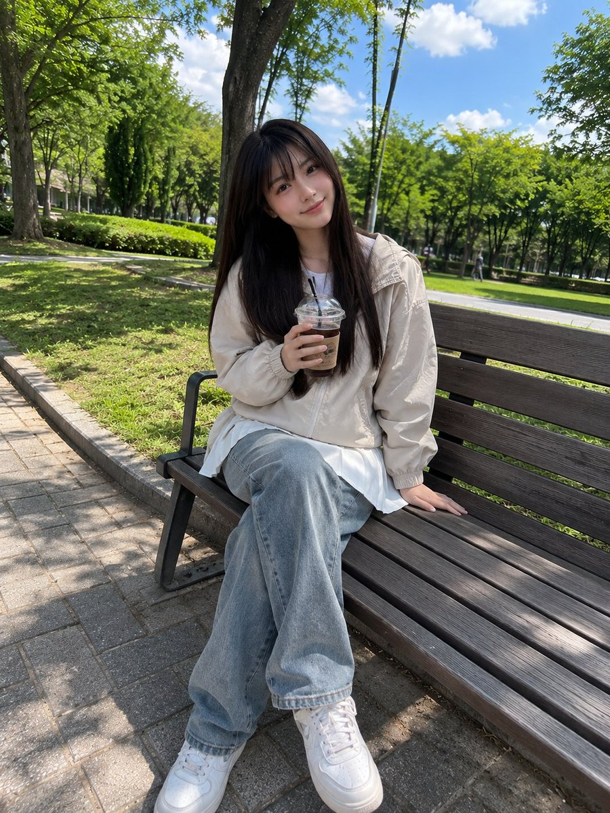</a></td><td width="50%"><a href="https://evolink.ai/gpt-image-2-prompts?utm_source=github&utm_medium=picture&utm_campaign=awesome-gpt-image-2-API-and-Prompts" target="_blank" rel="noopener noreferrer">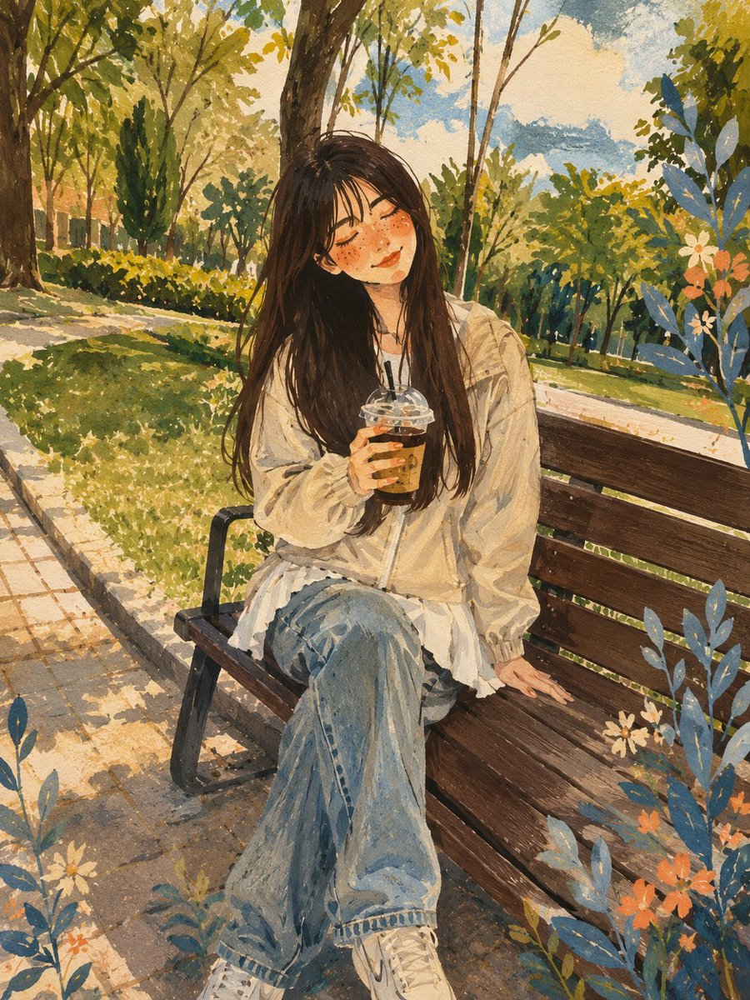</a></td></tr>
</table>

**Prompt:**

```
Beautiful young Japanese girl with long straight dark brown hair and soft full bangs, fair skin, bright natural smile, sitting casually on a wooden park bench while holding an iced coffee cup. Wearing a light beige windbreaker jacket and a white pleated mini skirt, relaxed posture, one hand resting on the bench. Surrounded by a lush green park with tall trees, fresh grass, and a bright blue sky with soft clouds. Captured with a smartphone camera in portrait mode, casual everyday snapshot, natural daylight, handheld iPhone photo, slightly imperfect framing, realistic skin texture, natural colors, soft HDR phone processing, candid social-media aesthetic, no professional modeling, no studio lighting, no cinematic color grading, authentic mobile photography, ordinary park outing vibe, spontaneous moment, realistic shadows, subtle lens softness, photorealistic, high-quality phone camera image.
```

<!-- Case 307: Curtain Bang Close-Up Portrait (by @iamsofiaijaz) -->
### Case 307: [Curtain Bang Close-Up Portrait](https://x.com/iamsofiaijaz/status/2067450336378544407) (by [@iamsofiaijaz](https://x.com/iamsofiaijaz))

| Output |
| :----: |
| <a href="https://evolink.ai/gpt-image-2-prompts?utm_source=github&utm_medium=picture&utm_campaign=awesome-gpt-image-2-API-and-Prompts" target="_blank" rel="noopener noreferrer">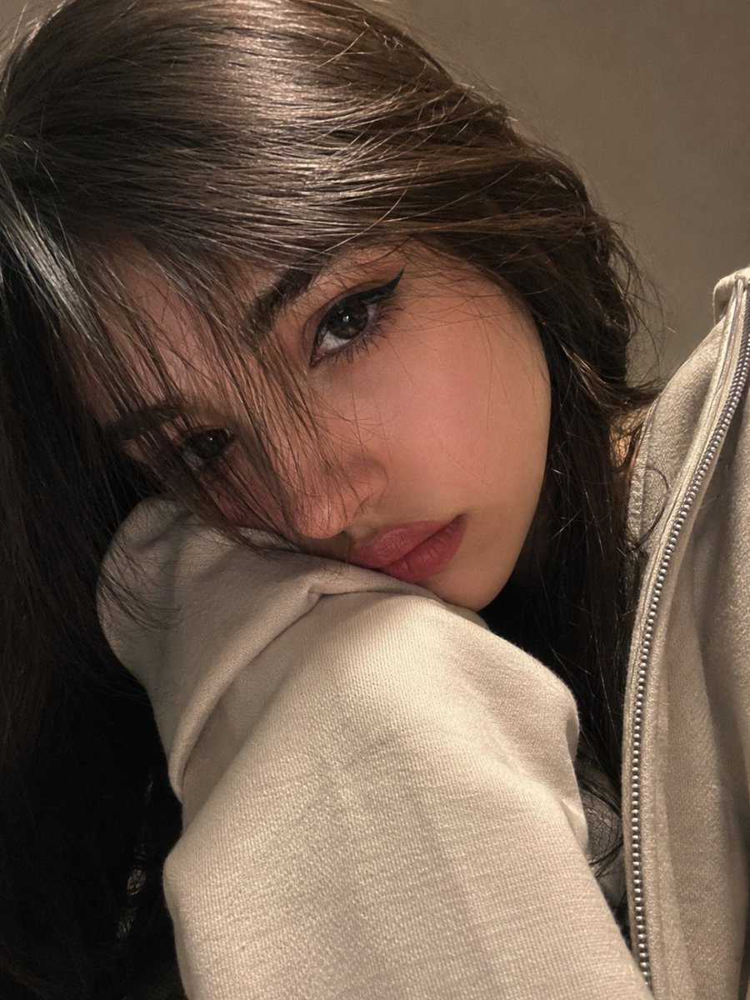</a> |

**Prompt:**

```
A photorealistic close-up portrait of a young girl filling almost the entire frame. Her head is slightly tilted to the side, with her cheek resting against her shoulder and partially hidden inside the long cream-colored sleeve of a hoodie. Long, straight hair with curtain bangs falls freely along the left side of her face, covering one eye. On the visible side of her face, she wears soft makeup: laminated brows, a sharp elongated black winged eyeliner that extends the shape of the eye, matte dusty-pink lips, and a calm, slightly pouting expression. She looks directly into the camera, with visible eyelashes.

A long zip-up hoodie over the one shoulder The composition is intimate and casual, resembling a webcam selfie. The frame has a slight tilt, and the face is positioned very close to the lens. Focus is sharp on the visible eye, lips, hair texture, and the thick cream-colored fabric of the sleeve, while the background fades into a soft blur. Behind her is a simple warm gray-beige wall with no visible details. Warm indoor and screen lighting from the front-left creates soft highlights on the skin and hair. The contrast is moderate, and the color palette is muted, featuring black, beige-gray, and dusty pink tones. The overall image should preserve the authentic feeling of a selfie photograph.
```

## 🎨 Poster & Illustration Cases

> **145 curated cases** — [Explore all Poster & Illustration Prompts →](cases/poster.md)

<!-- Case 214: Peacock Botanical Vintage Symmetrical Art Print (by @dotey) -->
### Case 214: [Peacock Botanical Vintage Symmetrical Art Print](https://x.com/dotey/status/2047803054422901046) (by [@dotey](https://x.com/dotey))

|                                                                                                                                                                                                        Output                                                                                                                                                                                                        |
| :------------------------------------------------------------------------------------------------------------------------------------------------------------------------------------------------------------------------------------------------------------------------------------------------------------------------------------------------------------------------------------------------------------------: |
| <a href="https://evolink.ai/gpt-image-2-prompts?utm_source=github&utm_medium=picture&utm_campaign=awesome-gpt-image-2-API-and-Prompts" target="_blank" rel="noopener noreferrer"></a> |

**Prompt:**

```
symmetrical design featuring two elegant blue peacocks with detailed feather patterns, surrounded by blue floral elements, intricate vintage botanical ornament, soft beige background, classical floral decor style with rich navy and sky blue details, decorative art illustration --ar 3:2
```

<!-- Case 214: Luxury Brand Ad Campaign Poster (by @TechieBySA) -->
### Case 214: [Luxury Brand Ad Campaign Poster](https://x.com/TechieBySA/status/2051676877794816074) (by [@TechieBySA](https://x.com/TechieBySA))

|                                                                                                                                                                                                 Output                                                                                                                                                                                                |
| :---------------------------------------------------------------------------------------------------------------------------------------------------------------------------------------------------------------------------------------------------------------------------------------------------------------------------------------------------------------------------------------------------: |
| <a href="https://evolink.ai/gpt-image-2-prompts?utm_source=github&utm_medium=picture&utm_campaign=awesome-gpt-image-2-API-and-Prompts" target="_blank" rel="noopener noreferrer"></a> |

**Prompt:**

```
A world-class luxury advertising campaign poster, 4:5 ratio, for [BRAND/PRODUCT], shot in a high-end photography studio, [COLOR] dramatic lighting with vivid color gels casting bold shadows, single hero product floating center frame with hyper-reflective surface catching light streaks, cinematic lens flare, deep rich background with gradient bloom, chrome and glass material feel, oversized bold editorial typography with the brand name, razor-sharp tagline in elegant thin font, extreme detail and texture on the product, smoke or liquid elements subtly in background, feels like Apple x Nike x Lamborghini had a campaign, shot on Hasselblad, photorealistic, magazine cover quality
```

<!-- Case 214: Food Photography with Doodle Characters (by @Taaruk_) -->
### Case 214: [Food Photography with Doodle Characters](https://x.com/Taaruk_/status/2051690647997088110) (by [@Taaruk_](https://x.com/Taaruk_))

|                                                                                                                                                                                                     Output                                                                                                                                                                                                    |
| :-----------------------------------------------------------------------------------------------------------------------------------------------------------------------------------------------------------------------------------------------------------------------------------------------------------------------------------------------------------------------------------------------------------: |
| <a href="https://evolink.ai/gpt-image-2-prompts?utm_source=github&utm_medium=picture&utm_campaign=awesome-gpt-image-2-API-and-Prompts" target="_blank" rel="noopener noreferrer"></a> |

**Prompt 1 (Beach café + cute doodle characters):**

```
Aesthetic beachside café scene with a wooden table overlooking the ocean, bright daylight, soft shadows, tropical vibe. A delicious bowl of food and a coconut drink placed on the table. Add cute illustrated cartoon characters (fox, bunny, cat) sitting and relaxing around the food, with tiny hand-drawn doodles (hearts, sparkles, motion lines). Cozy wholesome mood, playful storytelling, mix of real photography and 2D illustration overlay, soft warm color grading, shallow depth of field, ultra-realistic food details, 4K.
```

**Prompt 2 (Food flatlay + playful illustrated annotations):**

```
Top-down vibrant food flatlay featuring multiple crispy fried dishes (fish, shrimp, chicken) with dipping sauces on a dark textured table. Add playful hand-drawn doodles and tiny cartoon characters interacting with the food (surfing shrimp, holding signs, cooking, playing). Include fun handwritten labels like "Golden Crunch", "Perfect Pairing", "Champion Fish". Bright colors, high contrast, crispy texture details, steam effects, dynamic composition, social media food ad style, ultra-realistic, 4K.
```

**Prompt 3 (Cozy coffee + illustrated storytelling):**

```
Warm cozy coffee scene on a rustic wooden table with a cup of latte art on a yellow saucer, coffee beans and cinnamon sticks around, small bonsai plant nearby. Add cute animated doodle characters (coffee bean with wings, cat barista painting latte art) and flowing illustrated steam forming magical shapes. Include soft handwritten typography: "Crafted Comfort – Your Daily Ritual". Golden hour lighting, warm tones, soft glow, dreamy atmosphere, shallow depth of field, ultra-realistic + 2D illustration blend, 4K.
```

<!-- Case 214: Hand-Torn Editorial Collage (by @realsigridjin) -->

### Case 214: [Hand-Torn Editorial Collage](https://x.com/realsigridjin/status/2054368795121361249) (by [@realsigridjin](https://x.com/realsigridjin))

|                                                                                                                                                                                               Output                                                                                                                                                                                              |
| :-----------------------------------------------------------------------------------------------------------------------------------------------------------------------------------------------------------------------------------------------------------------------------------------------------------------------------------------------------------------------------------------------: |
| <a href="https://evolink.ai/gpt-image-2-prompts?utm_source=github&utm_medium=picture&utm_campaign=awesome-gpt-image-2-API-and-Prompts" target="_blank" rel="noopener noreferrer"></a> |

**Prompt:**

```
Transform the attached image into a collage artwork. Make it appear as if hand-torn from newspapers, magazines, and flyers and pasted. Every single expression should be completed using large, torn pieces of paper. Represent in detail the torn edges, wrinkles, overlaps, and glue marks on the paper. Use relatively large pieces of paper, not too small, and place them randomly at different angles and directions, with the paper orientation rotated haphazardly. Create it to look like an actual collage roughly hand-pasted by a person.
```

<!-- Case 214: Glowing Sailboat Night Illustration (by @churvikv) -->

### Case 214: [Glowing Sailboat Night Illustration](https://x.com/churvikv/status/2054315113587384469) (by [@churvikv](https://x.com/churvikv))

|                                                                                                                                                                                                   Output                                                                                                                                                                                                  |
| :-------------------------------------------------------------------------------------------------------------------------------------------------------------------------------------------------------------------------------------------------------------------------------------------------------------------------------------------------------------------------------------------------------: |
| <a href="https://evolink.ai/gpt-image-2-prompts?utm_source=github&utm_medium=picture&utm_campaign=awesome-gpt-image-2-API-and-Prompts" target="_blank" rel="noopener noreferrer"></a> |

**Prompt:**

```
A luminous sailboat, outlined in glowing golden light, floats serenely on dark, rippling water under a starry night sky. The sails, translucent and faintly blue, catch the ethereal light, while the hull is a solid, dark silhouette. Numerous tiny, twinkling golden stars are scattered across the black expanse above, and a crescent moon hangs softly to the right. Lush, vibrant green reeds and grasses sprout from smooth, grey stones in the foreground, their tips adorned with delicate, glowing golden florets. The water reflects the golden outline of the sailboat, creating a shimmering, warm glow that contrasts with the cool, deep darkness of the night. The scene is composed with a slightly low angle, emphasizing the majestic presence of the sailboat against the vastness of the night. The overall atmosphere is magical, tranquil, and dreamlike, evoking a sense of peaceful adventure and celestial wonder. The style is reminiscent of digital fantasy art with glowing neon accents.
```

<!-- Case 214: Istanbul Line-Art Travel Poster (by @miilesus) -->

### Case 214: [Istanbul Line-Art Travel Poster](https://x.com/miilesus/status/2054285276780929527) (by [@miilesus](https://x.com/miilesus))

|                                                                                                                                                                                                 Output                                                                                                                                                                                                |
| :---------------------------------------------------------------------------------------------------------------------------------------------------------------------------------------------------------------------------------------------------------------------------------------------------------------------------------------------------------------------------------------------------: |
| <a href="https://evolink.ai/gpt-image-2-prompts?utm_source=github&utm_medium=picture&utm_campaign=awesome-gpt-image-2-API-and-Prompts" target="_blank" rel="noopener noreferrer"></a> |

**Prompt:**

```
Create a minimalist ultra-high-resolution travel poster in line-art style for ISTANBUL, portraying the city as a stylish everyday urban scene rather than a tourist postcard.

MAIN COMPOSITION:

Central composition features Istanbul’s most iconic everyday urban scene — a lively tram street in Karaköy, Kadıköy, Beyoğlu, Eminönü, or a Bosphorus-side pedestrian avenue filled with daily life.

Foreground includes local residents, commuters, ferry passengers, café visitors, simit sellers, students, cyclists, street musicians, and shoppers naturally interacting within the city.

People should authentically reflect modern Istanbul street fashion, layered urban lifestyle, and contemporary Turkish culture.

Background filled with authentic Turkish signage, tea houses, bookstores, tram lines, ferry terminals, cafés, bakeries, fish restaurants, street lamps, mosques integrated into skyline, apartment façades, hanging laundry, cats, seagulls, and dense architectural textures.

Subtle landmarks blend naturally into daily life rather than dominating the composition — Galata Tower, Bosphorus ferries, nostalgic tram, mosque silhouettes, and waterfront railings should appear integrated into the urban rhythm.

Use authentic Turkish typography and culturally recognizable street elements.

Large centered title at the top: “ISTANBUL”

Subtitle at the bottom in Turkish: “Türkiye” or “İstanbul”

STYLE:

Ultra-clean vector illustration
Swiss modernist travel poster aesthetic
Minimalist line-art
Monoline drawing
Mid-century editorial illustration style
Architectural illustration
Contemporary Turkish graphic poster design
Crisp geometric perspective
Extremely clean negative space
Premium luxury travel-brand aesthetic
Highly organized visual density

LINE STYLE:

Monochrome line illustration only
Thin, highly precise lines
Minimal fill areas
Intricate city-map-level detailing
Rhythmic arrangement of tram cables, balconies, ferry rails, windows, signage, cats, street furniture, and waterfront architecture
Visually dense yet extremely balanced composition
Ultra-precise vector-quality rendering

COLOR SYSTEM — VERY IMPORTANT:

Use only ONE primary ink color + ONE background color
Automatically select the color pairing that best represents Istanbul’s atmosphere
Monochrome silkscreen poster aesthetic
No rainbow palettes
No excessive neon
Color should reflect Istanbul’s maritime atmosphere, historic architecture, ferry culture, and urban warmth
Recommended palette for Istanbul:
Deep Bosphorus navy ink on warm cream background

COMPOSITION:

Vertical poster layout
Frontal street-level perspective
Pedestrians naturally moving through tram streets, ferry exits, café terraces, and waterfront walkways
Balanced urban rhythm and architectural layering
Strong depth perspective with elegant negative space
Should feel like a premium global city-brand campaign poster

MOOD:

Stylish urban everyday life
Calm yet vibrant atmosphere
Sophisticated metropolitan energy
Timeless city identity
High-end travel magazine cover aesthetic
Minimalist yet ultra-detailed
Elegant Mediterranean-meets-modern urban mood

TEXT QUALITY — EXTREMELY IMPORTANT:

All typography must be clean, readable, and professionally designed
No random symbols
No broken or distorted letters
Turkish signage must appear authentic and natural
Editorial-grade typography hierarchy
Premium modernist poster layout

OUTPUT:

Vertical poster composition
Ultra-detailed 8K resolution
Print-ready
Ultra-precise vector-quality rendering
Luxury travel poster aesthetic
Museum-quality graphic design composition
```

<!-- Case 214: Dark Western Outlaw Poster (by @you1873118) -->

### Case 214: [Dark Western Outlaw Poster](https://x.com/you1873118/status/2054366009214316840) (by [@you1873118](https://x.com/you1873118))

|                                                                                                                                                                                              Output                                                                                                                                                                                              |
| :----------------------------------------------------------------------------------------------------------------------------------------------------------------------------------------------------------------------------------------------------------------------------------------------------------------------------------------------------------------------------------------------: |
| <a href="https://evolink.ai/gpt-image-2-prompts?utm_source=github&utm_medium=picture&utm_campaign=awesome-gpt-image-2-API-and-Prompts" target="_blank" rel="noopener noreferrer"></a> |

**Prompt:**

```
高级电影感西部亡命徒海报，竖版 2:3 构图，暗黑西部游戏角色设定海报风格。

一个神秘蒙面牛仔与黑马站在荒漠边境，人物全身正面，宽檐牛仔帽压低，花纹面巾遮住下半张脸，深色长发，黑色皮革手套，黑色西部夹克与多层皮革装备，子弹带、左轮枪套、金属腰带扣、厚重长靴，肩上披着红棕色几何图案披毯，边缘破损飘动。人物姿态冷静危险，一只手靠近枪套。右侧黑马半身入镜，带白色额纹，缰绳细节清晰。

背景是暴风雨中的西部荒漠，闪电、乌云、远处峡谷岩壁、枯树、沙尘、烟雾、火星、泥地反光，氛围压抑史诗。

画面左侧是复古羊皮纸留白，右侧是黑暗风暴场景，强烈明暗分割。加入大号竖排英文标题、通缉令信息、人物档案、坐标、地图网格、细线框、圆形罗盘图形、小红色标记、签名印章等高级海报排版元素。

风格：黑色墨迹飞溅、旧纸纹理、电影级写实、暗黑西部、强烈明暗对比、皮革和金属超细节、尘土、泥点、划痕、烟雾、火星、边缘轮廓光、高级收藏级游戏海报、荒野大镖客氛围、艺术设定集质感、8K、高细节。
```

<!-- Case 214: Anime Streetwear Mascot Poster (by @Taaruk_) -->

### Case 214: [Anime Streetwear Mascot Poster](https://x.com/Taaruk_/status/2054234237398851768) (by @Taaruk_)

|                                                                                                                                                                                                Output                                                                                                                                                                                                |
| :--------------------------------------------------------------------------------------------------------------------------------------------------------------------------------------------------------------------------------------------------------------------------------------------------------------------------------------------------------------------------------------------------: |
| <a href="https://evolink.ai/gpt-image-2-prompts?utm_source=github&utm_medium=picture&utm_campaign=awesome-gpt-image-2-API-and-Prompts" target="_blank" rel="noopener noreferrer"></a> |

**Prompt:**

```
Stylized anime streetwear brand poster of a fast-food mascot character, full-body dynamic pose, highly detailed manga/anime illustration, modern urban fashion outfit inspired by the restaurant brand colors and identity, oversized hoodie, tactical straps, sneakers, chains, branded accessories, holding signature food item, bold graphic typography, editorial magazine layout, Japanese text elements, logos, promotional stickers, menu-style side panels, grunge textures, paint splashes, distressed paper background, collectible poster aesthetic, cyber street fashion meets commercial advertising, vibrant red/orange/black/white color palette, dramatic lighting, ultra detailed line art, cel-shaded anime rendering, energetic composition, high contrast, trendy hypebeast vibe, futuristic fast-food campaign art, iconic mascot redesign, layered collage graphics, branding everywhere on clothing and background, premium anime poster quality, vertical composition, sharp shadows, dynamic perspective, stylish and playful attitude.
```

<!-- Case 214: Wildlife Infographic Reference Poster (by @sha_zdiii) -->

### Case 214: [Wildlife Infographic Reference Poster](https://x.com/sha_zdiii/status/2054229209460117552) (by @sha_zdiii)

|                                                                                                                                                                                                    Output                                                                                                                                                                                                   |
| :---------------------------------------------------------------------------------------------------------------------------------------------------------------------------------------------------------------------------------------------------------------------------------------------------------------------------------------------------------------------------------------------------------: |
| <a href="https://evolink.ai/gpt-image-2-prompts?utm_source=github&utm_medium=picture&utm_campaign=awesome-gpt-image-2-API-and-Prompts" target="_blank" rel="noopener noreferrer"></a> |

**Prompt:**

```
.

Create a premium cinematic wildlife infographic poster centered around a rare or visually unique animal species such as (animal). The entire artwork must feel like a futuristic luxury wildlife dossier rather than a normal educational infographic.
The animal should dominate the composition with intense photorealistic detail: ultra-detailed fur/scales, realistic eyes, moisture textures, cinematic shadows, environmental interaction, dramatic posture, visible muscle definition, floating particles, and powerful eye contact.
The environment must fully match the chosen species: (environment).
Build dense layered infographic storytelling around the animal using: • anatomy callouts
• adaptation systems
• prey and diet visuals
• ecosystem overlays
• conservation status indicators
• geographic range maps
• hunting behavior graphics
• climate danger visuals
• detail inserts
• tactical icon systems
• scientific labels and compact data snippets
The layout should feel highly artistic and cinematic instead of educational. Use: • asymmetric editorial composition
• layered transparent info panels
• premium typography
• subtle paper grain textures
• contour-line overlays
• holographic UI elements
• cinematic infographic markers
• museum-grade visual hierarchy
Blend: (luxury editorial aesthetic) + (cinematic documentary realism) + (futuristic infographic design) + (collectible field-guide energy).
Color Theme: (color theme)
Mood: (mood)
Lighting: dramatic cinematic lighting, volumetric fog, glowing rim light, atmospheric haze, realistic environmental reflections, high contrast shadows, ultra-premium editorial lighting.
The final artwork must look like a viral collectible wildlife poster people would instantly save, repost, print, and frame.
Ultra-realistic, 8K, cinematic infographic masterpiece, insanely detailed, premium art direction, tactile textures, layered storytelling, emotional visual impact, museum-quality composition, viral social-media-worthy aesthetic.
```

<!-- Case 214: Ancient Civilization Miniature Diorama (by @Naiknelofar788) -->

### Case 214: [Ancient Civilization Miniature Diorama](https://x.com/Naiknelofar788/status/2054221110372405534) (by @Naiknelofar788)

|                                                                                                                                                                                                    Output                                                                                                                                                                                                    |
| :----------------------------------------------------------------------------------------------------------------------------------------------------------------------------------------------------------------------------------------------------------------------------------------------------------------------------------------------------------------------------------------------------------: |
| <a href="https://evolink.ai/gpt-image-2-prompts?utm_source=github&utm_medium=picture&utm_campaign=awesome-gpt-image-2-API-and-Prompts" target="_blank" rel="noopener noreferrer"></a> |

**Prompt:**

```
A highly detailed miniature diorama of an ancient civilization under construction, displayed directly on top of large rolled-out architectural blueprints spread across a realistic wooden drafting table. The scene features iconic historical architecture from [CIVILIZATION OR LOCATION], including partially completed monuments, temples, towers, walls, palaces, streets, or ceremonial structures at different stages of construction. Tiny craftsmen, builders, engineers, and workers interact naturally throughout the scene using historically accurate tools, scaffolding, ramps, cranes, carts, stone blocks, timber frameworks, and construction platforms.
The miniature terrain blends seamlessly into the printed engineering drawings beneath, combining realistic sand, stone, earth, marble, vegetation, or desert textures with visible architectural floor plans, elevation sketches, measurements, annotations, and cross-sections. Surrounding the workspace are drafting instruments, compasses, rolled parchment plans, books, rulers, brass weights, candles, maps, carving tools, and historical reference materials that enhance the workshop atmosphere.
Soft cinematic lighting with warm natural sunlight from a nearby window, shallow depth of field, ultra realistic textures, handcrafted museum-quality scale model aesthetic, intricate miniature detailing, photoreal materials, atmospheric realism, editorial architectural photography style, clean composition, immersive world-building, vertical composition, extremely high detail, realistic shadows, authentic historical mood.
```

<!-- Case 214: Japanese Fashion Collage Poster (by @Mind_Boticni) -->

### Case 214: [Japanese Fashion Collage Poster](https://x.com/Mind_Boticni/status/2054203134411739609) (by [@Mind_Boticni](https://x.com/Mind_Boticni))

|                                                                                                                                                                                                 Output                                                                                                                                                                                                |
| :---------------------------------------------------------------------------------------------------------------------------------------------------------------------------------------------------------------------------------------------------------------------------------------------------------------------------------------------------------------------------------------------------: |
| <a href="https://evolink.ai/gpt-image-2-prompts?utm_source=github&utm_medium=picture&utm_campaign=awesome-gpt-image-2-API-and-Prompts" target="_blank" rel="noopener noreferrer"><img src="https://raw.githubusercontent.com/EvoLinkAI/awesome-gpt-image-2-API-and-Prompts/main/images/poster_case257/ou